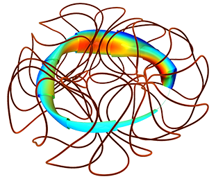

# simsopt

`simsopt` is a framework for optimizing
[stellarators](https://en.wikipedia.org/wiki/Stellarator).
The high-level routines of `simsopt` are in python, with calls to C++
or fortran where needed for performance. Several types of components
are included:

- Interfaces to physics codes, e.g. for MHD equilibrium.
- Tools for defining objective functions and parameter spaces for
  optimization.
- Geometric objects that are important for stellarators - surfaces and
  curves - with several available parameterizations.
- An efficient implementation of the Biot-Savart law, including
  derivatives.
- Tools for parallelized finite-difference gradient calculations.

Some of the physics modules with compiled code reside in separate
repositories. These separate modules include

- [VMEC](https://github.com/hiddenSymmetries/VMEC2000), for MHD
  equilibrium.
- [SPEC](https://github.com/PrincetonUniversity/SPEC), for MHD
  equilibrium. (This repository is private.)
- [booz_xform](https://hiddensymmetries.github.io/booz_xform), for
  Boozer coordinates and quasisymmetry.
  
The design of `simsopt` is guided by several principles:

- Thorough unit testing, regression testing, and continuous
  integration.
- Extensibility: It should be possible to add new codes and terms to
  the objective function without editing modules that already work,
  i.e. the [open-closed principle](https://en.wikipedia.org/wiki/Open%E2%80%93closed_principle).
  This is because any edits to working code can potentially introduce bugs.
- Modularity: Physics modules that are not needed for your
  optimization problem do not need to be installed. For instance, to
  optimize SPEC equilibria, the VMEC module need not be installed.
- Flexibility: The components used to define an objective function can
  be re-used for applications other than standard optimization. For
  instance, a `simsopt` objective function is a standard python
  function that can be plotted, passed to optimization packages
  outside of `simsopt`, etc.

`simsopt` is fully open-source, and anyone is welcome to make suggestions, contribute, and use.
Several methods are available for installing `simsopt`. One
recommended approach is to use pip

    pip install simsopt

For more installation options and other information, see the [main
simsopt documentation here.](https://simsopt.readthedocs.io)

[//]: # (`simsopt` is one of several available systems for stellarator)
[//]: # "optimization.  Others include [STELLOPT](https://github.com/PrincetonUniversity/STELLOPT),"
[//]: # "[ROSE](https://doi.org/10.1088/1741-4326/aaed50), and"
[//]: # "[LASSO](https://gitlab.com/wistell).)"

We gratefully acknowledge funding from the [Simons Foundation's Hidden
symmetries and fusion energy
project](https://hiddensymmetries.princeton.edu). 
