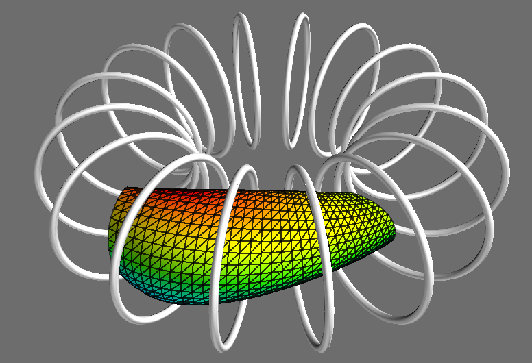
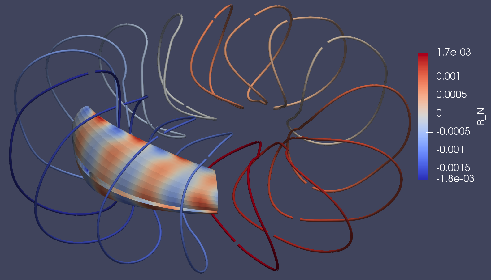

Coil optimization
=================

Here we work through several examples of "stage 2" coil optimization.  In
this approach, a target plasma shape (i.e. boundary flux surface shape)
has already been found in
a "stage 1" optimization, and the present task is to
optimize the shapes of coils to produce this target field.
For this stage-2 problem, no MHD codes are used (example, VMEC or SPEC), so
there is no need to have them installed.

We first describe the basic principles of "stage 2" coil optimization and
how they are used in SIMSOPT, namely, how to set up the optimization problem
in the minimal example ``examples/2_Intermediate/stage_two_optimization.py``.
We then add several advanced features to the problem:

- Including more terms in the objective to regularize the coils,
  which may help with engineering feasibility.
- Taking into account coil perturbations via systematic and statistical
  errors using a stochastic optimization method similar to the example in
  :simsopt_file:`examples/2_Intermediate/stage_two_optimization_stochastic.py`.
- Taking into account the presence of plasma current
  using the virtual casing principle, similar to the example
  in :simsopt_file:`examples/2_Intermediate/stage_two_optimization_finite_beta.py`.
- Taking into account finite coil width using a multi-filament approach
  similar to the example in :simsopt_file:`examples/3_Advanced/stage_two_optimization_finitebuild.py`.

.. _minimal_stage2:

Minimal example
---------------

A minimal objective function (cost function) for coil optimization is

.. math::
  
  J = \frac{1}{2} \int |\vec{B} \cdot \vec{n}|^2 ds
      + (\mathtt{LENGTH\_WEIGHT}) \left(L_* - \sum_j L_j\right)^2.

This example can also be found in
:simsopt_file:`examples/1_Simple/stage_two_optimization_minimal.py`.
The first term in the right-hand-side term is the "quadratic flux", the area
integral over the target plasma surface of the square of the magnetic
field normal to the surface. If the coils exactly produce a flux
surface of the target shape, this term will vanish. 

Next, :math:`L_j`
is the length of the :math:`j`-th coil.
The number :math:`L_*` 
is chosen to balance a trade-off: small
values will give smooth coils at the cost of inaccuracies in producing
the target field; large values of :math:`L_*` will give a more
accurate match to the target field at the cost of complicated coils.
The weight parameter ``LENGTH_WEIGHT`` provides some additional control over the regularization,
though results should not be very sensitive to it, and a value of 1.0 is fine.

In this first section we consider vacuum fields only, so the magnetic field
due to current in the plasma does not need to be subtracted in the
quadratic flux term. The configuration considered is the
`precise QA configuration <https://doi.org/10.1103/PhysRevLett.128.035001>`_,
which has two field periods and is quasi-axisymmetric.

The stage-2 optimization problem is automatically parallelized in
simsopt using OpenMP and vectorization, but MPI is not used, so the
``mpi4py`` python package is not needed. This example can be run in a
few seconds on a laptop.

To solve this optimization problem in simsopt, we first import the necessary classes::

  from simsopt.geo import SurfaceRZFourier, create_equally_spaced_curves, \
      CurveLength, plot, curves_to_vtk
  from simsopt.field import Current, coils_via_symmetries, BiotSavart
  from simsopt.objectives import SquaredFlux, QuadraticPenalty

The target plasma surface is given in the VMEC input file :simsopt_file:`tests/test_files/input.LandremanPaul2021_QA`.
We load the surface using:

.. code-block::

  nphi = 32
  ntheta = 32
  filename = "tests/test_files/input.LandremanPaul2021_QA"
  s = SurfaceRZFourier.from_vmec_input(filename, range="half period", nphi=nphi, ntheta=ntheta)

You can adjust the directory in ``"filename"`` as appropriate for your
system. The surface could also be read in from a VMEC wout file using
:obj:`simsopt.geo.SurfaceRZFourier.from_wout()`.  Note that VMEC does
not need to be installed to initialize a surface from a VMEC input or
output file. As surface objects carry a grid of "quadrature points" at
which the position vector is evaluated we may want these points to
cover different ranges of the toroidal angle. For this problem with
stellarator symmetry and field-period symmetry, we need only consider
half of a field period in order to evaluate integrals over the entire
surface. For this reason, the ``range`` parameter of the surface is
set to ``"half period"`` here. Possible options in general are ``"full
torus"``, ``"field period"`` and ``"half period"``, but ``"half
period"`` is significantly more efficient than the other options for
this problem.

We next set the initial condition for the coils, which will be equally spaced circles.
We consider here a case with four unique coil shapes, each of which is repeated four times due to
stellarator symmetry and two-field-period symmetry, giving a total of 16 coils.
The four unique coil shapes are called the "base coils". Each copy of a coil also carries the same current,
but we will allow the unique coil shapes to have different current from each other,
as is allowed on W7-X. For this tutorial we consider the coils to be infinitesimally thin filaments.
In simsopt, such a coil is represented with the :obj:`simsopt.field.Coil` class,
which is essentially a curve paired with a current, represented using
:obj:`simsopt.geo.Curve` and :obj:`simsopt.field.Current` respectively.
The initial conditions are set as follows::

  # Number of unique coil shapes:
  ncoils = 4

  # Major radius for the initial circular coils:
  R0 = 1.0
  
  # Minor radius for the initial circular coils:
  R1 = 0.5

  # Number of Fourier modes describing each Cartesian component of each coil:
  order = 5

  base_curves = create_equally_spaced_curves(ncoils, s.nfp, stellsym=True, R0=R0, R1=R1, order=order)
  base_currents = [Current(1.0) * 1e5 for i in range(ncoils)]

In the last line, the degrees of freedom for the current are set to be of order 1,
but the actual currents are ``1e5`` larger so the magnetic field will be on the order of 1 Tesla.
One detail of optimizing coils for a vacuum configuration is that the
optimizer can "cheat" by making all the currents go to zero, which
makes the quadratic flux vanish. To close this loophole, we can fix
the current of the first base coil::

  base_currents[0].fix_all()

(A :obj:`~simsopt.field.Current` object only has one degree of freedom, hence we can use
``fix_all()``.)  If you wish, you can fix the currents in all the
coils to force them to have the same value. Now the full set of 16
coils can be obtained using stellarator symmetry and field-period
symmetry::

  coils = coils_via_symmetries(base_curves, base_currents, s.nfp, True)

To make sure that the coils class has the non-fixed degrees of freedom that
we specified, we can print the ``dof_names`` property::

  >>> print(coils[0].dof_names)

  ['CurveXYZFourier1:xc(0)', 'CurveXYZFourier1:xs(1)', 'CurveXYZFourier1:xc(1)', ...

  >>> print(coils[1].dof_names)

  ['Current2:x0', 'CurveXYZFourier2:xc(0)', 'CurveXYZFourier2:xs(1)', 'CurveXYZFourier2:xc(1)', ...

  >>> print(coils[4].dof_names)

  ['CurveXYZFourier1:xc(0)', 'CurveXYZFourier1:xs(1)', 'CurveXYZFourier1:xc(1)', ...

Notice that the current appears in the list of dofs for ``coils[1]``
but not for ``coils[0]``, since we fixed the current for
``coils[0]``. Also notice that ``coils[4]`` has the same degrees of
freedom (owned by ``CurveXYZFourier1``) as ``coils[0]``, because coils
0 and 4 refer to the same base coil shape and current.

There are several ways to view the objects we have created so far. One
approach is the function :obj:`simsopt.geo.plot()`, which accepts
a list of Coil, Curve, and/or Surface objects::

  plot(coils + [s], engine="mayavi", close=True)

	
Instead of ``"mayavi"`` you can select ``"matplotlib"`` or
``"plotly"`` as the graphics engine, although matplotlib has problems
with displaying multiple 3D objects in the proper
order. Alternatively, you can export the objects in VTK format and
open them in Paraview::

  curves = [c.curve for c in coils]
  curves_to_vtk(curves, "curves_init")
  s.to_vtk("surf_init")
  
To evaluate the magnetic field on the target surface, we create a
:obj:`simsopt.field.BiotSavart` object based on the coils,
and instruct it to evaluate the field on the surface::

  bs = BiotSavart(coils)
  bs.set_points(s.gamma().reshape((-1, 3)))

(The surface position vector ``gamma()`` returns an array of size
``(nphi, ntheta, 3)``, which we reshaped here to
``(nphi*ntheta, 3)`` as required for the
:obj:`~simsopt.field.BiotSavart` object.)
To check the size of the field normal to the target surface
before optimization we can run::

  B_dot_n = np.sum(bs.B().reshape((nphi, ntheta, 3)) * s.unitnormal(), axis=2)
  print('Initial max|B dot n|:', np.max(np.abs(B_dot_n)))

The result is 0.23 Tesla.

We now define the objective function by stating what are the weights
used and the corresponding terms::

  # Weight on the curve lengths in the objective function.
  LENGTH_WEIGHT = 1.0

  # Target value for the sum of the lengths of the base coils:
  LENGTH_TARGET = 18.0
  
  # Define the individual terms objective function:
  Jf = SquaredFlux(s, bs)
  Jls = [CurveLength(c) for c in base_curves]

  # Form the total objective function.
  objective = Jf + LENGTH_WEIGHT * QuadraticPenalty(sum(Jls), LENGTH_TARGET, "max")

In the last line, we have used the fact that the Optimizable objects
representing the individual terms in the objective can be scaled by a
constant and added.  (This feature applies to Optimizable objects that
have a function ``J()`` returning the objective and, if gradients are
used, a function ``dJ()`` returning the gradient.)  Also, the
``"max"`` option to :obj:`~simsopt.objectives.QuadraticPenalty`
specifies that the length penalty is active if the coil length is too
large but not if it is too small. You can instead specify a penalty
for values that are too small or a regular 2-sided quadratic penalty
by setting the last argument to ``"min"`` or ``"identity"``
respectively.

Note that the :obj:`~simsopt.objectives.SquaredFlux` objective can be
defined in several different ways. You can choose among the available
definitions using the ``definition`` argument. For the available
definitions, see the documentation for
:obj:`~simsopt.objectives.SquaredFlux`.

You can check the degrees of freedom that will be varied in the
optimization by printing the ``dof_names`` property of the objective::

  >>> print(objective.dof_names)

  ['Current2:x0', 'Current3:x0', 'Current4:x0', 'CurveXYZFourier1:xc(0)', 'CurveXYZFourier1:xs(1)', ...
   'CurveXYZFourier1:zc(5)', 'CurveXYZFourier2:xc(0)', 'CurveXYZFourier2:xs(1)', ...
   'CurveXYZFourier4:zs(5)', 'CurveXYZFourier4:zc(5)']

As desired, the Fourier amplitudes of all four base coils appear, as
do three of the four currents.  Next, to interface with scipy's
minimization routines, we write a small function::

  def fun(dofs):
      objective.x = dofs
      return objective.J(), objective.dJ()

Note that when the ``dJ()`` method of the objective is called to
compute the gradient, simsopt automatically applies the chain rule to
assemble the derivatives from the various terms in the objective, and
entries in the gradient corresponding to degrees of freedom that are
fixed (such as the current in the first coil) are automatically
removed.  We can now run the optimization using the `L-BFGS-B algorithm
from scipy
<https://docs.scipy.org/doc/scipy/reference/optimize.minimize-lbfgsb.html#optimize-minimize-lbfgsb>`_::

  res = minimize(fun, objective.x, jac=True, method='L-BFGS-B',
                 options={'maxiter': 300, 'iprint': 5}, tol=1e-15)
  
The optimization takes a few seconds, and the output will look like

.. code-block:: none
   
   RUNNING THE L-BFGS-B CODE

           * * *

  Machine precision = 2.220D-16
   N =          135     M =           10
   This problem is unconstrained.

  At X0         0 variables are exactly at the bounds

  At iterate    0    f=  3.26880D-02    |proj g|=  5.14674D-02

  At iterate    5    f=  6.61538D-04    |proj g|=  2.13561D-03

  At iterate   10    f=  1.13772D-04    |proj g|=  6.27872D-04

  ...
  At iterate  295    f=  6.20353D-07    |proj g|=  9.16379D-06

  At iterate  300    f=  6.19516D-07    |proj g|=  1.66448D-05
  
           * * *

  Tit   = total number of iterations
  Tnf   = total number of function evaluations
  Tnint = total number of segments explored during Cauchy searches
  Skip  = number of BFGS updates skipped
  Nact  = number of active bounds at final generalized Cauchy point
  Projg = norm of the final projected gradient
  F     = final function value

           * * *

   N    Tit     Tnf  Tnint  Skip  Nact     Projg        F
  135    300    409      2     0     0   1.664D-05   6.195D-07
  F =   6.1951581434132075E-007
  
  STOP: TOTAL NO. of ITERATIONS REACHED LIMIT                 

(You may obtain somewhat different values). You can adjust parameters such as the tolerance and number of
iterations. Let us check the final :math:`\vec{B}\cdot\vec{n}` on the surface::

  B_dot_n = np.sum(bs.B().reshape((nphi, ntheta, 3)) * s.unitnormal(), axis=2)
  print('Final max|B dot n|:', np.max(np.abs(B_dot_n)))

The final value is 0.0015 Tesla, reduced two orders of magnitude from
the initial state.  As with the initial conditions, you can plot the
optimized coil shapes directly from simsopt using

.. code-block::

  plot(coils + [s], engine="mayavi", close=True)
  
or you can export the objects in VTK format and open them in
Paraview. For this latter option, we can also export the final
:math:`\vec{B}\cdot\vec{n}` on the surface using the following
syntax::

  curves = [c.curve for c in coils]
  curves_to_vtk(curves, "curves_opt")
  s.to_vtk("surf_opt", extra_data={"B_N": B_dot_n[:, :, None]})

	
(Your coils may look somewhat different).
The optimized value of the current in coil ``j`` can be obtained using
``coils[j].current.get_value()``. The optimized Fourier coefficients
for coil ``j`` can be obtained from ``coils[j].curve.x``, where the
meaning of each array element can be seen from
``coils[j].curve.dof_names``.  The position vector for coil ``j`` in
Cartesian coordinates can be obtained from ``coils[j].curve.gamma()``.

At the end of the optimization, the results can be saved as follows::

   bs.save("biot_savart_opt.json")

This line saves the optimized coil shapes and currents, along with the
:obj:`~simsopt.field.BiotSavart` object that evaluates the magnetic
field produced by the coils. The resulting json file can be loaded in
later in a separate script to analyze the results (making Poincare
plots, etc.)

Further coil regularization terms
---------------------------------

In the previous example we have already seen several objective function terms available for coil regularization:

- :obj:`~simsopt.geo.CurveLength`: The length of a coil
- :obj:`~simsopt.objectives.QuadraticPenalty`: Useful for making quantities equal to, greater than, or less than a target value.

However, better coils can be obtained if additional terms are included in the objective function
to control the coil curvature and coil-to-coil separation.
A large number of other terms are available in :obj:`simsopt.geo` to include in the objective function,
many of which are illustrated in
:simsopt_file:`examples/2_Intermediate/stage_two_optimization.py`. Other available objective terms include

- :obj:`~simsopt.geo.MeanSquaredCurvature`: Reduces the coil curvature evenly along the curve.
- :obj:`~simsopt.geo.LpCurveCurvature`: Penalizes values of the coil curvature that exceed a threshold.
- :obj:`~simsopt.geo.LpCurveTorsion`: Penalizes values of the coil torsion that exceed a threshold. Coil optimization does not tend to work well when this term is included.
- :obj:`~simsopt.geo.CurveCurveDistance`: Useful for ensuring the minimum coil-to-coil distance is at least a specified target value.
- :obj:`~simsopt.geo.CurveSurfaceDistance`: Useful for ensuring the minimum coil-to-plasma distance is at least a specified target value.
- :obj:`~simsopt.geo.ArclengthVariation`: Ensures the curves are parameterized using (approximately) a uniform-arclength parameter.
- :obj:`~simsopt.geo.LinkingNumber`: Prevents coils from becoming topologically linked to each other.

You can click on any of the links above in this section to see the precise definitions of these objective terms.

Another useful class for forming objective functions is
:obj:`simsopt.objectives.Weight`, which is a wrapper for a float.
This object can be used for the weight in front of a term in the
objective function.  Although a standard float works for this purpose
as well, the advantage of using :obj:`~simsopt.objectives.Weight` is
that when the value of the weight is changed, the objective function
object is automatically updated with the new value.

Stochastic Optimization
-----------------------

In this example we solve a stochastic version of
the :ref:`first example here <minimal_stage2>`. As before,
the goal is to find coils that generate a specific target
normal field on a given surface. As we are still considering a vacuum
field the target is just zero.
The target equilibrium is the `precise QA configuration <https://doi.org/10.1103/PhysRevLett.128.035001>`_.
The complete script can be found in :simsopt_file:`examples/2_Intermediate/stage_two_optimization_stochastic.py`.

The objective function is similar to :simsopt_file:`examples/2_Intermediate/stage_two_optimization.py`
but with a few modifications::

    J = (1/2) Mean(\int |B dot n|^2 ds)
        + LENGTH_WEIGHT * (sum CurveLength)
        + DISTANCE_WEIGHT * MininumDistancePenalty(DISTANCE_THRESHOLD)
        + CURVATURE_WEIGHT * CurvaturePenalty(CURVATURE_THRESHOLD)
        + MSC_WEIGHT * MeanSquaredCurvaturePenalty(MSC_THRESHOLD)
        + ARCLENGTH_WEIGHT * ArclengthVariation

The first term is altered to be given by the mean (expected value) of the flux over a distribution
of possible perturbed coils instead of the
flux itself. The mean is approximated by a sample average over perturbed coils.
The coil perturbations for each coil are the sum of a 'systematic error' and a
'statistical error'.  The former satisfies rotational and stellarator symmetry,
the latter is independent for each coil.

The last term in the objective, :obj:`~simsopt.geo.ArclengthVariation`,
tends to be useful to include when doing stochastic optimization. Without this term,
which tends to make the curve parameterization have a uniform arclength,
the optimizer can exploit the curve parameterization rather than actually changing the shape of the curve.
This is possible since the Gaussian process model for curve perturbations is based on the curve parameter rather than arclength.

We now define the objective function by stating what are the weights
used and the corresponding terms. Besides the terms in
the previous examples, we additionally define::

  # Weight for the arclength variation penalty in the objective function:
  ARCLENGTH_WEIGHT = 1e-2

  # Standard deviation for the coil errors
  SIGMA = 1e-3

  # Length scale for the coil errors
  L = 0.5

  # Number of samples to approximate the mean
  N_SAMPLES = 16

  # Number of samples for out-of-sample evaluation
  N_OOS = 256

  # Objective function for the arclength variation
  Jals = [ArclengthVariation(c) for c in base_curves]

  # Objective function for the coils and its perturbations
  rg = np.random.Generator(np.random.PCG64DXSM(seed))
  sampler = GaussianSampler(curves[0].quadpoints, SIGMA, L, n_derivs=1)
  Jfs = []
  curves_pert = []
  for i in range(N_SAMPLES):
      # first add the 'systematic' error. this error is applied to the base curves and hence the various symmetries are applied to it.
      base_curves_perturbed = [CurvePerturbed(c, PerturbationSample(sampler, randomgen=rg)) for c in base_curves]
      coils = coils_via_symmetries(base_curves_perturbed, base_currents, s.nfp, True)
      # now add the 'statistical' error. this error is added to each of the final coils, and independent between all of them.
      coils_pert = [Coil(CurvePerturbed(c.curve, PerturbationSample(sampler, randomgen=rg)), c.current) for c in coils]
      curves_pert.append([c.curve for c in coils_pert])
      bs_pert = BiotSavart(coils_pert)
      Jfs.append(SquaredFlux(s, bs_pert))
  Jmpi = MPIObjective(Jfs, comm, needs_splitting=True)

  # Form the total objective function. To do this, we can exploit the
  # fact that Optimizable objects with J() and dJ() functions can be
  # multiplied by scalars and added:
  JF = Jmpi \
      + LENGTH_WEIGHT * sum(Jls) \
      + DISTANCE_WEIGHT * Jdist \
      + CURVATURE_WEIGHT * sum(Jcs) \
      + MSC_WEIGHT * sum(QuadraticPenalty(J, MSC_THRESHOLD, "max") for J in Jmscs) \
      + ARCLENGTH_WEIGHT * sum(Jals)

As can be seen here, in the stochastic optimization method,
we apply two different types of errors.
The first one is the systematic error which is applied where
random perturbations based on a Gaussian Sampler with a predefined standard deviation
are added to the base curves. The second is a statistical error that is
added to each of the final coils, and is independent between coils.

Finite Beta Optimization
------------------------

In this example, we solve a variant of
the :ref:`first example here <minimal_stage2>`
in which there is current inside the plasma, which contributes significantly to
the total magnetic field.Therefore, the
target quantity :math:`\vec{B}_{external}\cdot \vec{n}` is no longer zero
and a virtual casing calculation is used to find its value.
The complete script can be found in :simsopt_file:`examples/2_Intermediate/stage_two_optimization_finite_beta.py`.

We use an objective function similar to :ref:`the first example <minimal_stage2>`
with small modifications::

    J = (1/2) \int |(B_{BiotSavart} - B_{External}) dot n|^2 ds
        + LENGTH_WEIGHT * (sum CurveLength)

The first term, while similar to the previous examples, it
calculates the external field :math:`B_{external}` using a
virtual casing principle. The virtual casing calculation
is done in the following way::

  # Resolution for the virtual casing calculation:
  vc_src_nphi = 80
  # (For the virtual casing src_ resolution, only nphi needs to be
  # specified; the theta resolution is computed automatically to
  # minimize anisotropy of the grid.)

  # Once the virtual casing calculation has been run once, the results
  # can be used for many coil optimizations. Therefore here we check to
  # see if the virtual casing output file alreadys exists. If so, load
  # the results, otherwise run the virtual casing calculation and save
  # the results.
  head, tail = os.path.split(vmec_file)
  vc_filename = os.path.join(head, tail.replace('wout', 'vcasing'))
  print('virtual casing data file:', vc_filename)
  if os.path.isfile(vc_filename):
      print('Loading saved virtual casing result')
      vc = VirtualCasing.load(vc_filename)
  else:
      # Virtual casing must not have been run yet.
      print('Running the virtual casing calculation')
      vc = VirtualCasing.from_vmec(vmec_file, src_nphi=vc_src_nphi, trgt_nphi=nphi, trgt_ntheta=ntheta)

We then define the objective function as the squared flux targeting
the value of the dot product between :math:`B_{external}` and the
surface normal vector computed with the results of the virtual casing principle::

  # Define the objective function:
  Jf = SquaredFlux(s, bs, target=vc.B_external_normal)
  Jls = [CurveLength(c) for c in base_curves]

  # Form the total objective function. To do this, we can exploit the
  # fact that Optimizable objects with J() and dJ() functions can be
  # multiplied by scalars and added:
  JF = Jf \
      + LENGTH_PENALTY * sum(QuadraticPenalty(Jls[i], Jls[i].J(), "identity") for i in range(len(base_curves)))

The example above uses very minimal coil regularization: only the deviation
from the initial coil length is penalized; curvature and distance are not
targeted here.

Finite Build Optimization
-------------------------

In this final example, we perform a stage 2 optimization with
finite build coils. The script for this case can be found in
:simsopt_file:`examples/3_Advanced/stage_two_optimization_finite_build.py`.
In particular, we use a multifilament approach that follows

.. code-block::
   
   "Optimization of finite-build stellarator coils,"
   Singh, Luquant, et al.  Journal of Plasma Physics 86, 4 (2020)

to approximate a finite build coil in order to have finite thickness.

The target equilibrium is the `precise QA configuration <https://doi.org/10.1103/PhysRevLett.128.035001>`_.
Besides the degrees of freedom listed in :ref:`first example here <minimal_stage2>`,
in this case, we have additional degrees of freedom related to the rotation
of the coil pack. The objective function is given by::

    J = (1/2) \int |(B_{BiotSavart}) dot n|^2 ds
        + LENGTH_PEN * (sum CurveLength)
        + DIST_PEN * CurveCurveDistance

Here, :obj:`~simsopt.geo.CurveCurveDistance` is used to prevents coils from
becoming too close. The constant
``DIST_PEN`` is selected to balance this minimum distance penalty
against the other objectives.
To initialize the finite build optimization, we use the definitions below::

  # Weight on the curve length penalty in the objective function:
  LENGTH_PEN = 1e-2

  # Threshhold and weight for the coil-to-coil distance penalty in the objective function:
  DIST_MIN = 0.1
  DIST_PEN = 10

  # Settings for multifilament approximation.  In the following
  # parameters, note that "normal" and "binormal" refer not to the
  # Frenet frame but rather to the "coil centroid frame" defined by
  # Singh et al., before rotation.
  numfilaments_n = 2  # number of filaments in normal direction
  numfilaments_b = 3  # number of filaments in bi-normal direction
  gapsize_n = 0.02  # gap between filaments in normal direction
  gapsize_b = 0.04  # gap between filaments in bi-normal direction
  rot_order = 1  # order of the Fourier expression for the rotation of the filament pack, i.e. maximum Fourier mode number

  nfil = numfilaments_n * numfilaments_b
  base_curves = create_equally_spaced_curves(ncoils, s.nfp, stellsym=True, R0=R0, R1=R1, order=order)
  base_currents = []
  for i in range(ncoils):
      curr = Current(1.)
      # since the target field is zero, one possible solution is just to set all
      # currents to 0. to avoid the minimizer finding that solution, we fix one
      # of the currents
      if i == 0:
          curr.fix_all()
      base_currents.append(ScaledCurrent(curr, 1e5/nfil))

  # use sum here to concatenate lists
  base_curves_finite_build = sum([
      create_multifilament_grid(c, numfilaments_n, numfilaments_b, gapsize_n, gapsize_b, rotation_order=rot_order) for c in base_curves], [])
  base_currents_finite_build = sum([[c]*nfil for c in base_currents], [])

  # apply stellarator and rotation symmetries
  curves_fb = apply_symmetries_to_curves(base_curves_finite_build, s.nfp, True)
  currents_fb = apply_symmetries_to_currents(base_currents_finite_build, s.nfp, True)
  # also apply symmetries to the underlying base curves, as we use those in the
  # curve-curve distance penalty
  curves = apply_symmetries_to_curves(base_curves, s.nfp, True)

  coils_fb = [Coil(c, curr) for (c, curr) in zip(curves_fb, currents_fb)]
  bs = BiotSavart(coils_fb)
  bs.set_points(s.gamma().reshape((-1, 3)))

Finally, the objective function takes the form::

  # Define the objective function:
  Jf = SquaredFlux(s, bs)
  Jls = [CurveLength(c) for c in base_curves]
  Jdist = CurveCurveDistance(curves, DIST_MIN)

  # Form the total objective function. To do this, we can exploit the
  # fact that Optimizable objects with J() and dJ() functions can be
  # multiplied by scalars and added:
  JF = Jf \
      + LENGTH_PEN * sum(QuadraticPenalty(Jls[i], Jls[i].J(), "max") for i in range(len(base_curves))) \
      + DIST_PEN * Jdist
