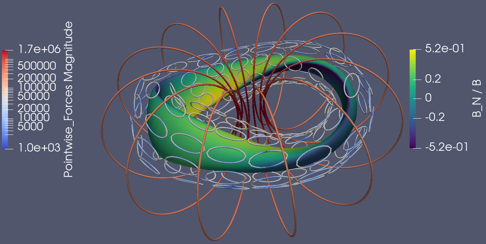
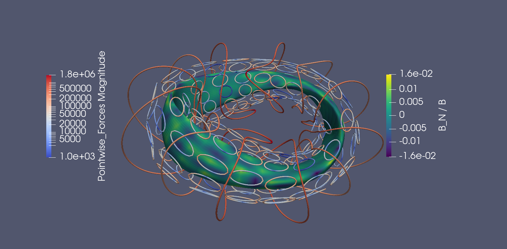
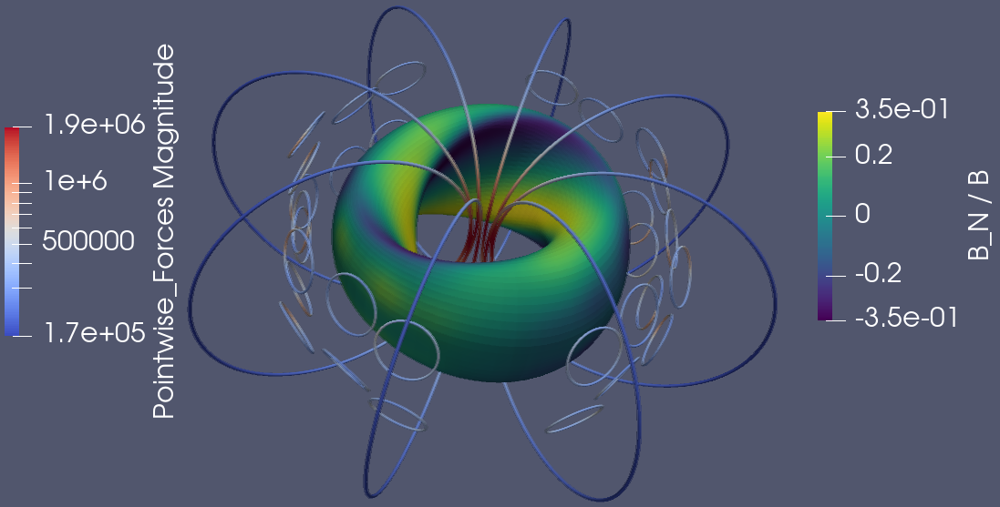
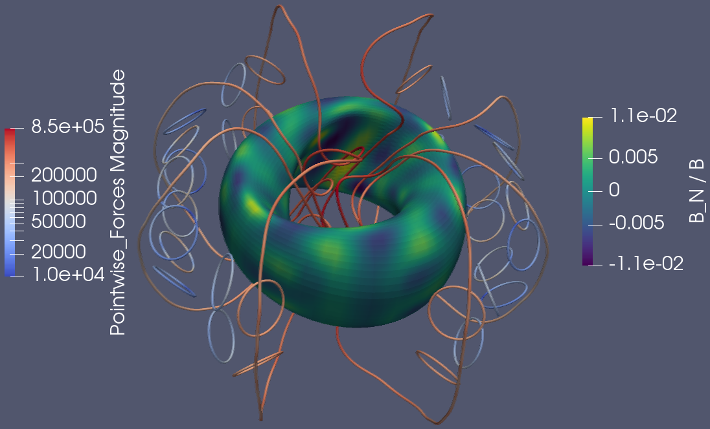
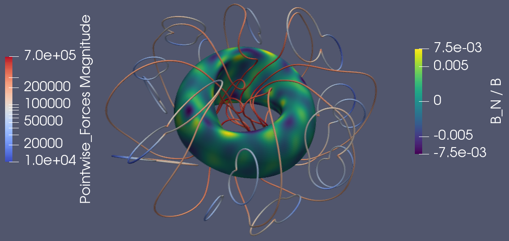

Dipole Array optimization
===============================================

In this tutorial it is shown how to perform stage-2 stellarator
optimization where we jointly optimize a set of modular toroidal field (TF)
coils and a typically larger set of dipole (window-pane) coils. The idea is primarily 
to reduce the complexity of the TF coils by using the dipole array. We also show
how forces and torques can be included in the optimization.

The approach employed here follows the work in two recent papers:

A. A. Kaptanoglu, A. Wiedman, J. Halpern, S. Hurwitz, E. J. Paul, and M. Landreman,
"Reactor-scale stellarators with force and torque minimized dipole coils,"
Nuclear Fusion 65, 046029 (2025).
https://iopscience.iop.org/article/10.1088/1741-4326/adc318/meta

A. A. Kaptanoglu, M. Landreman, and M. C. Zarnstorff, "Optimization of passive 
superconductors for shaping stellarator magnetic fields," Phys. Rev. E 111, 065202 (2025).
https://journals.aps.org/pre/abstract/10.1103/PhysRevE.111.065202

Both of these papers have corresponding Zenodo datasets:
https://zenodo.org/records/14934093
https://zenodo.org/records/15236238

We first describe the basic principles of "stage 2" optimization and how they are used in SIMSOPT, 
namely, how to set up the optimization problem in the minimal example 
``examples/3_Advanced/dipole_array_tutorial.py``. A more advanced tutorial 
can be found in the script 
``examples/3_Advanced/dipole_array_tutorial_advanced.py``.

.. _minimal_dipole_array_example:

Minimal dipole array example
-----------------------------------

A minimal objective function (cost function) for coil optimization is

.. math::

  J = \frac{1}{2} \int |(\vec{B}_{TF} + \vec{B}_{dipoles} + \vec{B}_{plasma}) \cdot \vec{n}|^2 ds

The objective represents the "quadratic flux", the area
integral over the target plasma surface of the square of the magnetic
field normal to the surface. If the magnets exactly produce a flux
surface of the target shape, this term will vanish. We will assume here that
:math:`B_{plasma} = 0` for simplicity. 

Notice that :math:`B_{TF}` must be nonzero.
This is because dipole coils cannot produce a net toroidal flux, i.e. 
cannot provide a free current through the torus hole, so that
application of Ampere's law along a toroidal curve gives zero. In other words, in
addition to the dipole coils, we still need a set of toroidal field (TF) coils to provide the net toroidal
flux in the stellarator. The goal of the dipole coils is primarily to reduce the 
geometrical complexity of the TF coils. 

We will optimize the Landreman and Paul two-field-period precise quasi-axisymmetric stellarator,
which is stellarator symmetric and scaled to roughly 5.7 Tesla on-axis. For simplicity, we will
ignore finite plasma currents in this configuration (which require a virtual casing call)
and assume that the configuration is in vacuum. The goal of the optimization is to 
find a set of dipole coils that decreases the complexity of the TF coils.

We will omit the normal details regarding stage-2 coil optimization 
(see the Coil Optimization tutorial for more details). We now focus on the dipole-array relevant parts. 

Generating base curves
------------------------

The purpose of this step is to **initialize dipole coils conformal to a winding surface**: a toroidal ``SurfaceRZFourier`` (usually the plasma boundary extended to a standoff vacuum vessel) that the windowpane dipoles are built to follow, rather than placing dipoles in free space.

:func:`~simsopt.util.generate_curves` takes that winding surface ``VV`` plus the plasma boundary ``surf``, and produces **half-field-period** base curves for the windowpane array (via ``generate_windowpane_array`` on ``VV``) and for TF coils (via ``generate_tf_array``, sized from ``surf``). The return pair ``(base_wp_curves, base_tf_curves)`` is then passed to ``coils_via_symmetries``. Optional VTK export and all tuning parameters are documented in the function docstring.

The minimal script builds ``VV`` and calls ``generate_curves`` as follows:

.. code-block::

  # create a vacuum vessel to place coils on with sufficient plasma-coil distance
  VV = SurfaceRZFourier.from_vmec_input(
      TEST_DIR / filename,
      quadpoints_phi=quadpoints_phi,
      quadpoints_theta=quadpoints_theta
  )
  VV.extend_via_projected_normal(1.75)  # extend the surface by 1.75 m
  base_wp_curves, base_tf_curves = generate_curves(s, VV, outdir=outdir)

We still need to initialize proper coils, rather than just the base curves.
First, we set the finite cross-section sizes (used for regularization when self-forces are included):

.. code-block:: python

  # wire cross section for the TF coils is a square 25 cm x 25 cm
  a = 0.25
  b = 0.25
  # wire cross section for the dipole coils should be at least 10 cm x 10 cm
  aa = 0.1
  bb = 0.1

Next, we define the total current in the TF coils and obtain all the symmetrized TF coils 
by ``coils_via_symmetries``::

  # Define the total current in the TF coils
  total_current = 70000000
  ncoils_TF = len(base_tf_curves)
  base_currents_TF = [(Current(total_current / ncoils_TF * 1e-7) * 1e7) for _ in range(ncoils_TF - 1)]
  total_current = Current(total_current)
  total_current.fix_all()
  base_currents_TF += [total_current - sum(base_currents_TF)]

  # Create the TF coils
  regularization_TF = regularization_rect(a, b)
  regularizations_TF = [regularization_TF for _ in range(ncoils_TF)]
  coils_TF = coils_via_symmetries(base_tf_curves, base_currents_TF, s.nfp, s.stellsym, regularizations=regularizations_TF)
  base_coils_TF = coils_TF[:ncoils_TF]
  curves_TF = [c.curve for c in coils_TF]

  # Create the TF BiotSavart object
  bs_TF = BiotSavart(coils_TF)

Finally, we do the same for the dipole coils. We also fix the spatial degrees of freedom 
of the dipole curve objects, so that they are not free to move around.

::

  # Fix the window pane curve dofs
  [c.fix_all() for c in base_wp_curves]

  # Initialize some dipole coil currents
  base_wp_currents = [Current(1.0) * 1e6 for i in range(ncoils)]

  # Create the dipole coils
  regularization_wp = regularization_rect(aa, bb)
  regularizations_wp = [regularization_wp for _ in range(ncoils)]
  coils = coils_via_symmetries(base_wp_curves, base_wp_currents, s.nfp, s.stellsym, regularizations=regularizations_wp)
  base_coils = coils[:ncoils]

  # Create the dipole BiotSavart object 
  bs = BiotSavart(coils)

  # Make a total BiotSavart object containing both the TF and dipole coils
  btot = bs + bs_TF

One can see that the forces on the TF coils are already beyond the typical material limits 
of ~ 1 MN/m. 

We now initialize the objective function. In ``dipole_array_tutorial.py`` it is a sum of
the following terms:

- The squared flux objective (main term)
- A quadratic penalty on the total length of the **TF** coils (relative to a target)
- A curve–curve distance term between **TF** coils only (via ``CurveCurveDistance`` on ``curves_TF``)

::

  # Define the individual terms in the objective function
  LENGTH_WEIGHT = Weight(0.01)
  CC_THRESHOLD = 0.8
  CC_WEIGHT = 1e2
  LENGTH_TARGET = 120
  Jf = SquaredFlux(s, btot)
  Jls_TF = [CurveLength(c) for c in base_tf_curves]
  Jlength = QuadraticPenalty(sum(Jls_TF), LENGTH_TARGET, "max")
  Jccdist = CurveCurveDistance(
      curves_TF, CC_THRESHOLD,
      num_basecurves=len(coils_TF)
  )
  JF = Jf \
      + CC_WEIGHT * Jccdist \
      + LENGTH_WEIGHT * Jlength

Optimization, logging, VTK export of the optimized surface, and optional Taylor tests are implemented in ``dipole_array_tutorial.py``.

The result is illustrated below (Paraview).

.. _advanced_dipole_array_example:

Advanced dipole array example
-----------------------------------

We will optimize the Schuett-Henneberg two-field-period precise quasi-axisymmetric stellarator,
which is stellarator symmetric and scaled to roughly 5.7 Tesla on-axis. For simplicity, we will
ignore the large finite plasma currents in this configuration (which require a virtual casing call)
and assume that the configuration is in vacuum. The goal of the optimization is to 
find a set of dipole coils that decreases the complexity of the TF coils.

The advanced script builds inner and outer toroidal surfaces by extending the plasma boundary; those surfaces bound the region where planar dipole coils are placed on a grid.

.. code-block::

  from pathlib import Path
  TEST_DIR = Path(__file__).parent / ".." / ".." / "tests" / "test_files"
  input_name = "wout_schuett_henneberg_nfp2_QA.nc"
  filename = TEST_DIR / input_name
  range_param = "half period"
  poff = 1.5
  coff = 3.0
  s = SurfaceRZFourier.from_wout(filename, range=range_param, nphi=nphi, ntheta=ntheta)
  s_inner = SurfaceRZFourier.from_wout(filename, range=range_param, nphi=nphi * 4, ntheta=ntheta * 4)
  s_outer = SurfaceRZFourier.from_wout(filename, range=range_param, nphi=nphi * 4, ntheta=ntheta * 4)
  s_inner.extend_via_normal(poff)
  s_outer.extend_via_normal(poff + coff)

We next set the initial toroidal field coils by calling a function that generates 
some plausible coils for a few predefined plasma configurations.

.. code-block::
  
  # initialize the coils
  regularization_TF = regularization_rect(a, b)
  base_curves_TF, curves_TF, coils_TF, currents_TF = initialize_coils(s, 'SchuettHennebergQAnfp2', regularization_TF)
  num_TF_unique_coils = len(base_curves_TF)
  base_coils_TF = coils_TF[:num_TF_unique_coils]
  currents_TF = np.array([coil.current.get_value() for coil in coils_TF])

  # Set up BiotSavart fields
  bs_TF = BiotSavart(coils_TF)

Next we initialize **planar** dipole coils on a uniform grid between ``s_inner`` and ``s_outer``.
In ``dipole_array_tutorial_advanced.py``, ``Nx``, ``Ny``, ``Nz`` set the grid size; ``order`` sets the
Fourier content of each planar coil. The script then drops inboard dipoles (``remove_inboard_dipoles``)
and dipoles that interlink TF coils (``remove_interlinking_dipoles_and_TFs``), aligns normals toward the
plasma (``align_dipoles_with_plasma``), and sets each coil’s orientation using **quaternion** DOFs
``q0``, ``qi``, ``qj``, ``qk`` (not the legacy ``x0``, ``x1``, … naming). Shape DOFs use ``rc(j)`` / ``rs(j)``;
centers use ``X``, ``Y``, ``Z``. Flags ``shape_fixed``, ``spatially_fixed``, and ``currents_fixed`` control
which of those are optimized.

The script builds ``eval_points = s.gamma().reshape(-1, 3)``, then either:

- **Active dipoles:** fixed currents or free ``Current`` objects, ``coils_via_symmetries``, ``btot = BiotSavart(coils) + bs_TF``, or
- **Passive dipoles:** a ``PSCArray`` couples dipole coils to the TF ``BiotSavart`` so induced currents are computed self-consistently; ``btot`` is taken from ``psc_array.biot_savart_total``.

One can see that the forces on the TF coils are already beyond the typical material limits 
of ~ 1 MN/m. Note that the dipole coils are all circular and on the outboard side of the plasma, and
facing the plasma surface. 

We now initialize the objective function. In ``dipole_array_tutorial_advanced.py`` it includes:

- Squared flux on the plasma surface
- Penalties on total TF length and (if dipole shapes are free) total dipole length
- Two coil–coil distance terms: a tighter threshold on **all** coils (``curves + curves_TF``) and a TF-only term
- Coil–surface clearance for **all** coils relative to the plasma (``CurveSurfaceDistance(curves + curves_TF, ...)``)
- Linking number between **all** coils
- TF curvature and mean-squared-curvature penalties
- Optional ``LpCurveForce`` / ``SquaredMeanForce`` / torque objectives. In the script, ``FORCE_WEIGHT = 1e-6`` turns on ``LpCurveForce``.

::

  # Define the objective function weights (see script for exact numbers)
  LENGTH_WEIGHT = Weight(0.01)
  LENGTH_WEIGHT2 = Weight(0.01)
  LENGTH_TARGET = 85
  LINK_WEIGHT = 1e4
  CC_THRESHOLD = 0.8
  CC_WEIGHT = 1e2
  CS_THRESHOLD = 1.3
  CS_WEIGHT = 1e1

  Jf = SquaredFlux(s, btot)
  Jls = [CurveLength(c) for c in base_curves]
  Jls_TF = [CurveLength(c) for c in base_curves_TF]
  Jlength = QuadraticPenalty(sum(Jls_TF), LENGTH_TARGET, "max")
  Jlength2 = QuadraticPenalty(sum(Jls), LENGTH_TARGET, "max")

  Jccdist = CurveCurveDistance(curves + curves_TF, CC_THRESHOLD / 2.0, num_basecurves=len(allcoils))
  Jccdist2 = CurveCurveDistance(curves_TF, CC_THRESHOLD, num_basecurves=len(coils_TF))
  Jcsdist = CurveSurfaceDistance(curves + curves_TF, s, CS_THRESHOLD)
  linkNum = LinkingNumber(curves + curves_TF, downsample=2)

  CURVATURE_THRESHOLD = 0.5
  MSC_THRESHOLD = 0.05
  CURVATURE_WEIGHT = 1e-2
  MSC_WEIGHT = 1e-1
  Jcs = [LpCurveCurvature(c.curve, 2, CURVATURE_THRESHOLD) for c in base_coils_TF]
  Jmscs = [MeanSquaredCurvature(c.curve) for c in base_coils_TF]

  FORCE_WEIGHT = 1e-6
  FORCE_WEIGHT2 = 0.0
  TORQUE_WEIGHT = 0.0
  TORQUE_WEIGHT2 = 0.0

  # source_coils_coarse are for coils that do not have many quadrature points.
  # source_coils_fine are for coils that have many quadrature points.
  # target_coils must all have the same number of quadrature points, so need to split up the coils into two sets.
  Jforce = LpCurveForce(base_coils_TF, source_coils_coarse=coils, source_coils_fine=coils_TF, downsample=2) \
    + LpCurveForce(base_coils, source_coils_coarse=coils, source_coils_fine=coils_TF, downsample=2)
  Jforce2 = SquaredMeanForce(base_coils_TF, source_coils_coarse=coils, source_coils_fine=coils_TF, downsample=2) \
    + SquaredMeanForce(base_coils, source_coils_coarse=coils, source_coils_fine=coils_TF, downsample=2)
  Jtorque = LpCurveTorque(base_coils_TF, source_coils_coarse=coils, source_coils_fine=coils_TF, downsample=2) \
    + LpCurveTorque(base_coils, source_coils_coarse=coils, source_coils_fine=coils_TF, downsample=2)
  Jtorque2 = SquaredMeanTorque(base_coils_TF, source_coils_coarse=coils, source_coils_fine=coils_TF, downsample=2) \
    + SquaredMeanTorque(base_coils, source_coils_coarse=coils, source_coils_fine=coils_TF, downsample=2)

  # Define the overall objective function
  JF = Jf \
      + CC_WEIGHT * Jccdist \
      + CC_WEIGHT * Jccdist2 \
      + CS_WEIGHT * Jcsdist \
      + CURVATURE_WEIGHT * sum(Jcs) \
      + MSC_WEIGHT * sum(QuadraticPenalty(J, MSC_THRESHOLD, "max") for J in Jmscs) \
      + LINK_WEIGHT * linkNum \
      + LENGTH_WEIGHT * Jlength

  # If dipole shapes can change, penalize the total length of the dipole coils
  if not shape_fixed:
      JF += LENGTH_WEIGHT2 * Jlength2

  # If force or torque terms are nonzero, add them to the objective function
  if FORCE_WEIGHT > 0.0:
      JF += FORCE_WEIGHT * Jforce

  if FORCE_WEIGHT2 > 0.0:
      JF += FORCE_WEIGHT2 * Jforce2

  if TORQUE_WEIGHT > 0.0:
      JF += TORQUE_WEIGHT * Jtorque

  if TORQUE_WEIGHT2 > 0.0:
      JF += TORQUE_WEIGHT2 * Jtorque2

The script passes the assembled objectives and weights into :func:`~simsopt.util.dipole_array_optimization_function` for use with ``scipy.optimize.minimize`` (L-BFGS-B): that wrapper evaluates ``JF``, applies optional logging/penalties, and handles passive-coil recomputation when a ``PSCArray`` is present. See ``dipole_array_tutorial_advanced.py`` for ``obj_dict`` / ``weight_dict`` construction, ``minimize`` options, ``save_coil_sets``, and VTK export of ``B_N`` and ``B_N / B``.

The optimized configuration is illustrated below (Paraview).

Passive coil array optimization
-------------------------------------------

Passive superconducting coils that are cooled into the superconducting state before the TF coils are energized
will have induced currents that maintain zero magnetic flux through the loop. This is a way to generate
MA-scale dipole coils without energizing them.

For passive dipole arrays, the script uses ``PSCArray`` so induced
currents in passive conductors are consistent with the TF field. The dipole geometry and screening setup match
the active case, but the **active** branch that creates ``Current`` objects and ``BiotSavart(coils)`` is skipped.

The PSCArray block in the script matches the following structure:

::

  # Initialize the PSCArray object
  ncoils = len(base_curves)
  a_list = np.ones(len(base_curves)) * aa
  b_list = np.ones(len(base_curves)) * aa
  psc_array = PSCArray(base_curves, coils_TF, eval_points, a_list, b_list, nfp=s.nfp, stellsym=s.stellsym)

  calculate_modB_on_major_radius(psc_array.biot_savart_TF, s)
  psc_array.biot_savart_TF.set_points(eval_points)
  btot = psc_array.biot_savart_total
  calculate_modB_on_major_radius(btot, s)
  coils = psc_array.coils
  base_coils = coils[:ncoils]

Dipole currents are then **not** independent DOFs; the same objective wrapper and ``minimize`` call apply
(with ``psc_array`` passed through). ``currents_fixed`` applies only to the active branch.

Example parameters used when discussing the passive run (see script):

.. code-block:: text

  FORCE_WEIGHT = 1e-6
  shape_fixed = False
  order = 2
  coff = 3.0
  nphi = 32
  ntheta = 32

After optimization, we obtain a result similar to the following in Paraview.

The max solution errors are actually a bit better than the active dipole array, and the forces on the TF coils are
very similar. The passive array solution has managed to outperform the active array solution by using the fact 
that the optimization gives a lot of leeway for the dipole coils to get larger. Larger dipole coil size
increases the size of the induced currents in the passive coils.
