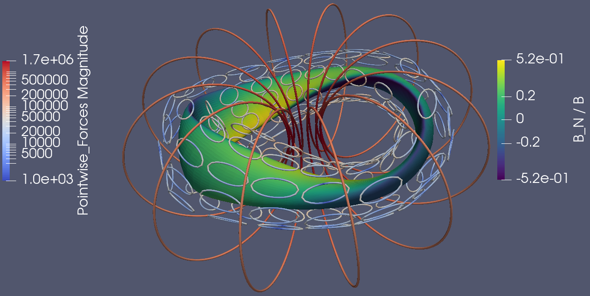

Dipole Array optimization
===============================================

In this tutorial it is shown how to perform stage-2 stellarator
optimization where we jointly optimize a set of modular toroidal field (TF)
coils and a typically larger set of dipole (window-pane) coils. The idea is primarily 
to reduce the complexity of the TF coils by using the dipole array. We also show
how forces and torques can be included in the optimization.

The approach employed here follows the work in two recent papers: `Reactor-scale stellarators with force and torque minimized dipole coils
<https://arxiv.org/abs/2412.13937>`__ and `Optimization of passive superconductors for shaping stellarator magnetic fields
<https://arxiv.org/abs/2501.12468>`__.

Both of these papers have corresponding Zenodo datasets:
https://zenodo.org/records/14934093
https://zenodo.org/records/15236238

We first describe the basic principles of "stage 2" optimization and how they are used in SIMSOPT, 
namely, how to set up the optimization problem in the minimal example 
``examples/3_Advanced/dipole_array_tutorial.py``. A more advanced tutorial 
can be found in the script 
``examples/3_Advanced/dipole_array_tutorial_advanced.py``.
Advanced scripts for dipole array optimization can be found in the following folders:

- Many more examples on dipole array optimization can be found in
  ``examples/3_Advanced/dipole_coil_optimization/``.
- Many more examples on passive dipole array optimization can be found in
  ``examples/3_Advanced/passive_coil_optimization/``.
- Files for performing a large-scale scan of coil optimization (to run 1000's of coil optimizations)
  can be found in
  ``examples/3_Advanced/coil_force_optimization/``.

.. _minimal_dipole_array_example:

Minimal dipole array example
-----------------------------------

A minimal objective function (cost function) for coil optimization is

.. math::

  J = \frac{1}{2} \int |(\vec{B}_{TF} + \vec{B}_{dipoles} + \vec{B}_{plasma}) \cdot \vec{n}|^2 ds

The objective represents the "quadratic flux", the area
integral over the target plasma surface of the square of the magnetic
field normal to the surface. If the magnets exactly produce a flux
surface of the target shape, this term will vanish. We will assume here that
:math:`B_{plasma} = 0` for simplicity. 

Notice that, unlike in normal stage-2 coil optimization, :math:`B_{TF}` must be nonzero.
This is because dipole coils cannot produce a net toroidal flux, i.e. 
cannot provide a free current through the torus hole, so that
application of Ampere's law along a toroidal curve gives zero. In other words, in
addition to the dipole coils, we still need a set of toroidal field (TF) coils to provide the net toroidal
flux in the stellarator. The goal of the dipole coils is primarily to reduce the 
geometrical complexity of the TF coils. 

We will optimize the Landreman and Paul two-field-period precise quasi-axisymmetric stellarator,
which is stellarator symmetric and scaled to roughly 5.7 Tesla on-axis. For simplicity, we will
ignore finite plasma currents in this configuration (which require a virtual casing call)
and assume that the configuration is in vacuum. The goal of the optimization is to 
find a set of dipole coils that decreases the complexity of the TF coils.

To solve this optimization problem in simsopt, we first import the necessary classes::
  
  from simsopt.field import BiotSavart
  from simsopt.geo import SurfaceRZFourier
  from simsopt.objectives import Weight, SquaredFlux, QuadraticPenalty

The target plasma surface is given in the wout input file ``tests/test_files/input.LandremanPaul2021_QA_reactorScale_lowres``.
We load the surface with low-resolution using:

.. code-block::

  nphi = 16
  ntheta = 16
  filename = "tests/test_files/input.LandremanPaul2021_QA_reactorScale_lowres"
  s = SurfaceRZFourier.from_vmec_input(filename, range="half period", nphi=nphi, ntheta=ntheta)

You can adjust the directory in ``"filename"`` as appropriate for your
system. As surface objects carry a grid of "quadrature points" at
which the position vector is evaluated we may want these points to
cover different ranges of the toroidal angle. For this problem with
stellarator symmetry and field-period symmetry, we need only consider
half of a field period in order to evaluate integrals over the entire
surface. For this reason, the ``range`` parameter of the surface is
set to ``"half period"`` here. Possible options in general are ``"full
torus"``, ``"field period"`` and ``"half period"``, but ``"half
period"`` is significantly more efficient than the other options for
this problem. The nphi and ntheta parameters should be ~ 64 or so for a high-resolution run.

We will now omit more of these normal details regarding stage-2 coil optimization 
(see the Coil Optimization tutorial for more details). We now focus on the dipole-array relevant parts. 

We next set the initial curves for the coils. There is a predefined function
that sets up the TF curves and the dipole curves, given a "winding surface" where 
the dipole coil center locations are constrained to lie on. 

.. code-block::

  # create a vacuum vessel to place coils on with sufficient plasma-coil distance
  VV = SurfaceRZFourier.from_vmec_input(
      TEST_DIR / filename,
      quadpoints_phi=quadpoints_phi,
      quadpoints_theta=quadpoints_theta
  )
  VV.extend_via_projected_normal(1.75)  # extend the surface by 1.75 m
  base_wp_curves, base_tf_curves = generate_curves(s, VV, outdir=outdir)

We still need to initialize proper coils, rather than just the base curves.
First, we initialize some values for the finite cross-section of the coils 
and the number of wire turns, for the purposes of calculating the forces at the end::

  # wire cross section for the TF coils is a square 25 cm x 25 cm
  # Only need this if make self forces and B2Energy nonzero in the objective!
  a = 0.25
  b = 0.25
  nturns = 100
  nturns_TF = 200

  # wire cross section for the dipole coils should be at least 10 cm x 10 cm
  aa = 0.1
  bb = 0.1

Next, we define the total current in the TF coils and obtain all the symmetrized TF coils 
by ``coils_via_symmetries``::

  # Define the total current in the TF coils
  total_current = 70000000
  ncoils_TF = len(base_tf_curves)
  base_currents_TF = [(Current(total_current / ncoils_TF * 1e-7) * 1e7) for _ in range(ncoils_TF - 1)]
  total_current = Current(total_current)
  total_current.fix_all()
  base_currents_TF += [total_current - sum(base_currents_TF)]

  # Create the TF coils
  coils_TF = coils_via_symmetries(base_tf_curves, base_currents_TF, s.nfp, True)
  base_coils_TF = coils_TF[:ncoils_TF]
  curves_TF = [c.curve for c in coils_TF]

  # Create the TF BiotSavart object
  bs_TF = BiotSavart(coils_TF)

Finally, we do the same for the dipole coils. We also fix the spatial degrees of freedom 
of the dipole curve objects, so that they are not free to move around.::

  # Fix the window pane curve dofs
  [c.fix_all() for c in base_wp_curves]

  # Initialize some dipole coil currents
  base_wp_currents = [Current(1.0) * 1e6 for i in range(ncoils)]

  # Create the dipole coils
  coils = coils_via_symmetries(base_wp_curves, base_wp_currents, s.nfp, True)
  base_coils = coils[:ncoils]

  # Create the dipole BiotSavart object 
  bs = BiotSavart(coils)

  # Make a total BiotSavart object containing both the TF and dipole coils
  btot = bs + bs_TF

The initial coils and plasma surface are plotted in vtk files, which can be viewed in Paraview.
One can see that the forces on the TF coils are already beyond the typical material limits 
of ~ 1 MN/m. 

We now initialize the objective function. The objective function is a sum of
the following terms:

- The squared flux objective, which is the main objective function
- The curve length objective, which penalizes the length of the TF coils
- The curve-curve distance objective, which penalizes the distance between all pairs of coils

::

  # Define the individual terms in the objective function
  LENGTH_WEIGHT = Weight(0.01)
  CC_THRESHOLD = 0.8
  CC_WEIGHT = 1e2
  LENGTH_TARGET = 120
  Jf = SquaredFlux(s, btot)
  Jls_TF = [CurveLength(c) for c in base_tf_curves]
  Jlength = QuadraticPenalty(sum(Jls_TF), LENGTH_TARGET, "max")
  Jccdist = CurveCurveDistance(
      curves_TF, CC_THRESHOLD, 
      num_basecurves=len(coils_TF)
  )  # Only penalizing the TF coil-coil distances
  JF = Jf \
      + CC_WEIGHT * Jccdist \
      + LENGTH_WEIGHT * Jlength

We define a function that returns the objective value and gradient,
through the following definition, which also allows us to print 
out the progress::

  def fun(dofs):
    JF.x = dofs
    J = JF.J()
    grad = JF.dJ()
    jf = Jf.J()
    length_val = LENGTH_WEIGHT.value * Jlength.J()
    cc_val = CC_WEIGHT * Jccdist.J()
    BdotN_over_B = np.mean(np.abs(np.sum(btot.B().reshape((nphi, ntheta, 3)) * s.unitnormal(), axis=2))
                            ) / np.mean(btot.AbsB())
    outstr = f"J={J:.1e}, Jf={jf:.1e}, ⟨B·n⟩/⟨B⟩={BdotN_over_B:.1e}"
    valuestr = f"J={J:.2e}, Jf={jf:.2e}"
    cl_string = ", ".join([f"{J.J():.1f}" for J in Jls_TF])
    outstr += f", Len=sum([{cl_string}])={sum(J.J() for J in Jls_TF):.2f}"
    valuestr += f", LenObj={length_val:.2e}"
    valuestr += f", ccObj={cc_val:.2e}"
    outstr += f", C-C-Sep={Jccdist.shortest_distance():.2f}"
    outstr += f", ║∇J║={np.linalg.norm(grad):.1e}"
    print(outstr)
    print(valuestr)
    return J, grad

Finally, we can optimize the coils using the L-BFGS-B algorithm.::
  
  MAXITER = 1000
  # Run the optimization
  res = minimize(fun, dofs, jac=True, method='L-BFGS-B',
                  options={'maxiter': MAXITER, 'maxcor': 500}, tol=1e-10)

  # Save the final coils
  save_coil_sets(btot, outdir, "_optimized")
  pointData = {
      "B_N / B": (np.sum(btot.B().reshape((qphi, qtheta, 3)) * n_plot, axis=2
                          ) / np.linalg.norm(btot.B().reshape(qphi, qtheta, 3), axis=-1))[:, :, None]}
  s_plot.to_vtk(outdir + "surf_optimized", extra_data=pointData)

which produces the following final results in Paraview.

.. _advanced_dipole_array_example:

Advanced dipole array example
-----------------------------------

We will optimize the Schuett-Henneberg two-field-period precise quasi-axisymmetric stellarator,
which is stellarator symmetric and scaled to roughly 5.7 Tesla on-axis. For simplicity, we will
ignore the large finite plasma currents in this configuration (which require a virtual casing call)
and assume that the configuration is in vacuum. The goal of the optimization is to 
find a set of dipole coils that decreases the complexity of the TF coils.

To solve this optimization problem in simsopt, we first import the necessary classes. There is quite 
a bit more functionality to import, since we need additional functions to compute the forces 
and torques and many other terms in the objective function we will eventually construct::
  
  from simsopt.field import BiotSavart, Current, coils_via_symmetries, regularization_rect
  from simsopt.util import calculate_modB_on_major_radius, remove_inboard_dipoles, \
      remove_interlinking_dipoles_and_TFs, initialize_coils, \
      dipole_array_optimization_function, save_coil_sets
  from simsopt.geo import (
      CurveLength, CurveCurveDistance,
      MeanSquaredCurvature, LpCurveCurvature, CurveSurfaceDistance, LinkingNumber,
      SurfaceRZFourier, create_planar_curves_between_two_toroidal_surfaces
  )
  from simsopt.objectives import Weight, SquaredFlux, QuadraticPenalty
  from simsopt.field.force import LpCurveForce, SquaredMeanForce, \
      SquaredMeanTorque, LpCurveTorque

The target plasma surface is given in the wout input file ``tests/test_files/input.SchuettHennebergQAnfp2``.
We load the surface with medium-resolution. We also initialize inner and outer toroidal surfaces 
by extending the plasma surface. The inner and outer surfaces are used to define 
a uniform grid between the inner and outer surfaces, which is used to initialize the 
dipole coils.

.. code-block::

  nphi = 32
  ntheta = 32
  filename = "tests/test_files/input.SchuettHennebergQAnfp2"
  s = SurfaceRZFourier.from_vmec_input(filename, range="half period", nphi=nphi, ntheta=ntheta)

  # Initialize s_inner and s_outer toroidal surfaces by extending the plasma surface
  poff = 1.5
  coff = 1.5
  s_inner = SurfaceRZFourier.from_vmec_input(
    filename, range=range_param, nphi=nphi * 4, ntheta=ntheta * 4)
  s_outer = SurfaceRZFourier.from_vmec_input(
    filename, range=range_param, nphi=nphi * 4, ntheta=ntheta * 4)
  s_inner.extend_via_normal(poff)
  s_outer.extend_via_normal(poff + coff)

We now initialize some values for the finite cross-section of the coils 
and the number of wire turns, for the purposes of calculating the forces at the end::

  # wire cross section for the TF coils is a square 25 cm x 25 cm
  # Only need this if make self forces and B2Energy nonzero in the objective!
  a = 0.2
  b = 0.2
  nturns = 100
  nturns_TF = 200

  # wire cross section for the dipole coils should be at least 10 cm x 10 cm
  aa = 0.1
  bb = 0.1

We next set the initial toroidal field coils by calling a function that generates 
some plausible coils for a few predefined plasma configurations.

.. code-block::
  
  # initialize the coils
  base_curves_TF, curves_TF, coils_TF, currents_TF = initialize_coils(s, TEST_DIR, 'SchuettHennebergQAnfp2')
  num_TF_unique_coils = len(base_curves_TF)
  base_coils_TF = coils_TF[:num_TF_unique_coils]
  currents_TF = np.array([coil.current.get_value() for coil in coils_TF])

  # Set up BiotSavart fields
  bs_TF = BiotSavart(coils_TF)

Next we initialize planar dipole coils in the array by initializing them with centers on a uniform grid 
defined between an inner and outer toroidal surface. ``Nx`` controls the resolution on this grid,
``order`` controls the maximum Fourier mode in the representation of the planar coils. Given that grid,
we then go through and remove any unwanted dipole coils. For this very compact plasma configuration,
we remove any dipole coils that are on the inboard side of the plasma. We also remove any dipole coils
that are interlinked with the TF coils. Lastly, we optionally fix the shape and spatial degrees of freedom
of the dipole coils. In this case, we let the dipole coil centers and orientations change, but the shapes
of the coils are fixed. The dipole currents can also change. 
Note that nothing
about this script requires that the dipole coils are planar, or that the dipole coils are fixed::

  # Number of Fourier modes describing each Cartesian component of each coil:
  order = 0

  # Whether to fix the shapes, spatial locations/orientations, and currents of the dipole coils
  shape_fixed = True
  spatially_fixed = False
  currents_fixed = False

  # Create the initial dipole coils:
  Nx = 4
  Ny = Nx
  Nz = Nx
  base_curves, all_curves = create_planar_curves_between_two_toroidal_surfaces(
      s, s_inner, s_outer, Nx, Ny, Nz, order=order,
  )

  # Remove dipoles that are on the inboard side, since this plasma is very compact.
  base_curves = remove_inboard_dipoles(s, base_curves)

  # Remove dipoles that are initialized interlinked with the TF coils.
  base_curves = remove_interlinking_dipoles_and_TFs(base_curves, base_curves_TF)

  # Get the angles of the dipole coils corresponding to their normal vectors
  # being aligned to point towards the nearest point on the plasma surface
  alphas, deltas = align_dipoles_with_plasma(s, base_curves)

  # print out total number of dipole coils remaining
  ncoils = len(base_curves)
  print('Ncoils = ', ncoils)

  # Fix the dipole coil locations, shapes, and orientations, so that
  # only degree of freedom for each dipole is how much current it has
  for i in range(len(base_curves)):
      
      # Set curve orientations to be aligned with the plasma surface
      alpha2 = alphas[i] / 2.0
      delta2 = deltas[i] / 2.0
      calpha2 = np.cos(alpha2)
      salpha2 = np.sin(alpha2)
      cdelta2 = np.cos(delta2)
      sdelta2 = np.sin(delta2)
      base_curves[i].set('x' + str(2 * order + 1), calpha2 * cdelta2)
      base_curves[i].set('x' + str(2 * order + 2), salpha2 * cdelta2)
      base_curves[i].set('x' + str(2 * order + 3), calpha2 * sdelta2)
      base_curves[i].set('x' + str(2 * order + 4), -salpha2 * sdelta2)

      if shape_fixed:
          # Fix shape of each coil
          for j in range(2 * order + 1):
              base_curves[i].fix('x' + str(j))

      if spatially_fixed:
          # Fix the orientation of each coil
          base_curves[i].fix('x' + str(2 * order + 2))
          base_curves[i].fix('x' + str(2 * order + 3))
          base_curves[i].fix('x' + str(2 * order + 4))
          # Fix center points of each coil
          base_curves[i].fix('x' + str(2 * order + 5))
          base_curves[i].fix('x' + str(2 * order + 6))
          base_curves[i].fix('x' + str(2 * order + 7))

  # Set the initial currents in the dipole coils
  base_currents = [Current(1.0) * 1e7 for i in range(ncoils)]
  if currents_fixed:
      [c.fix_all() for c in base_currents]

  # Create the dipole coils and the BiotSavart object
  coils = coils_via_symmetries(base_curves, base_currents, s.nfp, True)
  base_coils = coils[:ncoils]
  bs = BiotSavart(coils)
  
  # Create the total Bfield object from both the TF and dipole coils
  btot = bs + bs_TF
  btot.set_points(s.gamma().reshape((-1, 3)))
  curves = [c.curve for c in coils]
  currents = [c.current.get_value() for c in coils]

The initial coils and plasma surface are plotted in vtk files, which can be viewed in Paraview.
One can see that the forces on the TF coils are already beyond the typical material limits 
of ~ 1 MN/m. Note that the dipole coils are all circular and on the outboard side of the plasma, and
facing the plasma surface. 

.. image:: AdvancedDipoleArrayInitial.png
   :width: 600 

We now initialize the objective function. The objective function is a sum of
the following terms:

- The squared flux objective, which is the main objective function
- The curve length objective, which penalizes the length of the TF coils
- The curve-curve distance objective, which penalizes the distance between TF coils
- Another curve-curve distance objective, which more weakly penalizes the distance between all pairs of coils
- The linking number objective, which penalizes the linking number between all pairs of coils.
- The curve-surface distance objective, which penalizes the distance between the TF coils and the plasma surface (the dipole coils are spatially fixed, so they cannot move around)
- The curvature objective, which penalizes the curvature of the TF coils (again the dipole coils are spatially fixed)
- The mean squared curvature objective, which penalizes the mean squared curvature of the TF coils
- The force and torque objectives, which penalize the forces and torques on the coils. This can be the pointwise forces along the coil or the net force on the coil.

::

  # Define the objective function weights
  LENGTH_WEIGHT = Weight(0.01)
  LENGTH_WEIGHT2 = Weight(0.01)
  LENGTH_TARGET = 85  # Target length of the TF coils
  LINK_WEIGHT = 1e4   # Very large weight of the linking number term to avoid interlinking
  CC_THRESHOLD = 1.0  # 1m threshold for the coil-coil distance term
  CC_WEIGHT = 1e2
  CS_THRESHOLD = 1.5  # 1.5m threshold for the coil-surface distance term
  CS_WEIGHT = 1e1

  # Define the individual terms objective function:
  Jf = SquaredFlux(s, btot)
  Jls = [CurveLength(c) for c in base_curves]
  Jls_TF = [CurveLength(c) for c in base_curves_TF]
  Jlength = QuadraticPenalty(sum(Jls_TF), LENGTH_TARGET, "max")
  Jlength2 = QuadraticPenalty(sum(Jls), LENGTH_TARGET, "max")

  # coil-coil distances between just TF coils, or between all coils
  Jccdist = CurveCurveDistance(curves + curves_TF, CC_THRESHOLD / 2.0, num_basecurves=len(allcoils))
  Jccdist2 = CurveCurveDistance(curves_TF, CC_THRESHOLD, num_basecurves=len(coils_TF))

  # coil-surface distance for the TF coils, since the dipole coils are fixed
  Jcsdist = CurveSurfaceDistance(curves_TF, s, CS_THRESHOLD)

  # While the coil array is not moving around, two dipole coils cannot interlink.
  linkNum = LinkingNumber(curves + curves_TF, downsample=2)

  # Curvature terms on the TF coils
  CURVATURE_THRESHOLD = 0.5
  MSC_THRESHOLD = 0.05
  CURVATURE_WEIGHT = 1e-2
  MSC_WEIGHT = 1e-1
  Jcs = [LpCurveCurvature(c.curve, 2, CURVATURE_THRESHOLD) for c in base_coils_TF]
  Jmscs = [MeanSquaredCurvature(c.curve) for c in base_coils_TF]

  # Force and torque terms
  all_coils = coils + coils_TF
  all_base_coils = base_coils + base_coils_TF
  FORCE_WEIGHT = 0.0
  FORCE_WEIGHT2 = 0.0
  TORQUE_WEIGHT = 0.0
  TORQUE_WEIGHT2 = 0.0
  regularization_list = [regularization_rect(aa, bb) for i in range(len(base_coils))] + \
        [regularization_rect(a, b) for i in range(len(base_coils_TF))]
  # Only compute the force and torque on the unique set of coils, otherwise
  # you are doing too much work. Also downsample the coil quadrature points
  # by a factor of 2 to save compute.
  Jforce = LpCurveForce(all_base_coils, all_coils, regularization_list, downsample=2)
  Jforce2 = SquaredMeanForce(all_base_coils, all_coils, downsample=2)
  Jtorque = LpCurveTorque(all_base_coils, all_coils, regularization_list, downsample=2)
  Jtorque2 = SquaredMeanTorque(all_base_coils, all_coils, downsample=2)

  # Define the overall objective function
  JF = Jf \
      + CC_WEIGHT * Jccdist \
      + CC_WEIGHT * Jccdist2 \
      + CS_WEIGHT * Jcsdist \
      + CURVATURE_WEIGHT * sum(Jcs) \
      + MSC_WEIGHT * sum(QuadraticPenalty(J, MSC_THRESHOLD, "max") for J in Jmscs) \
      + LINK_WEIGHT * linkNum \
      + LENGTH_WEIGHT * Jlength

  # If dipole shapes can change, penalize the total length of the dipole coils
  if not shape_fixed:
      JF += LENGTH_WEIGHT2 * Jlength2

  # If force or torque terms are nonzero, add them to the objective function
  if FORCE_WEIGHT > 0.0:
      JF += FORCE_WEIGHT * Jforce

  if FORCE_WEIGHT2 > 0.0:
      JF += FORCE_WEIGHT2 * Jforce2

  if TORQUE_WEIGHT > 0.0:
      JF += TORQUE_WEIGHT * Jtorque

  if TORQUE_WEIGHT2 > 0.0:
      JF += TORQUE_WEIGHT2 * Jtorque2

Finally, we can optimize the coils using the L-BFGS-B algorithm and a predefined function call that takes 
all the weights and objective terms::
  
  # Define dictionary of objectives and weights to pass to dipole array optimization wrapper
  obj_dict = {
    "JF": JF,
    "Jf": Jf,
    "Jlength": Jlength,
    "Jlength2": Jlength2,
    "Jls": Jls,
    "Jls_TF": Jls_TF,
    "Jcs": Jcs,
    "Jmscs": Jmscs,
    "Jccdist": Jccdist,
    "Jccdist2": Jccdist2,
    "Jcsdist": Jcsdist,
    "linkNum": linkNum,
    "Jforce": Jforce,
    "Jforce2": Jforce2,
    "Jtorque": Jtorque,
    "Jtorque2": Jtorque2,
    "btot": btot,
    "s": s,
    "base_curves_TF": base_curves_TF,
  }
  weight_dict = {
      "length_weight": LENGTH_WEIGHT.value,
      "curvature_weight": CURVATURE_WEIGHT,
      "msc_weight": MSC_WEIGHT,
      "msc_threshold": MSC_THRESHOLD,
      "cc_weight": CC_WEIGHT,
      "cs_weight": CS_WEIGHT,
      "link_weight": LINK_WEIGHT,
      "force_weight": FORCE_WEIGHT,
      "torque_weight": TORQUE_WEIGHT,
      "net_force_weight": FORCE_WEIGHT2,
      "net_torque_weight": TORQUE_WEIGHT2,
  }

  # Run the optimization
  dofs = JF.x
  MAXITER = 500
  res = minimize(dipole_array_optimization_function, dofs, args=(obj_dict, weight_dict), jac=True, method='L-BFGS-B',
                options={'maxiter': MAXITER, 'maxcor': 1000}, tol=1e-20)

  # Save the optimized dipole and TF coils
  save_coil_sets(btot, OUT_DIR, "_optimized")
  pointData = {"B_N / B": (np.sum(btot.B().reshape((qphi, qtheta, 3)) * s_plot.unitnormal(), axis=2
                                  ) / np.linalg.norm(btot.B().reshape(qphi, qtheta, 3), axis=-1))[:, :, None]}
  s_plot.to_vtk(OUT_DIR + "surf_optimized", extra_data=pointData)

which produces the following final results in Paraview.

.. image:: AdvancedDipoleArrayFinal.png
   :width: 600 

We can see that the forces are right at the material tolerances. 
We now reoptimize, changing some parameters listed below to improve the forces and the accuracy of the solution::

  FORCE_WEIGHT = 1e-18
  shape_fixed = False
  order = 2
  coff = 3.0
  nphi = 64
  ntheta = 64

which produces a solution with comparable solution accuracy, but lower forces and using fewer dipoles.
Moreover, one of the dipole coils is providing very little current, so it could be removed before another 
round of optimization.

.. image:: ModifiedDipoleArrayFinal.png
   :width: 600 

Passive coil array optimization
-------------------------------------------
In this tutorial, we repeat the previous example, but we use a passive coil array, where the currents 
in the dipole coils are induced by the TF coils. This requires a lot of complicated changes in the optimization,
but we have hidden this from the user interface. So only a few minor changes are needed to switch out 
active dipole coils for passive dipole coils in this script, and they can be turned on by flipping the flag 
``passive_coil_array`` to ``True``. The dipole coil array is initialized in exactly the same way. 
The primary change is that a PSCArray object is called for initializing the passive dipole coils
with self-consistently calculated currents at the beginning::

  # Initialize the PSCArray object
  ncoils = len(base_curves)
  a_list = np.ones(len(base_curves)) * aa
  b_list = np.ones(len(base_curves)) * aa
  psc_array = PSCArray(base_curves, coils_TF, eval_points, a_list, b_list, nfp=s.nfp, stellsym=s.stellsym)

  # Calculate average, approximate on-axis B field strength
  calculate_modB_on_major_radius(psc_array.biot_savart_TF, s)
  psc_array.biot_savart_TF.set_points(eval_points)
  btot = psc_array.biot_savart_total
  calculate_modB_on_major_radius(btot, s)
  coils = psc_array.coils
  base_coils = coils[:ncoils]

Note lastly that the whole point is that the currents in the dipole coils are not degrees of freedom in the optimization,
but are instead calculated self-consistently. So ``currents_fixed`` is no longer used as a flag. We use the parameters::

  FORCE_WEIGHT = 1e-18
  shape_fixed = False
  order = 2
  coff = 3.0
  nphi = 32
  ntheta = 32

After optimization, we obtain the following result in Paraview.

.. image:: PassiveArrayFinal.png
   :width: 600 

The max solution errors are actually a bit better than the active dipole array, and the forces on the TF coils are
very similar. The passive array solution has managed to outperform the active array solution by using the fact 
that the optimization gives a lot of leeway for the dipole coils to get larger. Larger dipole coil size
increases the size of the induced currents in the passive coils. 
