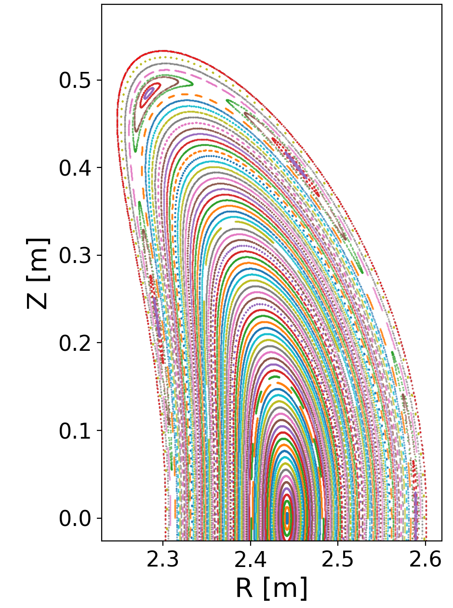
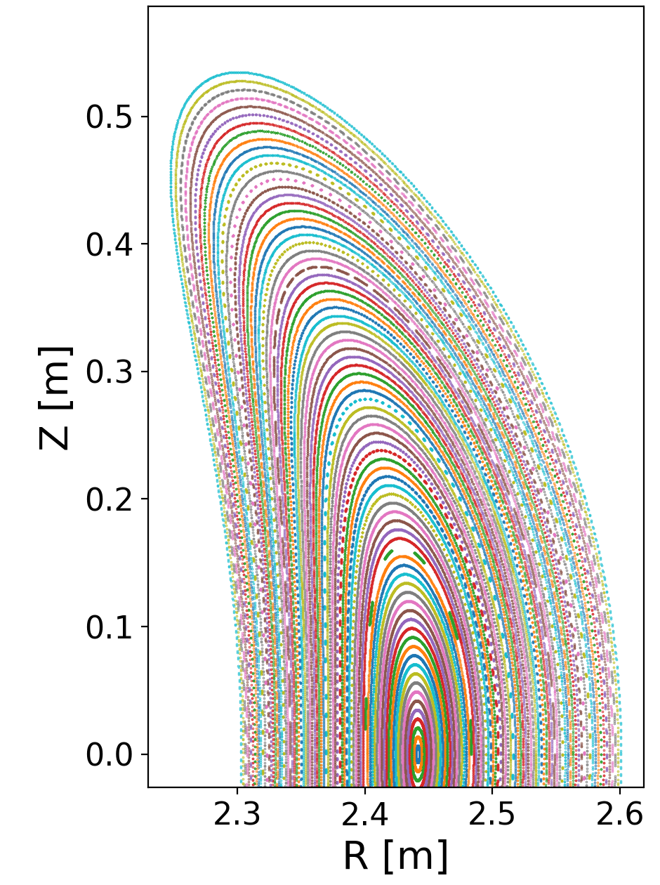

.. _eliminating-islands:

Eliminating magnetic islands
============================

In this example, we show how the shape of a boundary magnetic surface
can be adjusted to eliminate magnetic islands inside it, considering a
vacuum field. For this example we will use the SPEC code with a single
radial domain. The geometry comes from a quasi-helically symmetric
configuration developed at the University of Wisconsin.  We will
eliminate the islands by minimizing an objective function involving
Greene's residue for several O-points and X-points, similar to the
approach of Hanson and Cary (1984).

The initial configuration is defined in the SPEC input file
``QH-residues.sp``, which can be found in the :simsopt:`examples/2_Intermediate/inputs`
directory. If you generate a Poincare plot for this boundary shape by
running standalone SPEC, it can be seen that there is an island chain
corresponding to the :math:`\iota = -8/7` resonance:

..
   Figure generated by Matt with ~/Box Sync/work20/20201231-01-AtenAndSimsopt/aten_poincare_redBoundary

This island chain can be eliminated by a slight change to the shape of
the boundary magnetic surface. To do this with simsopt, the first step
is to import some items we will need::

  import numpy as np
  from simsopt.mhd import Spec, Residue
  from simsopt.objectives import LeastSquaresProblem
  from simsopt.solve import least_squares_serial_solve

We then create a Spec object based on the input file::

  s = Spec('QH-residues.sp')

Many Fourier modes of the boundary affect the island width, so we can
choose nearly any subset or all of the boundary modes to vary in the
optimization. To keep this example fast, we will pick out just two
modes to vary rather than all of the modes. Modes with high poloidal
mode number m couple particularly strongly to the islands. Here we
will choose to vary two modes with m=6. Since the original
configuration contains only modes up to m=3, we must increase the
number of modes in the boundary shape in order to have m=6 modes
available to vary::

  s.boundary.change_resolution(6, s.boundary.ntor)

Now we can pick out a few modes of the boundary shape to vary in the
optimization::

  s.boundary.fix_all()
  s.boundary.unfix('zs(6,1)')
  s.boundary.unfix('zs(6,2)')

Next, let us define the objective function. The objective function
will be based on the residue defined by Greene (1979). A residue is a
property of a periodic trajectory, such as the field line at the
O-point or X-point of a magnetic island. If a good magnetic surface
exists at a rational value of :math:`\iota`, the residues will be
zero, so minimizing the squares of residues will promote good surface
quality. In simsopt, we can define a Residue object based on a Spec
object, together with the rational number of the island chain::

  # Resonant surface is iota = p / q:
  p = -8
  q = 7
  # Guess for radial location of the island chain:
  s_guess = 0.9
  residue1 = Residue(s, p, q, s_guess=s_guess)

The initial guess for the radial coordinate s is not critical; the
Newton method to find the periodic field line is robust in this
case. By default, the residue will be computed at a poloidal angle of
zero, corresponding to the O-point of the island chain. We can define
a second residue for the X-point, by specifying the poloidal angle to
be :math:`\pi` instead of zero::

  residue2 = Residue(s, p, q, s_guess=s_guess, theta=np.pi)

To get a numerical value for the residues, you can call the ``J()``
function of these objects. Doing so will automatically cause SPEC to
run::

  initial_r1 = residue1.J()
  initial_r2 = residue2.J()
  print(f"Initial residues: {initial_r1}, {initial_r2}")

After SPEC runs, the output should be close to the following::

  Initial residues: 0.02331532869136166, -0.02287637681580268
  
You are free to also define residues for other rational surfaces in
the confinement region. In this example it turns out to be useful to
also control the residues of the :math:`\iota=-12/11` surface, since
boundary adjustments to eliminate the -8/7 island can open up -12/11
islands. Therefore let us define Residue objects for the O and X
points at this second rational surface::

  p = -12
  q = 11
  s_guess = -0.1

  residue3 = Residue(s, p, q, s_guess=s_guess)
  residue4 = Residue(s, p, q, s_guess=s_guess, theta=np.pi)

We now combine the four residues into a least-squares objective
function, by summing the squares of the residues::

  # Objective function is \sum_j residue_j ** 2
  prob = LeastSquaresProblem.from_tuples([(residue1.J, 0, 1),
                                          (residue2.J, 0, 1),
                                          (residue3.J, 0, 1),
                                          (residue4.J, 0, 1)])

If you wanted an island to be present instead of absent, which might
be the case when designing an island divertor, a value other than zero
could be used for the goal values above, e.g. ``(residue1, 0.1, 1)``.

Finally, let us solve the optimization problem::

  least_squares_serial_solve(prob)

The solution takes about 18 function evaluations, which likely will
take a minute or two.  Afterward, we can examine the optimum::

  final_r1 = residue1.J()
  final_r2 = residue2.J()
  print(f"Final residues: {final_r1}, {final_r2}")

The residues have been reduced::
  
  Final residues: 2.9093984016959062e-06, 2.5974339906698063e-06

Generating a Poincare plot of the final configuration using standalone
SPEC, the island chain has been eliminated:

..
   Figure generated by Matt with ~/Box Sync/work20/20201231-01-AtenAndSimsopt/aten_poincare_optimized

(Note that to make Poincare plots like this with SPEC, you can
increase the values of ``nppts`` and ``nptrj`` in the SPEC input
file.)
