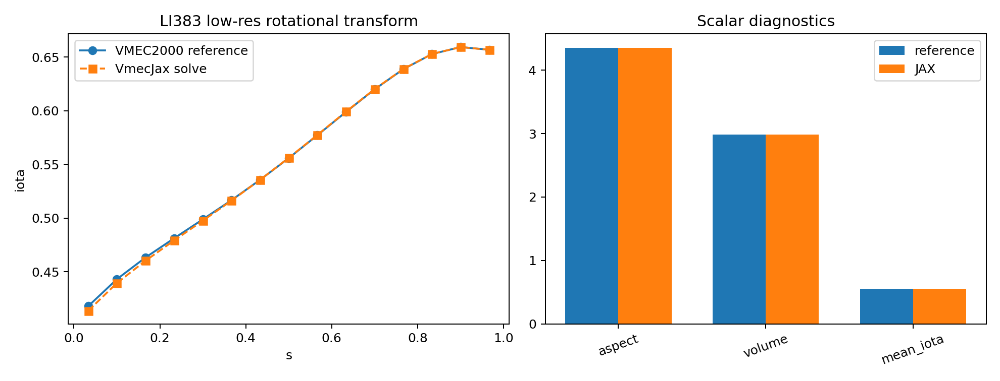
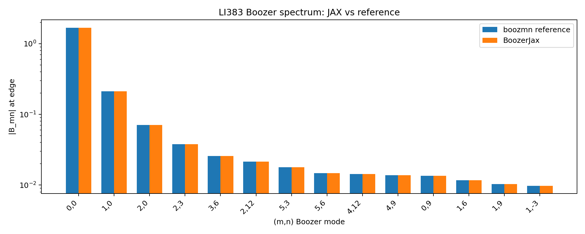
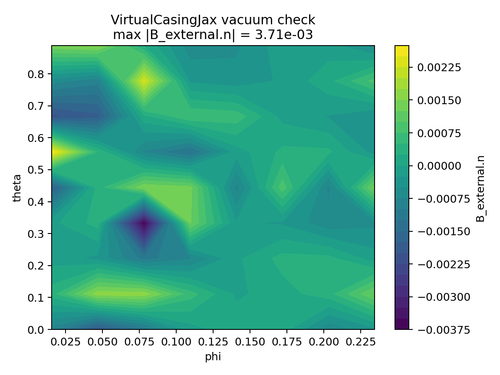

.. role:: python(code)
   :language: python

JAX MHD wrappers and finite-beta optimization
=============================================

This page documents the first SIMSOPT integration of the JAX MHD stack:
``vmec_jax`` for fixed-boundary VMEC solves and exact differentiation,
``booz_xform_jax`` for Boozer-coordinate spectra, and
``virtual_casing_jax`` for finite-beta external normal-field targets.
The long-term goal is to provide JAX-backed replacements for the
existing VMEC2000, BOOZ_XFORM, and virtual-casing workflows while
preserving the usual SIMSOPT interfaces for surfaces, coils, objectives,
and diagnostics.

The coil objects, Biot-Savart calculations, coil regularization terms,
and coil derivatives remain the native SIMSOPT implementations. The JAX
wrappers replace only the MHD equilibrium and MHD postprocessing pieces.

Implemented interfaces
----------------------

The new MHD wrappers follow the existing SIMSOPT class names and workflow,
with a ``Jax`` suffix:

* :python:`VmecJax` mirrors :python:`Vmec` for fixed-boundary solves,
  loaded ``wout`` files, scalar diagnostics, boundary degrees of freedom,
  and pressure/current/iota profile objects.
* :python:`BoozerJax` mirrors :python:`Boozer` surface registration and
  computes Boozer spectra through ``booz_xform_jax``. For
  stellarator-symmetric equilibria it uses the vectorized JAX backend
  when the installed ``booz_xform_jax`` API provides the complete
  ``boozmn`` output fields.
* :python:`QuasisymmetryJax` mirrors the existing Boozer-spectrum
  quasisymmetry objective.
* :python:`QuasisymmetryRatioResidualJax` mirrors
  :python:`QuasisymmetryRatioResidual` and delegates the VMEC-side
  quasisymmetry metric to ``vmec_jax``.
* :python:`VirtualCasingJax` mirrors :python:`VirtualCasing`, preserving
  the saved NetCDF format and the :python:`B_external_normal` field used
  by stage-II and finite-beta coil objectives.

The core wrappers are available from :python:`simsopt.mhd`, for example:

.. code-block:: python

    from simsopt.mhd import (
        VmecJax,
        BoozerJax,
        QuasisymmetryJax,
        QuasisymmetryRatioResidualJax,
        VirtualCasingJax,
    )

Examples
--------

The JAX examples are direct counterparts of existing SIMSOPT examples:

* :simsopt_file:`examples/2_Intermediate/QH_fixed_resolution_jax.py`
  follows :simsopt_file:`examples/2_Intermediate/QH_fixed_resolution.py`.
  It uses ``vmec_jax`` exact discrete-adjoint derivatives instead of
  finite differences.
* :simsopt_file:`examples/2_Intermediate/QH_fixed_resolution_boozer_jax.py`
  follows :simsopt_file:`examples/2_Intermediate/QH_fixed_resolution_boozer.py`.
  It computes nonsymmetric normalized Boozer ``|B|`` harmonics through
  ``vmec_jax -> booz_xform_jax`` and differentiates the residual with JAX.
* :simsopt_file:`examples/2_Intermediate/B_external_normal_jax.py`
  follows :simsopt_file:`examples/2_Intermediate/B_external_normal.py`.
  It uses ``VirtualCasingJax`` and demonstrates saved-file compatibility.
* :simsopt_file:`examples/2_Intermediate/stage_two_optimization_finite_beta_jax.py`
  follows :simsopt_file:`examples/2_Intermediate/stage_two_optimization_finite_beta.py`.
  It keeps the SIMSOPT coil optimization and swaps the finite-beta
  virtual-casing target to ``VirtualCasingJax``.
* :simsopt_file:`examples/3_Advanced/single_stage_optimization_jax.py`
  follows :simsopt_file:`examples/3_Advanced/single_stage_optimization.py`.
  It uses ``VmecJax`` and ``QuasisymmetryRatioResidualJax`` for diagnostics,
  and evaluates the stage-I objective gradient through
  ``vmec_jax.FixedBoundaryExactOptimizer`` rather than MPI finite
  differences, while keeping the native SIMSOPT coil objective and mixed
  Biot-Savart surface derivative.
* :simsopt_file:`examples/3_Advanced/single_stage_optimization_finite_beta_jax.py`
  follows :simsopt_file:`examples/3_Advanced/single_stage_optimization_finite_beta.py`.
  It uses ``VmecJax``, ``QuasisymmetryRatioResidualJax``, and
  ``VirtualCasingJax``.

Validation plots
----------------

The plots below are generated from the same regression cases used in
the JAX wrapper tests. They are intended as a compact visual check that
the new wrappers reproduce existing SIMSOPT reference data before being
used in larger optimization studies.

VMEC-JAX solve compared with the existing VMEC2000 reference ``wout``:

For this LI383 low-resolution case, the reference and JAX scalar
diagnostics agree to roundoff for aspect and volume:

* aspect: reference ``4.354967596750808``, JAX ``4.354967596750813``
* volume: reference ``2.9813872701632924``, JAX ``2.9813872701632906``
* mean iota: reference ``0.5544911906253179``, JAX ``0.5535895178061357``
* fresh JAX residuals: ``fsqr=9.765e-14``, ``fsqz=1.861e-14``,
  ``fsql=7.144e-15``

Boozer-JAX spectrum compared with the existing ``boozmn`` reference:

The maximum absolute error in the LI383 edge ``bmnc_b`` spectrum is
``7.073e-16`` for this comparison. This plot is generated from the
stellarator-symmetric path that exercises the vectorized
``booz_xform_jax`` backend and then populates the standard
``Booz_xform`` attributes used by SIMSOPT diagnostics.

Virtual-casing JAX normal field for a vacuum reference equilibrium:

For the vacuum check, the maximum absolute value of
``B_external_normal`` is ``3.709e-3`` on the small test grid.

Testing
-------

The focused JAX MHD test suite currently covers:

* loaded-``wout`` diagnostics and fixed-boundary ``VmecJax`` solves,
* SIMSOPT profile transfer into ``VmecJax`` input data,
* ``BoozerJax`` spectra against reference ``boozmn`` files,
* VMEC-side quasisymmetry residual parity with the existing
  :python:`QuasisymmetryRatioResidual`,
* ``VirtualCasingJax`` parity, vacuum-field checks, and save/load.

Run the focused tests with:

.. code-block:: bash

    python -m pytest \
        tests/mhd/test_vmec_jax.py \
        tests/mhd/test_boozer_jax.py \
        tests/mhd/test_vmec_diagnostics_jax.py \
        tests/mhd/test_virtual_casing_jax.py -q

At the time this page was updated, the focused suite plus example
compilation tests passed with ``19 passed``, six example subtests, and
one upstream JAX deprecation warning.

Current limitations
-------------------

This is an integration milestone, not yet a complete replacement for
every legacy workflow. The current implementation is focused on
fixed-boundary VMEC-JAX solves, MHD diagnostics, Boozer spectra,
virtual casing, and example parity. Remaining work includes broader
API coverage, longer optimization regression runs, performance tuning,
and upstreaming any API additions needed in the JAX packages. The
finite-beta single-stage example still uses the existing whole-objective
finite-difference pattern for the virtual-casing target shape derivative;
making that path exact requires composing VMEC-JAX state tangents with a
JAX derivative of ``B_external_normal``. An upstream
``virtual_casing_jax`` pull request now exposes a functional normal-field
API with surface-coordinate JVP coverage for this purpose. The
vectorized Boozer backend currently requires an upstream
``booz_xform_jax`` API addition that returns ``gmnc_b``; without that
field, ``BoozerJax`` falls back to the compatibility execution path.
