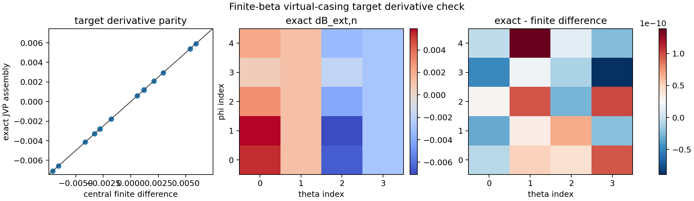
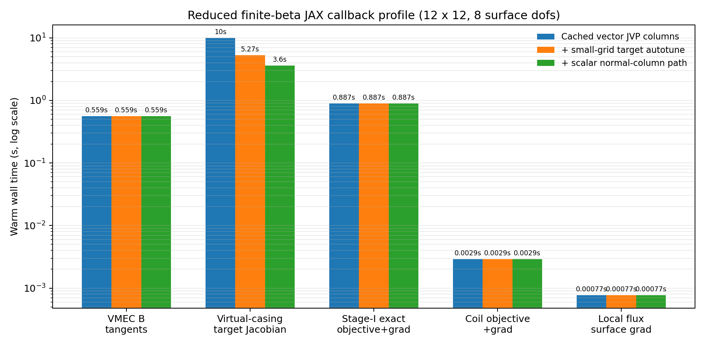

.. role:: python(code)
   :language: python

JAX MHD wrappers and finite-beta optimization
=============================================

This page documents the first SIMSOPT integration of the JAX MHD stack:
``vmec_jax`` for fixed-boundary VMEC solves and exact differentiation,
``booz_xform_jax`` for Boozer-coordinate spectra, and
``virtual_casing_jax`` for finite-beta external normal-field targets.
The long-term goal is to provide JAX-backed replacements for the
existing VMEC2000, BOOZ_XFORM, and virtual-casing workflows while
preserving the usual SIMSOPT interfaces for surfaces, coils, objectives,
and diagnostics.

The coil objects, Biot-Savart calculations, coil regularization terms,
and coil derivatives remain the native SIMSOPT implementations. The JAX
wrappers replace only the MHD equilibrium and MHD postprocessing pieces.

Implemented interfaces
----------------------

The new MHD wrappers follow the existing SIMSOPT class names and workflow,
with a ``Jax`` suffix:

* :python:`VmecJax` mirrors :python:`Vmec` for fixed-boundary solves,
  loaded ``wout`` files, scalar diagnostics, boundary degrees of freedom,
  and pressure/current/iota profile objects.
* :python:`B_cartesian_jax` mirrors
  :python:`simsopt.mhd.vmec_diagnostics.B_cartesian` for ``VmecJax``
  objects and uses the upstream ``vmec_jax.b_cartesian_from_state``
  boundary-field helper.
* :python:`B_cartesian_jax_tangent_columns` evaluates the same boundary
  field together with exact VMEC-JAX accepted-point tangent columns from
  ``vmec_jax.FixedBoundaryExactOptimizer``.
* :python:`BoozerJax` mirrors :python:`Boozer` surface registration and
  computes Boozer spectra through ``booz_xform_jax``. For
  stellarator-symmetric equilibria it uses the vectorized JAX backend
  when the installed ``booz_xform_jax`` API provides the complete
  ``boozmn`` output fields.
* :python:`QuasisymmetryJax` mirrors the existing Boozer-spectrum
  quasisymmetry objective.
* :python:`QuasisymmetryRatioResidualJax` mirrors
  :python:`QuasisymmetryRatioResidual` and delegates the VMEC-side
  quasisymmetry metric to ``vmec_jax``.
* :python:`VirtualCasingJax` mirrors :python:`VirtualCasing`, preserving
  the saved NetCDF format and the :python:`B_external_normal` field used
  by stage-II and finite-beta coil objectives.
* :python:`B_external_normal_from_data` and
  :python:`B_external_normal_jvp_from_data` expose the functional
  ``virtual_casing_jax`` normal-field path in SIMSOPT array convention,
  and :python:`B_external_normal_jacobian_from_surface` composes that JVP
  with SIMSOPT surface-coordinate and surface-normal derivatives.
* :python:`local_squared_flux_surface_gradient` evaluates the local
  :python:`SquaredFlux` surface gradient with an optional virtual-casing
  target Jacobian, which is the finite-beta single-stage derivative term.

The core wrappers are available from :python:`simsopt.mhd`, for example:

.. code-block:: python

    from simsopt.mhd import (
        VmecJax,
        B_cartesian_jax,
        B_cartesian_jax_tangent_columns,
        BoozerJax,
        QuasisymmetryJax,
        QuasisymmetryRatioResidualJax,
        VirtualCasingJax,
        B_external_normal_jvp_from_data,
        B_external_normal_jacobian_from_surface,
        local_squared_flux_surface_gradient,
    )

Examples
--------

The JAX examples are direct counterparts of existing SIMSOPT examples:

* :simsopt_file:`examples/2_Intermediate/QH_fixed_resolution_jax.py`
  follows :simsopt_file:`examples/2_Intermediate/QH_fixed_resolution.py`.
  It uses ``vmec_jax`` exact discrete-adjoint derivatives instead of
  finite differences.
* :simsopt_file:`examples/2_Intermediate/QH_fixed_resolution_boozer_jax.py`
  follows :simsopt_file:`examples/2_Intermediate/QH_fixed_resolution_boozer.py`.
  It computes nonsymmetric normalized Boozer ``|B|`` harmonics through
  ``vmec_jax -> booz_xform_jax`` and differentiates the residual with JAX.
* :simsopt_file:`examples/2_Intermediate/B_external_normal_jax.py`
  follows :simsopt_file:`examples/2_Intermediate/B_external_normal.py`.
  It uses ``VirtualCasingJax`` and demonstrates saved-file compatibility.
* :simsopt_file:`examples/2_Intermediate/stage_two_optimization_finite_beta_jax.py`
  follows :simsopt_file:`examples/2_Intermediate/stage_two_optimization_finite_beta.py`.
  It keeps the SIMSOPT coil optimization and swaps the finite-beta
  virtual-casing target to ``VirtualCasingJax``.
* :simsopt_file:`examples/3_Advanced/single_stage_optimization_jax.py`
  follows :simsopt_file:`examples/3_Advanced/single_stage_optimization.py`.
  It uses ``VmecJax`` and ``QuasisymmetryRatioResidualJax`` for diagnostics,
  and evaluates the stage-I objective gradient through
  ``vmec_jax.FixedBoundaryExactOptimizer`` rather than MPI finite
  differences, while keeping the native SIMSOPT coil objective and mixed
  Biot-Savart surface derivative.
* :simsopt_file:`examples/3_Advanced/single_stage_optimization_finite_beta_jax.py`
  follows :simsopt_file:`examples/3_Advanced/single_stage_optimization_finite_beta.py`.
  It uses ``VmecJax``, ``QuasisymmetryRatioResidualJax``, and
  ``VirtualCasingJax``. Its single-stage surface gradient uses VMEC-JAX
  exact stage-I derivatives and composes VMEC-JAX boundary-field tangent
  columns with the SIMSOPT
  :python:`B_external_normal_jacobian_from_surface` helper instead of a
  whole-objective finite-difference wrapper.

Validation plots
----------------

The plots below are generated from the same regression cases used in
the JAX wrapper tests. They are intended as a compact visual check that
the new wrappers reproduce existing SIMSOPT reference data before being
used in larger optimization studies.

VMEC-JAX solve compared with the existing VMEC2000 reference ``wout``:

.. image:: jax_mhd_vmec_jax_vs_reference.png
   :alt: VMEC-JAX iota profile and scalar diagnostics compared with reference VMEC output.
   :width: 95%

For this LI383 low-resolution case, the reference and JAX scalar
diagnostics agree to roundoff for aspect and volume:

* aspect: reference ``4.354967596750808``, JAX ``4.354967596750813``
* volume: reference ``2.9813872701632924``, JAX ``2.9813872701632906``
* mean iota: reference ``0.5544911906253179``, JAX ``0.5535895178061357``
* fresh JAX residuals: ``fsqr=9.765e-14``, ``fsqz=1.861e-14``,
  ``fsql=7.144e-15``

Boozer-JAX spectrum compared with the existing ``boozmn`` reference:

.. image:: jax_mhd_boozer_jax_vs_reference.png
   :alt: Boozer-JAX edge Boozer spectrum compared with reference boozmn data.
   :width: 95%

The maximum absolute error in the LI383 edge ``bmnc_b`` spectrum is
``7.073e-16`` for this comparison. This plot is generated from the
stellarator-symmetric path that exercises the vectorized
``booz_xform_jax`` backend and then populates the standard
``Booz_xform`` attributes used by SIMSOPT diagnostics.

Virtual-casing JAX normal field for a vacuum reference equilibrium:

.. image:: jax_mhd_virtual_casing_jax_normal_field.png
   :alt: VirtualCasingJax normal external field on a vacuum equilibrium.
   :width: 70%

For the vacuum check, the maximum absolute value of
``B_external_normal`` is ``3.709e-3`` on the small test grid.

Finite-beta virtual-casing target derivative assembled from the SIMSOPT
surface Jacobian compared with a central finite difference:

For this reduced-grid derivative check, the maximum absolute difference
between the assembled JVP and the central finite difference is
``1.390e-10``.

A reduced finite-beta single-stage component profile shows where the
remaining wall time is concentrated in the exact JAX surface-gradient path:

This profile uses a ``12 x 12`` target grid, 8 active VMEC-JAX boundary
parameters, and the cached batched virtual-casing JVP-column path. Updating
``virtual_casing_jax`` so its CPU ``target_chunk_size="auto"`` heuristic leaves
small B-field target grids unblocked reduces the warm virtual-casing
target-Jacobian step from about ``10.0`` seconds to about ``5.3`` seconds in
this reduced case, while preserving agreement at the ``1e-12`` level in the
JVP columns. Routing SIMSOPT through the upstream scalar normal-field
JVP-column helper reduces the same public helper to about ``3.6`` seconds and
keeps the target Jacobian within ``3e-13`` of the previous projected-vector
path. The virtual-casing target-Jacobian assembly remains the dominant
component, but the remaining cost is now concentrated in the geometry-tangent
singular correction rather than VMEC-JAX boundary-field replay.

Testing
-------

The focused JAX MHD test suite currently covers:

* loaded-``wout`` diagnostics and fixed-boundary ``VmecJax`` solves,
* SIMSOPT profile transfer into ``VmecJax`` input data,
* ``BoozerJax`` spectra against reference ``boozmn`` files,
* VMEC-side quasisymmetry residual parity with the existing
  :python:`QuasisymmetryRatioResidual`,
* ``VirtualCasingJax`` parity, vacuum-field checks, and save/load.
* functional ``B_external_normal`` parity with ``VirtualCasingJax`` and a
  forward-mode JVP Taylor check for the virtual-casing target projection.
* surface-coefficient Jacobian assembly for ``B_external_normal``,
  including source geometry, total-field tangent, and target-normal
  tangent terms.
* VMEC-JAX boundary Cartesian-field tangent columns against the
  ``FixedBoundaryExactOptimizer`` exact Jacobian convention.
* the reduced finite-beta local ``SquaredFlux`` surface gradient, including
  the virtual-casing target Jacobian, against a central finite difference.

Run the focused tests with:

.. code-block:: bash

    python -m pytest \
        tests/mhd/test_jax_examples.py \
        tests/mhd/test_vmec_jax.py \
        tests/mhd/test_boozer_jax.py \
        tests/mhd/test_vmec_diagnostics_jax.py \
        tests/mhd/test_virtual_casing_jax.py -q

At the time this page was updated, the focused suite plus example
compilation tests passed with ``26 passed``, six example subtests, and
one upstream JAX deprecation warning.

Current limitations
-------------------

This is an integration milestone, not yet a complete replacement for
every legacy workflow. The current implementation is focused on
fixed-boundary VMEC-JAX solves, MHD diagnostics, Boozer spectra,
virtual casing, and example parity. Remaining work includes broader
API coverage, longer optimization regression runs, performance tuning,
and upstreaming any API additions needed in the JAX packages. The
finite-beta single-stage example now has an exact JAX derivative path for
the virtual-casing target, but it still needs longer optimization
regression runs and performance profiling before it should replace the
legacy production example. An upstream ``vmec_jax`` pull request now
exposes both the boundary Cartesian-field helper and an exact optimizer
field-tangent API used for those VMEC-JAX field tangent columns. An
upstream ``virtual_casing_jax`` pull request exposes the functional
normal-field API used by the SIMSOPT JVP helper. The vectorized Boozer
backend currently requires an upstream
``booz_xform_jax`` API addition that returns ``gmnc_b``; without that
field, ``BoozerJax`` falls back to the compatibility execution path.
