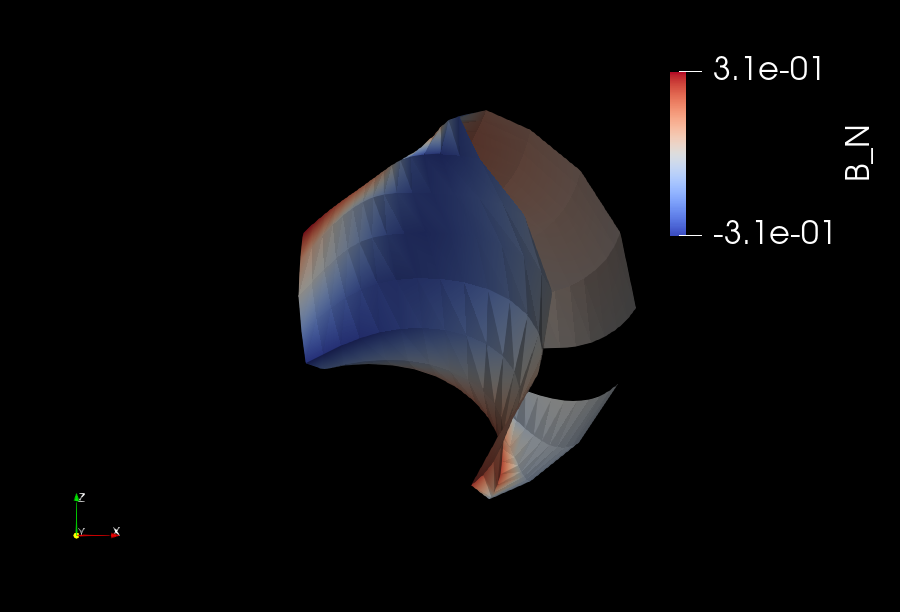
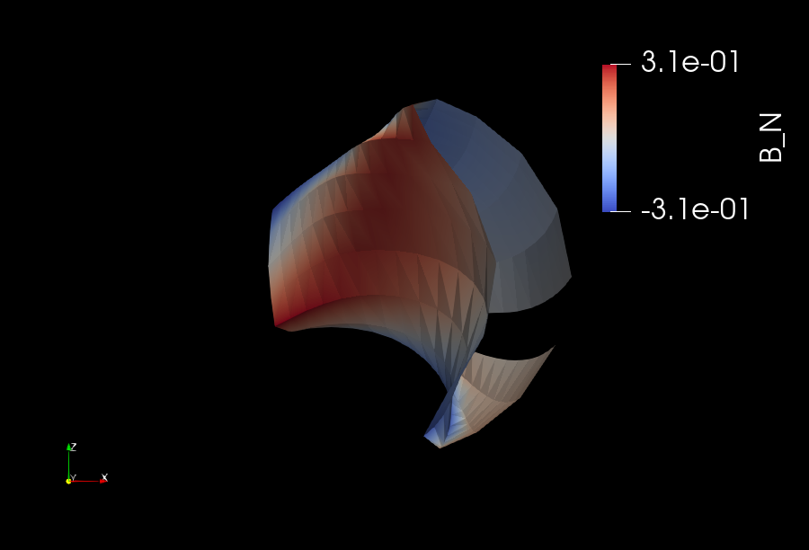
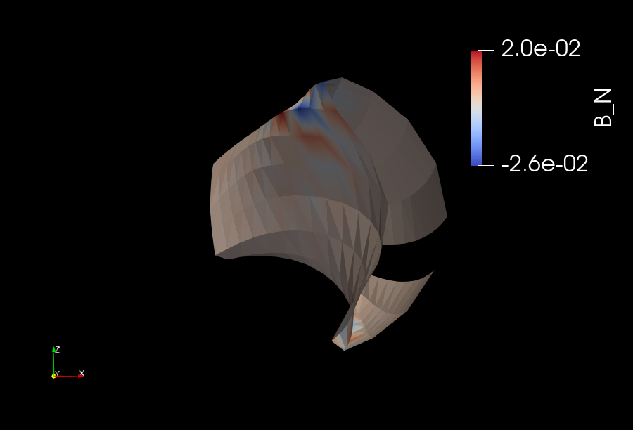

Permanent magnet optimization
==================================

In this tutorial it is shown how to perform stage-2 stellarator
optimization using a set of permanent magnets. 
The approach employed here follows the work in the paper 
`Greedy permanent magnet optimization
<https://iopscience.iop.org/article/10.1088/1741-4326/acb4a9/meta>`__.

Here we work through several examples of "stage 2" permanent magnet optimization for different stellarators and variants of the optimization algorithm. In this approach, a target plasma shape (i.e. boundary flux surface shape) has already been found in a "stage 1" optimization, and the present task is to optimize a large set of permanent magnets (at predefined locations on a 3D grid) to produce this target field. For this stage-2 problem, no MHD codes are used (example, VMEC or SPEC), so there is no need to have them installed.

We first describe the basic principles of "stage 2" permanent magnet optimization and how they are used in SIMSOPT, namely, how to set up the optimization problem in the minimal example :simsopt_file:`examples/1_Simple/permanent_magnet_simple.py`. Several advanced features for permanent magnet optimization can be found in the following scripts:

- Using a pre-defined FAMUS grid of permanent magnets to optimize the MUSE
  stellarator, and using greedy backtracking to optimize the magnets in 
  :simsopt_file:`examples/2_Intermediate/permanent_magnet_MUSE.py`.
- Solving the continuous relaxation of the optimization using the 
  relax and split algorithm and the Landreman/Paul QA stellarator in 
  :simsopt_file:`examples/2_Intermediate/permanent_magnet_QA.py`.
- Using arbitrarily oriented dipoles with the greedy algorithms for 
  the best flexibility and performance in permanent magnet optimization in
  :simsopt_file:`examples/2_Intermediate/permanent_magnet_PM4Stell.py`.

.. _minimal_pm:

Minimal permanent magnets example
-----------------------------------

A minimal objective function (cost function) for permanent magnet optimization is

.. math::

  J = \frac{1}{2} \int |(\vec{B}_{magnets} - \vec{B}_{ext}) \cdot \vec{n}|^2 ds = \frac{1}{2} \|Am - b\|^2_2

Here :math:`\vec{B}_{magnets}` is the magnetic field generate purely from the permanent magnets,
:math:`\vec{B}_{ext}` are any external magnetic fields, 
and m is the flattened optimization variables representing all of the dipole 
vectors for every permanent magnet in the grid. 
The objective represents the "quadratic flux", the area
integral over the target plasma surface of the square of the magnetic
field normal to the surface. If the magnets exactly produce a flux
surface of the target shape, this term will vanish.

Notice that, unlike in normal stage-2 coil optimization, :math:`B_{ext}` must be nonzero.
This is because permanent magnets cannot produce a net toroidal flux, i.e. 
permanent magnets cannot provide a free current through the torus hole, so that
application of Ampere's law along a toroidal curve gives zero. In other words, in
addition to the permanent magnets, we need a set of coils to provide the net toroidal
flux in the stellarator.

Moreover, we don't want any solution of magnets that minimizes this objective. Actually,
we want to solve it such that magnets are at maximum-strength (so we use as few magnets as possible, 
and each magnet is best utilized) and grid-aligned (so the resulting permanent magnet grid
can be reasonably engineered in the real world). This really complicates the optimization
problem but we can ignore this here and simply adopt a greedy approach described more below.

In this first section we consider vacuum fields only, so the magnetic field
due to current in the plasma does not need to be subtracted in the
quadratic flux term. The configuration considered is the
`C09R00 NCSX configuration <https://iopscience.iop.org/article/10.1088/1741-4326/aa57d4/meta?casa_token=wyeRjdz8ZeIAAAAA:qhfHYapwBezuGNINVqA7x1M2BSlOZLSGqpGyyQ6l-gxucBKmWjgAFN4-ZFVejB0kR1qEFP2R>`_,
which is three-field-period and stellarator symmetric, and is scaled to 0.5 Tesla
on-axis.

The stage-2 optimization problem is automatically parallelized in
simsopt using OpenMP and vectorization, but MPI is not used, so the
``mpi4py`` python package is not needed. This example can be run in a
few minutes on a laptop.

To solve this optimization problem in simsopt, we first import the necessary classes::
  
  from pathlib import Path
  import numpy as np
  from simsopt.field import DipoleField, ToroidalField
  from simsopt.geo import PermanentMagnetGrid, SurfaceRZFourier
  from simsopt.solve import GPMO
  from simsopt.util.permanent_magnet_helper_functions import *

The target plasma surface is given in the wout input file :simsopt_file:`tests/test_files/wout_c09r00_fixedBoundary_0.5T_vacuum_ns201.nc`.
We load the surface with low-resolution using:

.. code-block::

  nphi = 16
  ntheta = 16
  filename = "tests/test_files/wout_c09r00_fixedBoundary_0.5T_vacuum_ns201.nc"
  s = SurfaceRZFourier.from_wout(filename, range="half period", nphi=nphi, ntheta=ntheta)

You can adjust the directory in ``"filename"`` as appropriate for your
system. As surface objects carry a grid of "quadrature points" at
which the position vector is evaluated we may want these points to
cover different ranges of the toroidal angle. For this problem with
stellarator symmetry and field-period symmetry, we need only consider
half of a field period in order to evaluate integrals over the entire
surface. For this reason, the ``range`` parameter of the surface is
set to ``"half period"`` here. Possible options in general are ``"full
torus"``, ``"field period"`` and ``"half period"``, but ``"half
period"`` is significantly more efficient than the other options for
this problem. The nphi and ntheta parameters should be ~ 64 or so for a high-resolution
and fully converged permanent magnet optimization run. 

We next set the initial condition for the coils. Usually, we would initialize
some coil class objects, but for this example we have simplified by imagining
we have a set of equally spaced toroidal field coils that produces a purely
toroidal field through Ampere's law for a purely toroidal field: :math:`2 \pi R B_0 = \mu_0 I`.
To evaluate the magnetic field on the target surface, we create a
:obj:`simsopt.field.ToroidalField` object based on the coils,
and instruct it to evaluate the field on the surface:

.. code-block::

  net_poloidal_current_Amperes = 3.7713e+6
  mu0 = 4 * np.pi * 1e-7
  RB = mu0 * net_poloidal_current_Amperes / (2 * np.pi)
  bs = ToroidalField(R0=1, B0=RB)
  bs.set_points(s.gamma().reshape((-1, 3)))
  Bnormal = np.sum(bs.B().reshape((nphi, ntheta, 3)) * s.unitnormal(), axis=2)

The surface position vector ``gamma()`` returns an array of size
``(nphi, ntheta, 3)``, which we reshaped here to
``(nphi*ntheta, 3)`` as required for the
:obj:`~simsopt.field.ToroidalField` object.

We are now ready to initialize a :obj:`~simsopt.geo.PermanentMagnetGrid` object. We first define
some keyword arguments to use -- here we set a cylindrical coordinate system for the 
permanent magnet grid, so that the magnets are represented as cylindrical bricks.
Lastly, we need to indicate where the
pre-defined grid (from FAMUS) can be found, in famus_filename::
  
  kwargs = {"coordinate_flag": "cylindrical"}
  famus_filename = 'init_orient_pm_nonorm_5E4_q4_dp.focus'
  pm_opt = PermanentMagnetGrid.geo_setup_from_famus(
      s, Bnormal, famus_filename, **kwargs
  )

We are now ready to initialize some keyword arguments for the optimization.
GPMO stands for greedy permanent magnet optimization, and it is so named
because the optimizer simply places magnets one-by-one into the grid in such
a way to minimize the :math:`\|Am-b\|_2^2` errors at each step. We then
specify K = 40000 to place 40000 permanent magnets and nhistory = 100, to
record the optimization progress 100 times (every 400 iterations)::

  kwargs = initialize_default_kwargs('GPMO')
  kwargs['K'] = 40000
  kwargs['nhistory'] = 100

  # Optimize the permanent magnets greedily
  R2_history, Bn_history, m_history = GPMO(pm_opt, **kwargs)

The GPMO algorithm returns a history of the :math:`\|Am - b\|_2^2` errors (R2_history),
a history of the :math:`|Am - b|` errors (Bn_history), and the optimized dipole
vectors at each point in the algorithm progress (m_history). 

Now we can visualize the solutions by creating a :obj:`~simsopt.field.DipoleField`
object from the optimized :obj:`~simsopt.geo.PermanentMagnetGrid`::

  b_dipole = DipoleField(
    pm_opt.dipole_grid_xyz,
    pm_opt.m,
    nfp=s.nfp,
    coordinate_flag=pm_opt.coordinate_flag,
    m_maxima=pm_opt.m_maxima,
  )
  b_dipole.set_points(s.gamma().reshape((-1, 3)))
  Bnormal_dipoles = np.sum(b_dipole.B().reshape((nphi, ntheta, 3)) * s.unitnormal(), axis=-1)
  Bnormal_total = Bnormal + Bnormal_dipoles
  
  # Now save vtk files of Bnormal, Bnormal_dipoles, and Bnormal_total for Paraview viewing
  pointData = {"B_N": Bnormal[:, :, None]}
  s.to_vtk("CoilsBn", extra_data=pointData)
  pointData = {"B_N": Bnormal_dipoles[:, :, None]}
  s.to_vtk("MagnetsBn", extra_data=pointData)
  pointData = {"B_N": Bnormal_total[:, :, None]}
  s.to_vtk("TotalBn", extra_data=pointData)

which produces the following in Paraview (from left to right: CoilsBn, MagnetsBn, TotalBn):

Notice that the Bnormal from the magnets is trying to cancel out the Bnormal from the
coils, so that the total Bnormal is close to zero. 
At the end of the optimization, the results can be saved as follows::
  
  pm_opt.write_to_famus()

This saves the :obj:`~simsopt.geo.PermanentMagnetGrid` solution and geometry into a FAMUS-style 
text file. It can be loaded again for post-processing or additional optimization with:: 

  pm_opt = PermanentMagnetGrid.geo_setup_from_famus("SIMSOPT_dipole_solution.focus")

Further options for improved optimization 
-------------------------------------------

By default, GPMO places magnets with their full strength magnitudes and
with their dipole vectors aligned with one of the three coordinate directions,
i.e. in the previous example, in the R, :math:`\phi`, or Z directions. The 
advantage of this technique is that only maximum-strength, grid-aligned 
magnet solutions are produced. One way to specify a single direction for all
magnets, as in the MUSE grid where all the dipoles must be in the :math:`\pm` R 
orientation, is to call GPMO with the following keyword argument::

  kwargs['single_direction'] = 0  # 0, 1, 2 correspond to (R, phi, Z)
  algorithm = 'baseline'  # unnecessary here, as this is the default
  R2_history, Bn_history, m_history = GPMO(pm_opt, algorithm, **kwargs)

Another possible improvement is to place multiple permanent magnets at time,
instead of one-by-one, it places sections of N (identically aligned!) magnets at each step. This has
the advantage of better avoiding magnets that are equal and opposite and spatially close -- such
magnets tend to be suboptimal in the final solution because their fields are mostly cancelling.
For this GPMOm algorithm, the following keyword can be used::

  kwargs['Nadjacent'] = 10  # place 10 magnets each iteration 

  # pass the full permanent magnet grid geometry in C++ compatible way
  # This is needed in order to figure out which magnets are adjacent to each other
  kwargs['dipole_grid_xyz'] = np.ascontiguousarray(pm_opt.dipole_grid_xyz)
  algorithm = 'multi' 
  R2_history, Bn_history, m_history = GPMO(pm_opt, algorithm, **kwargs)

Probably the most useful improvement to the GPMO algorithm is to incorporate
backtracking. Basically, every ``backtracking`` iterations, the algorithm will
pause placing new magnets, and look around for suboptimal magnets (a magnet
with an oppositely oriented magnet very close to it). If it finds such a pair
of magnets, it removes them from the grid and continues on, until all such pairs are
removed. Then it re-continues placing magnets::

  kwargs['backtracking'] = 1000  # Backtrack every 1000 algorithm iterations 
  kwargs['max_nMagnets'] = 20000  # Stop when 20000 magnets have been placed 
  kwargs['Nadjacent'] = 10  # Look only at 10 closest neighbors for purposes of backtracking
  kwargs['dipole_grid_xyz'] = np.ascontiguousarray(pm_opt.dipole_grid_xyz)
  algorithm = 'backtracking'
  R2_history, Bn_history, m_history = GPMO(pm_opt, algorithm, **kwargs)

Notice that with backtracking, the algorithm may run 40000 iterations and only place 19000 magnets
in the final solution, because of pair removals. For this reason, there is an additional
keyword argument ``max_nMagnets`` that can be used to specify the maximum number of magnets to place
before the algorithm quits. The ``Nadjacent`` parameter is also used a bit differently here. It is 
telling the backtracking that only oppositely-oriented magnet pairs that are within each-other's
10 nearest neighbors should be removed. Playing with this hyperparameter can improve performance
for most stellarators. 

Next, it is possible to define arbitrary coordinate systems
for each of the permanent magnets. The result is that each of the permanent magnets is given a 
set of orientation vectors that determine the discrete set of allowable dipole vector directions 
for that magnet. An advanced usage, using the Subset 5 orientations from the paper `Design of an arrangement of cubic magnets for a quasi-axisymmetric stellarator experiment
<https://iopscience.iop.org/article/10.1088/1741-4326/ac906e/meta>`__ is as follows::

  # Obtain data on the magnet arrangement
  fname_argmt = TEST_DIR / 'magpie_trial104b_PM4Stell.focus'
  fname_corn = TEST_DIR / 'magpie_trial104b_corners_PM4Stell.csv'
  mag_data = FocusData(fname_argmt, downsample=downsample)  # load a MAGPIE grid file
  nMagnets_tot = mag_data.nMagnets
  pol_axes = np.zeros((0, 3))
  pol_type = np.zeros(0, dtype=int)

  # Get face-oriented orientation vectors for each magnet and reject the negatives 
  pol_axes_f, pol_type_f = polarization_axes(['face'])
  ntype_f = int(len(pol_type_f)/2)
  pol_axes_f = pol_axes_f[:ntype_f, :]
  pol_type_f = pol_type_f[:ntype_f]
  pol_axes = np.concatenate((pol_axes, pol_axes_f), axis=0)
  pol_type = np.concatenate((pol_type, pol_type_f))
  
  # Get face-edge orientation vectors for each magnet and reject the negatives 
  pol_axes_fe_ftri, pol_type_fe_ftri = polarization_axes(['fe_ftri'])
  ntype_fe_ftri = int(len(pol_type_fe_ftri)/2)
  pol_axes_fe_ftri = pol_axes_fe_ftri[:ntype_fe_ftri, :]
  pol_type_fe_ftri = pol_type_fe_ftri[:ntype_fe_ftri] + 1
  pol_axes = np.concatenate((pol_axes, pol_axes_fe_ftri), axis=0)
  pol_type = np.concatenate((pol_type, pol_type_fe_ftri))
  
  # Get face-corner orientation vectors for each magnet and reject the negatives 
  pol_axes_fc_ftri, pol_type_fc_ftri = polarization_axes(['fc_ftri'])
  ntype_fc_ftri = int(len(pol_type_fc_ftri)/2)
  pol_axes_fc_ftri = pol_axes_fc_ftri[:ntype_fc_ftri, :]
  pol_type_fc_ftri = pol_type_fc_ftri[:ntype_fc_ftri] + 2
  pol_axes = np.concatenate((pol_axes, pol_axes_fc_ftri), axis=0)
  pol_type = np.concatenate((pol_type, pol_type_fc_ftri))

  # Read in the phi coordinates and set the pol_vectors
  ophi = orientation_phi(fname_corn)[:nMagnets_tot]
  discretize_polarizations(mag_data, ophi, pol_axes, pol_type)
  pol_vectors = np.zeros((nMagnets_tot, len(pol_type), 3))
  pol_vectors[:, :, 0] = mag_data.pol_x
  pol_vectors[:, :, 1] = mag_data.pol_y
  pol_vectors[:, :, 2] = mag_data.pol_z
  
  # Set pol_vectors during initialization of NCSX PermanentMagnetGrid object
  kwargs = {"coordinate_flag": "cylindrical", "pol_vectors": pol_vectors}
  famus_filename = 'init_orient_pm_nonorm_5E4_q4_dp.focus'
  pm_opt = PermanentMagnetGrid.geo_setup_from_famus(
      s, Bnormal, famus_filename, **kwargs
  )

If the PermanentMagnetGrid is initialized with ``pol_vectors``, the optimization should
be performed with the ``ArbVec`` (or, described in a moment, the ``ArbVec_backtracking``) algorithm variant::

  algorithm = 'ArbVec'
  R2_history, Bn_history, m_history = GPMO(pm_opt, algorithm, **kwargs)

For best performance, GPMO should be used with backtracking AND orientations for 
each magnet. Even better, the backtracking can be improved by specifying ``thresh_angle``,
which determines the minimum angle between two nearby magnets to consider removing them
during backtracking (the default backtracking algorithm assumes that thresh_angle = :math:`\pi`,
i.e. fully oppositely oriented, but when there are many orientations available to the magnets,
often the magnets are not fully opposite). Putting this altogether, the most effective
use of the GPMO algorithm and its variants looks something like::

  algorithm = 'ArbVec_backtracking'
  kwargs = initialize_default_kwargs('GPMO')
  kwargs['K'] = 20000 
  kwargs['dipole_grid_xyz'] = np.ascontiguousarray(pm_opt.dipole_grid_xyz)
  if algorithm == 'backtracking' or algorithm == 'ArbVec_backtracking':
      kwargs['backtracking'] = 200 
      kwargs['Nadjacent'] = 10  
      kwargs['dipole_grid_xyz'] = np.ascontiguousarray(pm_opt.dipole_grid_xyz)  # make sure C++ compatible
      if algorithm == 'ArbVec_backtracking':
          kwargs['thresh_angle'] = np.pi * 120 / 180
          kwargs['max_nMagnets'] = 10000 
  R2_history, Bn_history, m_history = GPMO(pm_opt, algorithm, **kwargs)

This performs GPMO with backtracking and the orientations allowed in ``pol_vectors``. The backtracking is performed
only every 200 iterations, and, if a given magnet and one of its 10 nearest
neighbors are oriented > 120 degrees with respect to each other, this pair is removed. 

The ``ArbVec_backtracking`` algorithm also supports user-input initial
guesses for solutions. In the previous examples, the GPMO algorithms were
all initialized to empty grids. To initialize to an arbitrary solution,
use the ``m_init`` keyword argument. ``m_init`` is a 2D array with one row for
each grid position and three columns, with each column corresponding to a
Cartesian x, y, or z component of the dipole moment for each grid position. 

The optimizer will ensure that the initial guess solution complies with the 
allowable polarizations specified by the ``pol_vectors`` field of the ``pm_grid``
class instance. Thus, if any rows of the ``m_init`` keyword argument contain
dipole moments that are not permitted for the respective grid position, 
the optimizer will instead use the closest allowable dipole moment (possibly 
zero).

As an example, suppose a set of magnets contained within ``pm_opt`` from the
previous examples has already been optimized, and you would like to refine
the optimization with different GPMO parameters. The initialization and
re-optimization can be performed as follows::

  kwargs['m_init'] = pm_opt.m.reshape([-1, 3])
  # Modify other kwargs as desired to adjust optimization parameters
  R2_history2, Bn_history2, m_history2 = GPMO(pm_opt, algorithm, **kwargs)

Note that initializations via the ``m_init`` keyword argument are currently 
only supported for the ``ArbVec_backtracking`` algorithm.
