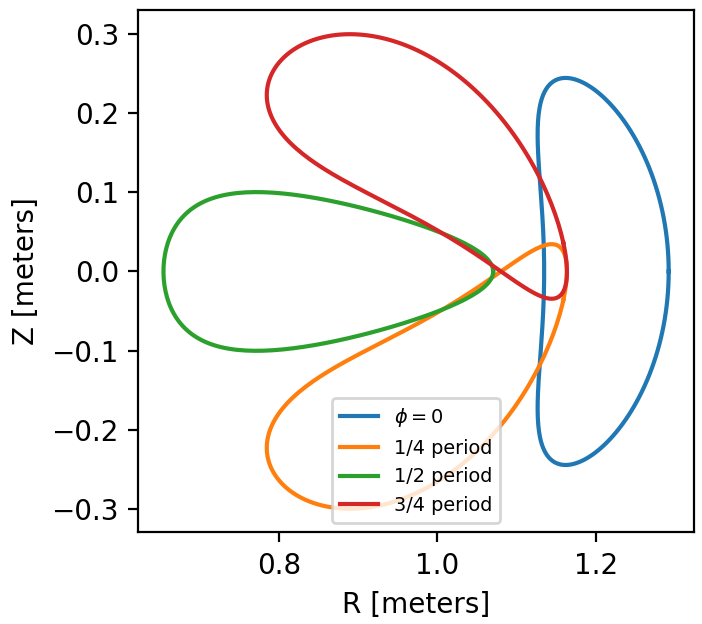
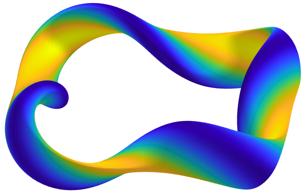
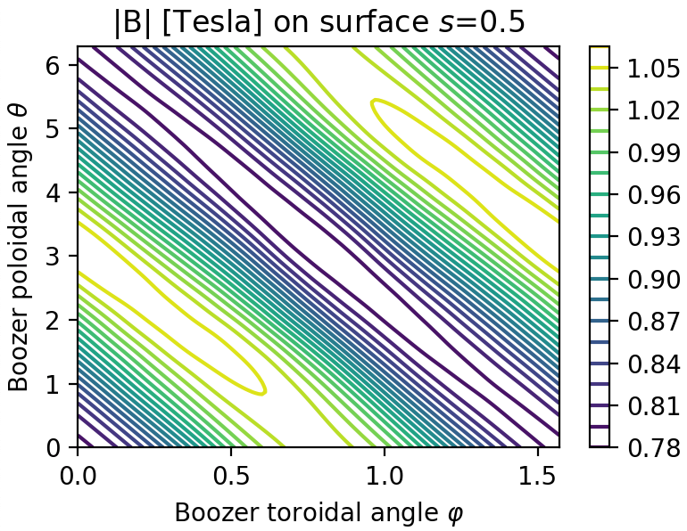

Optimizing for quasisymmetry
============================

In this tutorial it is shown how to optimize the boundary shape of a
VMEC configuration to achieve quasisymmetry on an interior flux
surface. First we will show the standard approach of optimizing with
fixed numerical resolution parameters. In the second section we show a
more advanced example in which the numerical resolution and size of
the parameter space are adjusted during the optimization.

For these optimization examples, you probably want to write a script
that is submitted to the queue on a computing cluster, where they are
likely to take minutes or tens of minutes on one node.

Fixed resolution
----------------

..
   Input file for this configuration came from IPP-Cobra in
   /ptmp/mlan/20210406-01-simsopt/20210406-01-002-simsopt_QH_attempt/wout_nfp4_QH_000_000050.nc
   This example was run on IPP-Cobra in /ptmp/mlan/20210421-01-simsoptAfterBetterErrorHandling/20210421-01-005_QH_example_const_resolution_maxMode2
   The final configuration is also available at
   ~/Box Sync/work21/wout_20210421-01-005_QH_example_nfp4_QH_warm_start_000_000165.nc

This example is also available as ``QH_fixed_resolution`` in the
``examples/2_Intermediate`` directory.  As usual, a driver script begins with
imports of the classes and functions we will need::

  #!/usr/bin/env python

  from simsopt.util.mpi import MpiPartition
  from simsopt.mhd import Vmec, Boozer, Quasisymmetry
  from simsopt.objectives.least_squares import LeastSquaresProblem
  from simsopt.solve.mpi import least_squares_mpi_solve

For this problem we will want MPI for parallelized finite difference
gradients. As explained below, this particular problem has 24
independent variables, so we can take advantage of 24 + 1 = 25 concurrent
function evaluations for one-sided differences. It is therefore
optimal to divide the MPI processes into 25 worker groups. For more
information about MPI and worker groups, see :ref:`mpi` or
:obj:`~simsopt.util.mpi.MpiPartition`.  In our script, we therefore
use::

  mpi = MpiPartition(25)

It is not necessary to use 25 groups - the code will function properly
for any choice.  If you select more than 25 groups, the groups beyond
the 25th will sit idle. If you select fewer than 25 groups, the 25
function evaluations needed for a finite difference gradient will be
distributed among the groups that are available.  There is no need to
make the number of groups a multiple of the number of available MPI
processes, although there cannot be more groups than processes.

We next initialize a VMEC object from an input file::

  vmec = Vmec("input.nfp4_QH_warm_start", mpi=mpi)

This file can be found in the ``examples/2_Intermediate/inputs`` directory. The file
describes a configuration that has already been partially optimized
for quasi-helical symmetry in a very small parameter space, keeping
poloidal and toroidal mode numbers only up through 1:

In the present example we will refine the configuration by optimizing
in a larger parameter space, with poloidal and toroidal mode numbers
up through 2. To define this parameter space, we set the ``fixed``
property of the boundary's Fourier modes as follows::

  # Define parameter space:
  surf = vmec.boundary
  surf.all_fixed()
  max_mode = 2
  surf.fixed_range(mmin=0, mmax=max_mode,
                   nmin=-max_mode, nmax=max_mode, fixed=False)
  surf.set_fixed("rc(0,0)") # Major radius

The above code first fixes all modes of the boundary, since we want
the mode numbers greater than 2 to all be fixed. Then the desired
range of modes is set to be not fixed. This range includes the m=n=0
mode which is essentially the mean major radius. We don't need or want
to vary the overall scale of the configuration, so it is convenient to
remove this mode from the parameter space.

Next, we need to configure a term in the objective function to
represent the departure from quasisymmetry. This can be done as
follows::

  # Configure quasisymmetry objective:
  qs = Quasisymmetry(Boozer(vmec),
                     0.5, # Radius to target
		     1, 1) # (M, N) you want in |B|

There are several adjustable options, the details of which can be
found in the API documentation for :obj:`~simsopt.mhd.boozer.Boozer`
and :obj:`~simsopt.mhd.boozer.Quasisymmetry`. The numerical resolution
of the Boozer-coordinate transformation can be adjusted by passing
parameters to the :obj:`~simsopt.mhd.boozer.Boozer` constructor, as in
``Boozer(vmec, mpol=64, ntor=32)``. The second argument to
``Quasisymmetry`` above sets the quasisymmetry objective to be
evaluated at normalized toroidal flux of 0.5, but you are free to
provide different values.  Or, a list of values can be provided to
target quasisymmetry on multiple surfaces. The
:obj:`~simsopt.mhd.boozer.Quasisymmetry` also has optional arguments
to adjust the normalization and weighting of different Fourier modes.

We are now ready to define the total objective function. Here we will
include quasisymmetry and aspect ratio. Aspect ratio must be included
because otherwise quasisymmetry can be made arbitrarily good by
increasing the aspect ratio to infinity. The simsopt objective
function is defined as follows::

  # Define objective function
  prob = LeastSquaresProblem([(vmec.aspect, 7, 1),
                              (qs, 0, 1)])

It can be seen that we are targeting an aspect ratio of 7. This
objective function will be a sum of 2017 least-squares terms, 2016 of
which correspond to symmetry-breaking Fourier modes of the Boozer
spectrum, plus one additional term ``(vmec.aspect - 7) ** 2``.

Finally, we solve the optimization problem::

  least_squares_mpi_solve(prob, mpi, grad=True)

Suppose you have written the above commands in a file named
``simsopt_driver``.  Depending on your computing system, the script
can be run using a command like ``srun python simsopt_driver`` (for
SLURM systems) or ``mpirun -n 25 simsopt_driver``.

Since this objective function has multiple local minima, the final
result of the optimization can be sensitive to small changes in
simsopt, VMEC, or the packages they depend on. Therefore you will not
necessarily obtain exactly the result shown here. But one result
produced by this optimization script is the following configuration:

..
   Figure produced by ~/Box Sync/MATLAB/m20210207_plotVMECWout.m

..
   Figure produced by ~/Box Sync/work21/boozPlotHalfFluxUnfilled wout_20210421-01-005_QH_example_nfp4_QH_warm_start_000_000165.nc

This last figure shows that reasonably good quasisymmetry has been
achieved on the desired magnetic surface. The quality of quasisymmetry
can be improved by further refining the configuration using one or
more rounds of optimization with more Fourier modes in the parameter
space.

Dynamic resolution
------------------

Since simsopt optimization problems are defined using a python script,
you are free to add other scripting. Here we show how this capability
can be used to increase the numerical resolution of VMEC and
booz_xform during the optimization. At the same time, we will increase
the number of Fourier modes in the parameter space during the
optimization. This example can also be found in the ``examples/2_Intermediate``
directory as ``resolution_increase``.

As usual, we begin with the necessary imports::

  #!/usr/bin/env python

  from simsopt.util.mpi import MpiPartition
  from simsopt.mhd import Vmec, Boozer, Quasisymmetry
  from simsopt import LeastSquaresProblem
  from simsopt import least_squares_mpi_solve

We again split the pool of MPI processes into worker groups. Here, for
simplicity, we make each process its own worker group, by omitting the
argument::

  mpi = MpiPartition()

We initialize a VMEC configuration from an input file. This starting
configuration is axisymmetric with a circular cross-section, so we are
starting "from scratch"::

  vmec = Vmec("input.nfp2_QA", mpi=mpi)

This input file can be found in the ``examples/2_Intermediate/inputs`` directory. We define
the quasisymmetry objective as in the previous section, except that we
specify a helicity of (1,0) instead of (1,1) to get quasi-axisymmetry
instead of quasi-helical symmetry::

  # Configure quasisymmetry objective:
  boozer = Boozer(vmec)
  qs = Quasisymmetry(boozer,
                     0.5, # Radius to target
	  	     1, 0) # (M, N) you want in |B|

We now define the total objective function. For this example, it is
necessary to include a nonzero target value for the rotational
transform in the objective, to prevent the optimum from being truly
axisymmetric::

  # Define objective function
  prob = LeastSquaresProblem([(vmec.aspect, 6, 1),
                              (vmec.iota_axis, 0.465, 1),
                              (vmec.iota_edge, 0.495, 1),
                              (qs, 0, 1)])

It can be seen here that we are seeking a configuration with aspect
ratio 6, and iota slightly below 0.5.

Now, we set up a loop over several optimization steps. At each step,
the resolution parameters ``mpol`` and ``ntor`` for VMEC increase, as
do the the Fourier resolution parameters for ``booz_xform``. At the
same time, in each optimization step a larger range of poloidal and
toroidal mode numbers are set to be varied in the optimization::

  for step in range(4):
      max_mode = step + 1
    
      # VMEC's mpol & ntor will be 3, 4, 5, 6:
      vmec.indata.mpol = 3 + step
      vmec.indata.ntor = vmec.indata.mpol

      # booz_xform's mpol & ntor will be 16, 24, 32, 40:
      boozer.mpol = 16 + step * 8
      boozer.ntor = boozer.mpol
    
      if mpi.proc0_world:
          print("Beginning optimization with max_mode =", max_mode, \
                ", vmec mpol=ntor=", vmec.indata.mpol, \
                ", boozer mpol=ntor=", boozer.mpol, \
                ". Previous vmec iteration = ", vmec.iter)

      # Define parameter space:
      surf.all_fixed()
      surf.fixed_range(mmin=0, mmax=max_mode, 
                       nmin=-max_mode, nmax=max_mode, fixed=False)
      surf.set_fixed("rc(0,0)") # Major radius

      # Carry out the optimization for this step:
      least_squares_mpi_solve(prob, mpi, grad=True)

      if mpi.proc0_world:
          print("Done optimization with max_mode =", max_mode, \
                ". Final vmec iteration = ", vmec.iter)

If you like, other parameters could be adjusted at each step too, such
as the radial resolution or number of iterations in VMEC, the solver
tolerances, or the maximum number of iteration of the optimization
algorithm.

As in the previous section, the final result of this optimization can
be sensitive to small changes in simsopt, VMEC, or the packages they
depend on. Therefore you will not necessarily obtain exactly the
result shown here. But one result produced by this optimization script
is the following configuration:

..
   Figure produced by ~/Box Sync/MATLAB/m20210207_plotVMECWout.m

..
   Figure produced by ~/Box Sync/work21/boozPlotHalfFluxUnfilled simsopt_nfp2_QA_20210328-01-020_000_000251/wout_simsopt_nfp2_QA_20210328-01-020_000_000251_scaled.nc
