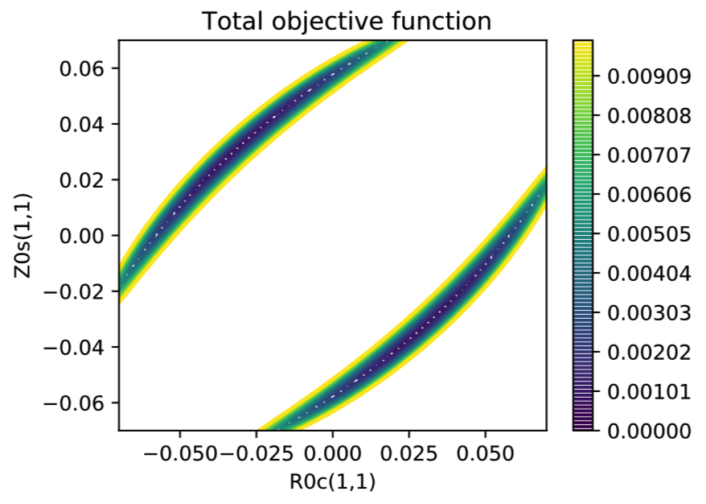

Optimizing an equilibrium code
==============================

Here we walk through an example of a small optimization problem in
which a fixed-boundary MHD equilibrium code is used, but no other
codes are required.  Either VMEC or SPEC can be used, and both
variants of the problem are shown here.  There are two independent
variables for the optimization, controlling the shape of a toroidal
boundary, and the objective function involves the rotational transform
and volume.  This same example is documented in the `stellopt
scenarios collection
<https://github.com/landreman/stellopt_scenarios/tree/master/2DOF_vmecOnly_targetIotaAndVolume>`_.
You can also find the source code for this example in the `examples
directory
<https://github.com/hiddenSymmetries/simsopt/blob/master/examples/stellarator_benchmarks/2DOF_vmecOnly_targetIotaAndVolume.py>`_.

For this problem the two independent variables are ``RBC(1,1)`` and
``ZBS(1,1)``, which control the shape of the plasma boundary::
  
  R(theta, phi) = 1 + 0.1 * cos(theta) + RBC(1,1) * cos(theta - 5 * phi),
  Z(theta, phi) =     0.1 * sin(theta) + ZBS(1,1) * sin(theta - 5 * phi).

Note that this boundary has five field periods. We consider the vacuum
field inside this boundary magnetic surface, i.e. there is no plasma
current or pressure. The toroidal flux enclosed by the boundary
surface is held fixed. The objective function is

.. code-block::
   
   f = (iota - iota_target)^2 + (volume - volume_target)^2,
   
where
``iota`` is the rotational transform on the magnetic axis,
``iota_target = 0.41``,
``volume_target = 0.15 m^3``,
and ``volume`` is the volume enclosed by the plasma boundary.

Here is what the objective function landscape looks like:

It can be seen that the total objective function has two long narrow
valleys that are fairly straight.  There are two symmetric optima, one
at the bottom of each valley.  When either of the two independent
variables is +/- 0.1m, the boundary surface becomes infinitesmally
thin, so equilibrium codes are likely to fail.
	   
The optimum configuration looks as follows, with the color indicating
the magnetic field strength:

	   
SPEC version
------------

Here we show the SPEC version of this example.
For simplicity, MPI parallelization will not be used for now.
To start, we must import several classes::

  from simsopt.mhd import Spec
  from simsopt.objectives import LeastSquaresProblem
  from simsopt.solve import least_squares_serial_solve

Then we create the equilibrium object, starting from an input file::

  equil = Spec('2DOF_targetIotaAndVolume.sp')

This file can be found in the :simsopt:`examples/stellarator_benchmarks/inputs` directory; you can prepend
the path to the filename if needed.

Next, we define the independent variables for the optimization, by
choosing which degrees of freedom are fixed or not fixed. In this
case, the independent variables are two of the Fourier amplitudes
defining the boundary. We choose the independent variables as follows::

  surf = equil.boundary
  surf.fix_all()
  surf.unfix('rc(1,1)')
  surf.unfix('zs(1,1)')

The next step is to define the objective function. For details of how to define
least-squares objective functions, see the :doc:`optimizable` page. For the present problem, we use

.. code-block::

   desired_volume = 0.15
   volume_weight = 1
   term1 = (equil.volume, desired_volume, volume_weight)

   desired_iota = -0.41
   iota_weight = 1
   term2 = (equil.iota, desired_iota, iota_weight)

   prob = LeastSquaresProblem.from_tuples([term1, term2])

Finally, we solve the optimization problem::

  least_squares_serial_solve(prob)

SPEC will then run many times; it will likely take a bit less than a
minute to find the optimum.  Once the problem is solved, we can
examine some properties of the optimum::

  print("At the optimum,")
  print(" rc(m=1,n=1) = ", surf.get_rc(1, 1))
  print(" zs(m=1,n=1) = ", surf.get_zs(1, 1))
  print(" volume, according to SPEC    = ", equil.volume())
  print(" volume, according to Surface = ", surf.volume())
  print(" iota on axis = ", equil.iota())
  print(" objective function = ", prob.objective())

The results are

.. code-block::
   
   At the optimum,
    rc(m=1,n=1) =  0.03136534181915223
    zs(m=1,n=1) =  -0.03127549335108014
    volume, according to SPEC    =  0.17802858467026614
    volume, according to Surface =  0.1780285846702657
    iota on axis =  -0.41148381548239504
    objective function =  0.0007878032670040736

These numbers match the solution found using stellopt and VMEC in
`stellopt_scenarios
<https://github.com/landreman/stellopt_scenarios/tree/master/2DOF_vmecOnly_targetIotaAndVolume>`_

.. _vmec_ex:
    
VMEC version
------------

To use VMEC instead of SPEC, the only essential change is to use a
:obj:`~simsopt.mhd.Vmec` class for the equilibrium instead of the
:obj:`~simsopt.mhd.Spec` class.

Here we can also show how to add MPI to the example.  MPI can be used
for parallelized finite-difference gradients, within each VMEC
computation, or both at the same time.  To introduce MPI we first
initialize an :obj:`simsopt.util.MpiPartition` object and choose
the number of worker groups.  The instance is then passed as an
argument to the :obj:`~simsopt.mhd.Vmec` object and to the
:meth:`simsopt.solve.least_squares_mpi_solve` function.
For more details about MPI, see :doc:`mpi`.

The complete example is then as follows::

  from simsopt.util import MpiPartition
  from simsopt.mhd import Vmec
  from simsopt.objectives import LeastSquaresProblem
  from simsopt.solve import least_squares_mpi_solve

  # In the next line, we can adjust how many groups the pool of MPI
  # processes is split into.
  mpi = MpiPartition(ngroups=3)

  # Initialize VMEC from an input file:
  equil = Vmec('input.2DOF_vmecOnly_targetIotaAndVolume', mpi)
  surf = equil.boundary

  # You can choose which parameters are optimized by setting their 'fixed' attributes.
  surf.fix_all()
  surf.unfix('rc(1,1)')
  surf.unfix('zs(1,1)')

  # Each Target is then equipped with a shift and weight, to become a
  # term in a least-squares objective function.  A list of terms are
  # combined to form a nonlinear-least-squares problem.
  desired_volume = 0.15
  volume_weight = 1
  term1 = (equil.volume, desired_volume, volume_weight)

  desired_iota = 0.41
  iota_weight = 1
  term2 = (equil.iota_axis, desired_iota, iota_weight)

  prob = LeastSquaresProblem.from_tuples([term1, term2])

  # Solve the minimization problem:
  least_squares_mpi_solve(prob, mpi, grad=True)

The VMEC input file used here can be found at :example_file:`stellarator_benchmarks/2DOF_vmecOnly_targetIotaAndVolume.py`.
