Wireframe optimization
======================

This tutorial demonstrates several examples of optimizations on wireframes
using the Regularized Constrained Least Squares (RCLS) and the Greedy 
Stellarator Coil Optimization (GSCO) techniques. Further details about these
methods may be found in the paper `A framework for discrete optimization of
stellarator coils <https://doi.org/10.1088/1741-4326/adbb02>`_.

All examples here make use of the :obj:`~simsopt.geo.ToroidalWireframe` class 
to formulate the coil current distribution as a set of interconnected straight 
segments of wire, for which the optimizable parameters are the currents carried 
by each segment. Each optimization technique upholds the requirement for 
current continuity; i.e. charge will not accumulate at the nodes where 
segments intersect.

Regularized Constrained Least Squares (RCLS)
^^^^^^^^^^^^^^^^^^^^^^^^^^^^^^^^^^^^^^^^^^^^

The RCLS technique uses linear least-squares methods to optimize the segment
currents with Tikhonov regularization, subject to constraints that include
current continuity.

The RCLS objective function to be minimized, subject to the constraints,
is defined as follows:

.. math::  
  J = \frac{1}{2} 
      \int \left| \left(\vec{B}_{wireframe} 
                  - \vec{B}_{ext}\right) \cdot \vec{n}\right|^2 ds
          + \frac{1}{2}\left( \mathbf{W}\vec{x} \right)^2.

Here, :math:`\vec{B}_{wireframe}` is the magnetic field produced by the 
wireframe, :math:`\vec{B}_{ext}` is the field produced by all other sources 
including plasma currents and other coils, :math:`\mathbf{W}` is a 
regularization matrix, and :math:`\vec{x}` contains the currents in each
wireframe segment. The first term in :math:`J` is the typical field accuracy
objective, while the second term is a Tikhonov regularization objective
that penalizes large currents in the segments. Often, the regularization
matrix :math:`\mathbf{W}` is replaced with a constant factor (in which case all
segment currents are penalized by the same factor) or is a diagonal matrix
(in which case different segment currents may be penalized by different
amounts).

The constraints that may be applied to the wireframe are as follows:

- **Continuity constraints.** These enforce current continuity at each node
  of the wireframe where segments intersect. The constraints require the 
  current flowing into each node to equal the current flowing out of it
  such that charge does not accumulate at the nodes. These constraints are
  automatically incorporated any time a wireframe is constructed, so there
  is no need for the user to add them manually.
- **Poloidal current constraint.** This requires the net poloidal current in the
  wireframe to have a specified value. Specifying the net poloidal current in
  this way guarantees a certain average value of the toroidal magnetic field 
  within the wireframe at a certain major radius.
- **Toroidal current constraint.** This requires the net toroidal current in the
  wireframe to have a specified value.
- **Segment constraints.** These constraints require the currents in specified
  segments to be zero, effectively removing those segments from consideration
  in the optimization. These are helpful for blocking off sections of the 
  wireframe to reserve space for other components, or for preventing current
  from flowing across certain user-imposed boundaries.

This section describes two examples of RCLS solutions:

- A basic use case that can be made arbitrarily accurate by increasing
  the wireframe resolution 
- A solution in which segments of the wireframe are blocked off to 
  leave room for ports modeled by :obj:`~simsopt.geo.Port` subclasses

Basic RCLS
----------

The first example includes the fundamental elements of a wireframe optimization
using RCLS: creating the wireframe, setting its constraints, setting the
optimization parameters, and running the optimization. It can also be found
in :simsopt_file:`examples/2_Intermediate/wireframe_rcls_basic.py`.

First import the necessary classes, including the ones for creating and
optimizing toroidal wireframes::

  from simsopt.geo import SurfaceRZFourier, ToroidalWireframe
  from simsopt.solve import optimize_wireframe

To construct a :obj:`~simsopt.geo.ToroidalWireframe` class instance, one must 
specify its geometry and resolution. The geometry is defined according to a 
toroidal surface, represented by an instance of 
:obj:`~simsopt.geo.SurfaceRZFourier`,  on which the 
wireframe's nodes are to be placed. In this example, the toroidal surface
is constructed to be a certain uniform distance away from the target
plasma boundary.

The nodes are positioned in a 
two-dimensional grid on the toroidal surface, spaced evenly in the toroidal 
and poloidal angles. The number of nodes is set by two integers, which specify
number of nodes per half-period in the toroidal dimension and the number of
nodes in the poloidal dimension, respectively. The geometry of the wireframe
segments is fully determined by the node positions, as the segments simply
lie on straight lines connecting adjacent pairs of nodes.

The wireframe in the example is constructed as follows::

  # Number of wireframe segments per half period in the toroidal dimension
  wf_nPhi = 8
  
  # Number of wireframe segments in the poloidal dimension
  wf_nTheta = 12
  
  # Distance between the plasma boundary and the wireframe
  wf_surf_dist = 0.3
  
  # File for the desired boundary magnetic surface:
  TEST_DIR = (Path(__file__).parent / ".." / ".." / "tests" / "test_files").resolve()
  filename_equil = TEST_DIR / 'input.LandremanPaul2021_QA'
  
  # Construct the wireframe on a toroidal surface
  surf_wf = SurfaceRZFourier.from_vmec_input(filename_equil)
  surf_wf.extend_via_projected_normal(wf_surf_dist)
  wf = ToroidalWireframe(surf_wf, wf_nPhi, wf_nTheta)

Since the target plasma in this case is a vacuum equilibrium with no internal
currents, and the wireframe is the sole magnetic field source, the quantity
:math:`\vec{B}_{ext}` is zero. Hence, one can trivially optimize the 
objective function simply by setting all segment currents to zero
(:math:`\vec{x} = 0`). In order to find a nontrivial solution that produces
a nonzero magnetic field with a minimal normal component on the target plasma
boundary, it will be necessary to set a constraint requiring the net poloidal
current in the wireframe to have a certain value. In the example script, the
value is determined by specifying the desired magnetic field near the magnetic
axis of the plasma equilibrium::

  # Average magnetic field on axis, in Teslas, to be produced by the wireframe.
  # This will be used for setting the poloidal current constraint. The radius
  # of the magnetic axis will be estimated from the plasma boundary geometry.
  field_on_axis = 1.0

  # Load the geometry of the target plasma boundary
  plas_nPhi = 32
  plas_nTheta = 32
  surf_plas = SurfaceRZFourier.from_vmec_input(filename_equil,
                  nphi=plas_nPhi, ntheta=plas_nTheta, range='half period')
  
  # Calculate the required net poloidal current and set it as a constraint
  mu0 = 4.0 * np.pi * 1e-7
  pol_cur = -2.0*np.pi*surf_plas.get_rc(0,0)*field_on_axis/mu0
  wf.set_poloidal_current(pol_cur)

Finally, the optimization parameters must be specified. For RCLS, this is just
the regularization matrix :math:`\mathbf{W}`::

  # Weighting factor for Tikhonov regularization (used instead of a matrix)
  regularization_w = 10**-10.
  
  # Set the optimization parameters
  opt_params = {'reg_W': regularization_w}

In general, :math:`\mathbf{W}` may be an arbitrary matrix. However, for 
simplicity in this example, a simple scalar value will be used. Effectively, 
:math:`\mathbf{W}` is the scalar times the identity matrix, although it is
sufficient to define ``'reg_W'`` as a scalar. Similarly, if one wishes to
supply a diagonal matrix for :math:`\mathbf{W}`, one can simply input the
vector of diagonal elements as a one-dimensional array rather than a full 
matrix.

With all necessary inputs specified, the RCLS procedure may then be run
using the :obj:`~simsopt.solve.optimize_wireframe` function. With the wireframe 
parameters specified above, the optimization itself should take less than a 
second to perform on a personal computer::

  # Run the RCLS optimization
  res = optimize_wireframe(wf, 'rcls', opt_params, surf_plas=surf_plas,
                           verbose=False)

When the optimization is complete, the :obj:`~simsopt.geo.ToroidalWireframe` 
class instance (``wf`` in this case) will be updated such that its ``currents`` 
attribute contains the segment currents found by the optimizer. One can verify 
that the solution satisfies all constraints using 
the :obj:`~simsopt.geo.ToroidalWireframe.check_constraints` method of 
the :obj:`~simsopt.geo.ToroidalWireframe` class::

  # Verify that the solution satisfies all constraints
  assert wf.check_constraints()

In addition to updating the wireframe class instance, the 
:obj:`~simsopt.solve.optimize_wireframe` function returns a dictionary with 
some key data associated with the optimization. This includes 
``'wframe_field'``, an instance of the :obj:`~simsopt.field.WireframeField` 
class representing the magnetic field produced by the optimized wireframe.
The :obj:`~simsopt.field.WireframeField` class is a subclass of the 
:obj:`~simsopt.field.MagneticField` class and can therefore be used for 
subsequent magnetic field calculations.

There are a number of ways to visualize the solution. One way is to generate
a two-dimensional plot of the segment currents using the 
:obj:`~simsopt.geo.ToroidalWireframe.make_plot_2d`
method of the :obj:`~simsopt.geo.ToroidalWireframe` class::

  # Save plots and visualization data to files
  wf.make_plot_2d(coordinates='degrees')
  pl.savefig(OUT_DIR + 'rcls_wireframe_curr2d.png')

The figure created by this command is shown below. The figure essentially
shows the wireframe unwrapped and flattened, with the toroidal dimension
running horizontally and the poloidal dimension running vertically. Accordingly,
toroidally-oriented wireframe segments are shown as horizontal line segments
on the plot, and poloidally-oriented wireframe segments are shown as 
vertical line segments. By default, a single half-period is plotted; hoever,
the user may plot other amounts of the wireframe with the keyword argument
``'extent'``. The line segments on the plot are color-coded according to
the current they carry. Red tones represent positive values, while blue
tones represent negative values. For toroidal segments, positive current flows
to the right; for poloidal segments, positive current flows upward.

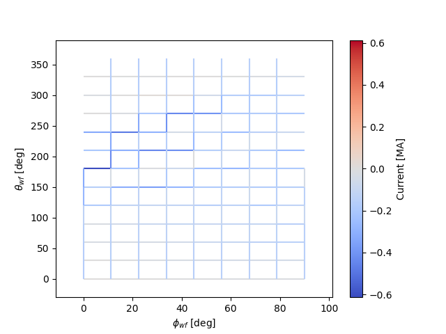
	
There are also options for generating a three-dimensional rendering of the
wireframe. With the :obj:`~.simsopt.geo.ToroidalWireframe.to_vtk` method, a 
file will be generated that may be loaded in ParaView::

  wf.to_vtk(OUT_DIR + 'rcls_wireframe')

Another option is to use the 
:obj:`~.simsopt.geo.ToroidalWireframe.make_plot_3d` method, which generates a 
three-dimensional rendering using the mayavi package (must be installed
separately).

Incorporating ports to avoid
----------------------------

Using the :obj:`~simsopt.geo.PortSet` class, the wireframe can be constrained 
to have its current distribution avoid overlap with an arbitrary set of ports. 
The ports may represent actual ports for diagnostics or heating systems, or they 
could be used more generally to block out spatial regions for other components.
This example will modify the above example to ensure that the RCLS optimizer
avoids placing currents in segments that overlap a set of ports placed on
the outboard side of the stellarator. The ports will be assumed to have
circular cross-sections and can thus be represented by the 
:obj:`~simsopt.geo.CircularPort` class. This example may also be found in the 
file :simsopt_file:`examples/2_Intermediate/wireframe_rcls_with_ports.py`.

First, the general :obj:`~simsopt.geo.PortSet` and 
:obj:`~simsopt.geo.CircularPort` classes must be imported::

  from simsopt.geo import PortSet, CircularPort  

The addition of constraints for avoiding ports at certain locations will, 
in general, reduce the attainable field accuracy at a given wireframe
resolution. Thus, the wireframe resolution will be higher than in the 
previous example in order to achieve a similar level of field accuracy::

  # Number of wireframe segments per half period in the toroidal dimension
  wf_nPhi = 12
  
  # Number of wireframe segments in the poloidal dimension
  wf_nTheta = 22

The location of each port is independently specified by an arbitrary origin 
point. For convenience in this example, it will be assumed that all ports
should have their origins on the same toroidal surface used to generate the
wireframe, at specified toroidal and poloidal angles::

  # Angular positions in each half-period where ports should be placed
  port_phis = [np.pi/8, 3*np.pi/8]  # toroidal angles
  port_thetas = [np.pi/4, 7*np.pi/4]  # poloidal angles
  
Further, for the sake of simplicity, the ports in this example will all have 
the same dimensions, although in general this need not be the case::

  # Dimensions of each port 
  port_ir = 0.1       # inner radius [m]
  port_thick = 0.005  # wall thickness [m]
  port_gap = 0.04     # minimum gap between port and wireframe segments [m]
  port_l0 = -0.15     # distance from origin to end, negative axis direction [m]
  port_l1 = 0.15      # distance from origin to end, positive axis direction [m]
  
The set of ports (``ports``) is initialized as an empty instance of the 
:obj:`~simsopt.geo.PortSet` class::

  ports = PortSet()

Each port is then initialized as an instance of the 
:obj:`~simsopt.geo.CircularPort` class and then added to ``ports``::

  # Construct the port geometry
  for i in range(len(port_phis)):
      # For simplicity, adjust the angles to the positions of the nearest existing
      # quadrature points in the surf_wf class instance
      phi_nearest = np.argmin(np.abs((0.5/np.pi)*port_phis[i]
                                     - surf_wf.quadpoints_phi))
      for j in range(len(port_thetas)):
          theta_nearest = np.argmin(np.abs((0.5/np.pi)*port_thetas[j] \
                                           - surf_wf.quadpoints_theta))
          ox = surf_wf.gamma()[phi_nearest, theta_nearest, 0]
          oy = surf_wf.gamma()[phi_nearest, theta_nearest, 1]
          oz = surf_wf.gamma()[phi_nearest, theta_nearest, 2]
          ax = surf_wf.normal()[phi_nearest, theta_nearest, 0]
          ay = surf_wf.normal()[phi_nearest, theta_nearest, 1]
          az = surf_wf.normal()[phi_nearest, theta_nearest, 2]
          ports.add_ports([CircularPort(ox=ox, oy=oy, oz=oz, ax=ax, ay=ay, az=az,
              ir=port_ir, thick=port_thick, l0=port_l0, l1=port_l1)])

Remarks about the above code:

- In this example, for simplicity, the port origins (specified by ``ox``, 
  ``oy``, and ``oz``) are not necessarily placed exactly at the toroidal and 
  poloidal angles specified above by ``port_thetas`` and ``port_phis``; rather, 
  they are placed at existing quadrature points of ``surf_wf`` that are close 
  to the requested angles.
- Each port is set to be locally perpendicular to the surface represented by 
  ``surf_wf``; hence, the port axis (specified by ``ax``, ``ay``, and ``az``) 
  aligns with the local normal vector to the surface represented

Finally, the :obj:`~simsopt.geo.PortSet.repeat_via_symmetries` method is used 
to ensure that equivalent ports originating in all half-periods are accounted 
for::

  ports = ports.repeat_via_symmetries(surf_wf.nfp, True)

With the port set fully specified, it can now be used to impart constraints
to the wireframe. Note that the :obj:`~simsopt.geo.PortSet` class has a method 
:obj:`~simsopt.geo.PortSet.collides`,
which takes as input arrays of ``x``, ``y``, and ``z`` coordinates of a set
of test points and returns a logical array that is ``True`` for each point
that collides with the port set. This function can be passed as an argument
to the :obj:`~simsopt.geo.ToroidalWireframe.constrain_colliding_segments` 
method of a :obj:`~simsopt.geo.ToroidalWireframe` class instance::

  # Constrain wireframe segments that collide with the ports
  wf.constrain_colliding_segments(ports.collides, gap=port_gap)

Internally, the :obj:`~simsopt.geo.ToroidalWireframe` class instance uses this 
function to determine which of its segments collide with the port set. Any 
segments found to be colliding are constrained to carry zero current.

Once these constraints are set, the optimization proceeds in the same way as
with the previous example::

  # Run the RCLS optimization
  res = optimize_wireframe(wf, 'rcls', opt_params, surf_plas=surf_plas, 
                           verbose=False)

To generate a 2D plot of the solution, it may be helpful to omit the 
segments that were constrained to have zero current due to collisions with
the ports. This can be done with the ``quantity`` keyword parameter to
the :obj:`~simsopt.geo.ToroidalWireframe.make_plot_2d` method::

  # Save plots and visualization data to files
  wf.make_plot_2d(quantity='nonzero currents', coordinates='degrees')

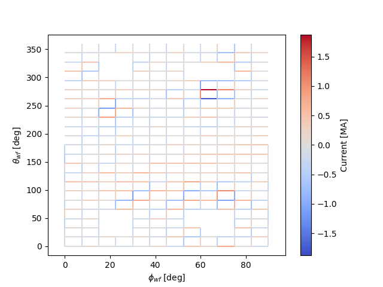

While it is possible to output VTK files for the ports and wireframes in 
order to generate 3D renderings with external software, it is also possible
to create 3D images directly in SIMSOPT. For 3D visualizations of wireframes
and ports, the mayavi package must be installed. Below is some code that
creates a 3D rendering of the plasma boundary, wireframe (with the constrained
segments hidden via the keyword argument ``to_show``), and ports::

  # Generate a 3D plot if desired
  if make_mayavi_plot:
  
      from mayavi import mlab
      mlab.options.offscreen = True
  
      mlab.figure(size=(1050,800), bgcolor=(1,1,1))
      wf.make_plot_3d(to_show='active')
      ports.plot()
      surf_plas_plot = SurfaceRZFourier.from_vmec_input(filename_equil, 
          nphi=plas_nPhi, ntheta=plas_nTheta, range='full torus')
      surf_plas_plot.plot(engine='mayavi', show=False, close=True, 
          wireframe=False, color=(1, 0.75, 1))
      mlab.view(distance=5.5, focalpoint=(0, 0, -0.15))
      mlab.savefig(OUT_DIR + 'rcls_ports_wireframe_plot3d.png')

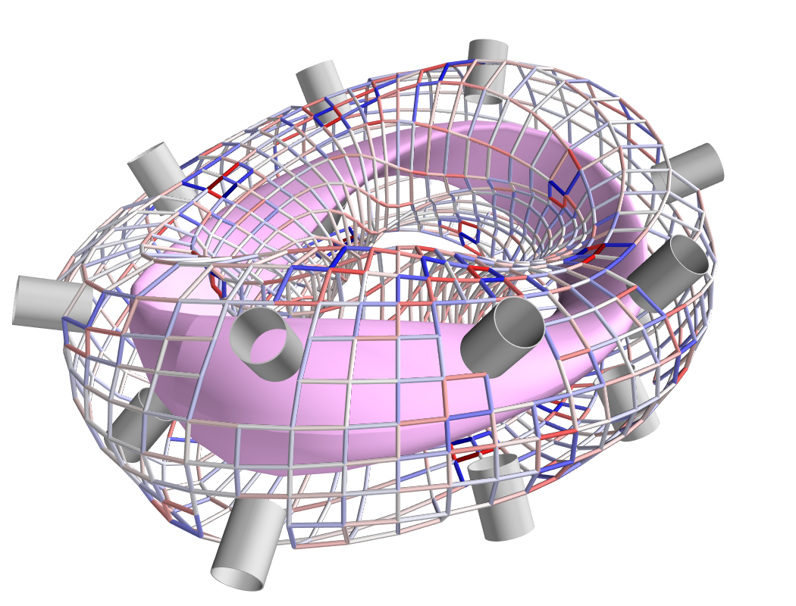

Greedy Stellarator Coil Optimization (GSCO)
^^^^^^^^^^^^^^^^^^^^^^^^^^^^^^^^^^^^^^^^^^^

The GSCO technique uses a greedy optimization algorithm that adds loops of 
current one by one to the wireframe, each time choosing the location and
polarization that brings about the greatest reduction of the objective 
function while upholding certain constraints and eligibility conditions.

The objective function for GSCO is

.. math::  
  J = \frac{1}{2} 
      \int \left| \left(\vec{B}_{wireframe} 
                  - \vec{B}_{ext}\right) \cdot \vec{n}\right|^2 ds
          + \frac{\lambda_S}{2} N_{active},

where :math:`N_{active}` is the number of active segments (that is, the number
of segments that carry nonzero current) and :math:`\lambda_S` is a weighting
factor. The first term, which is the same as the first term in the 
`RCLS <#regularized-constrained-least-squares-rcls>`_
objective function, incentivizes magnetic field accuracy.
The second term incentivizes sparsity in the solution. The higher
the value of :math:`\lambda_S`, the more the optimizer will prioritize 
sparsity over field accuracy.

In each GSCO iteration, a loop of current is added to a cell within the 
wireframe. A *cell* in this context consists of four segments that form a 
rectangle in the wireframe grid (i.e. they form a loop that does not enclose
any other segments). By adding loops with the same amount of current to 
adjacent cells in the wireframe, coils can be formed or reshaped. For example, 
as shown in plot (a) of the figure below, if five loops of current with the 
same polarity are added to five contiguous cells within the wireframe, the
net result will be a single saddle coil enclosing the cells where the loops 
were added. As another example, as shown in plot (b) of the figure below, 
adding loops of current to cells adjacent to an initially straight section of
a coil will effectively change the shape of the initial coil.

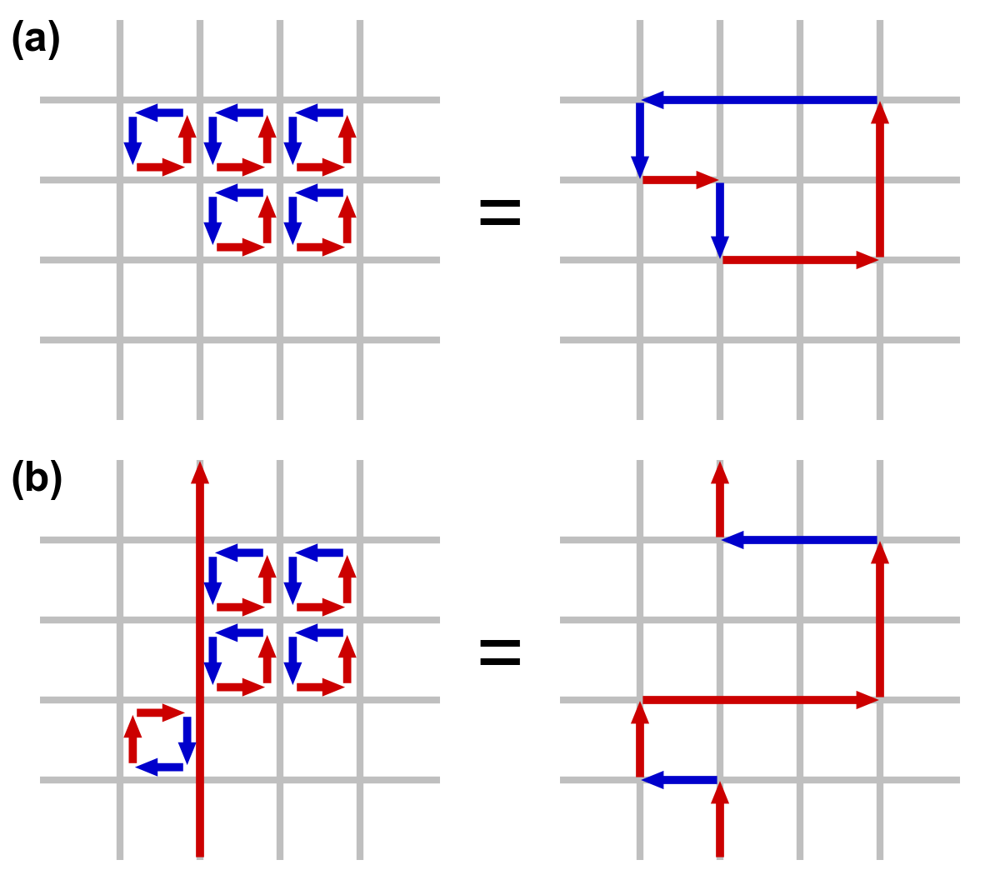
    
The optimizer cannot necessarily place a loop in any wireframe cell in a given
iteration. Whether or not a loop may be added to a given cell is controlled by
a *eligibility rules*. The eligibility rules that may be applied to GSCO 
optimizations are listed below: 

.. list-table:: 
   :widths: 20 55 25
   :header-rows: 1
   :class: tight-table

   * - Rule
     - Description
     - Parameter in :obj:`~simsopt.solve.optimize_wireframe`
   * - wireframe constraints
     - Solution must satisfy all constraint equations (this rule is mandatory)
     - n/a (always applied)
   * - no crossing
     - At each node, at most two segments may carry current
     - ``no_crossing``
   * - no new coils
     - Loops may not be added to a cell around which all segments presently 
       carry no current
     - ``no_new_coils``
   * - max current :math:`(I_{max})`
     - The absolute value of the current in any given segment may not exceed 
       a given :math:`I_{max}`
     - ``max_current``
   * - max loops per cell :math:`(N_{max})`
     - The net number of positive or negative loops of current added to a 
       given cell may not exceed a defined maximum, :math:`N_{max}`
     - ``max_loop_count``

The nature of the solution depends greatly on the constraints and eligibility 
rules that are applied. The examples in this section use the same wireframe
structure and optimize for the same plasma, but produce very different 
solutions by employing different constraints and rules. The examples are as 
follows:

- Modular coils
- Saddle coils confined to toroidal sectors
- Saddle coils with different currents combined with external toroidal field 
  coils

Modular coils
-------------

The first example uses GSCO to produce a modular coil solution. To accomplish 
this, it is important to note that GSCO cannot create modular coils on an empty 
wireframe grid, because the current loops added during GSCO iterations can 
contribute no net poloidal current component. However, if the wireframe is 
initialized with a set of (planar) TF coils, GSCO can reshape the coils to
minimize the objective function. An example of this is demonstrated in the file  
:simsopt_file:`examples/2_Intermediate/wireframe_gsco_modular.py`.

To achieve good field accuracy with GSCO, one generally must use a higher
wireframe resolution than what is sufficient with the RCLS approach::

  # Number of wireframe segments per half period, toroidal dimension
  wf_nPhi = 48

  # Number of wireframe segments per half period, poloidal dimension
  wf_nTheta = 50

To match the solution in the paper reference, the resolution would need to be
increased to 96x100; however, 48x50 already yields a pretty accurate solution.

In this example, the wireframe is created on a surface generated by the 
`BNORM <https://princetonuniversity.github.io/STELLOPT/BNORM>`__ code to be
spaced approximately 30 cm from the target plasma boundary. Its coefficients
are stored in the format of a NESCOIL input file. This can be used to create 
a Simsopt surface via the 
:obj:`~simsopt.geo.SurfaceRZFourier.from_nescoil_input`
method. The surface is then used to create the wireframe::

  # Construct the wireframe on a toroidal surface
  surf_wf = SurfaceRZFourier.from_nescoil_input(filename_wf_surf, 'current')
  wf = ToroidalWireframe(surf_wf, wf_nPhi, wf_nTheta)

Next, a set of planar TF coils is initialized on the wireframe using the 
:obj:`~simsopt.geo.ToroidalWireframe.add_tfcoil_currents` method::

  # Calculate the required net poloidal current
  mu0 = 4.0 * np.pi * 1e-7
  pol_cur = -2.0*np.pi*surf_plas.get_rc(0,0)*field_on_axis/mu0
  
  # Initialize the wireframe with a set of planar TF coils
  coil_current = pol_cur/(2*wf.nfp*n_mod_coils_hp)
  wf.add_tfcoil_currents(n_mod_coils_hp, coil_current)

The initialized wireframe can be visualized with the 
:obj:`~simsopt.geo.ToroidalWireframe.make_plot_3d` method::

  mlab.figure(size=(1050,800), bgcolor=(1,1,1))
  wf.make_plot_3d(to_show='all')
  surf_plas_plot = SurfaceRZFourier.from_vmec_input(filename_equil,
      nphi=plas_nPhi, ntheta=plas_nTheta, range='full torus')
  surf_plas_plot.plot(engine='mayavi', show=False, close=True,
      wireframe=False, color=(1, 0.75, 1))
  mlab.view(distance=5.5, focalpoint=(0, 0, -0.15))
  mlab.savefig(OUT_DIR + 'gsco_modular_wifeframe_init_plot3d.png')

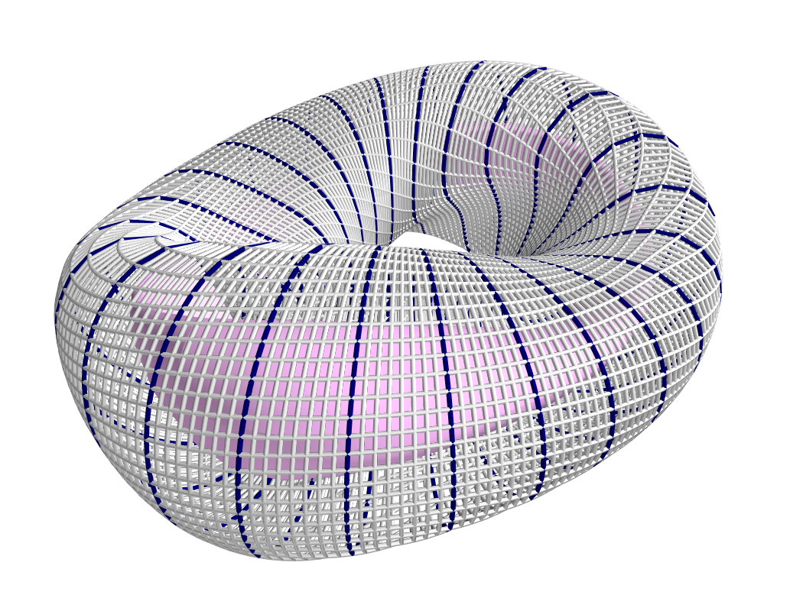

Before running the GSCO procedure, a number of optimizer parameters must be 
specified. Among other things, the parameters determine which eligibility rules
will be applied for adding current loops to the wireframe. For this example,
the "no crossing" rule will be invoked to prevent crossing current paths in
the solution by setting the ``no_crossing`` parameter to ``True``.
It is also necessary to specify the magnitude of the current :math:`I_{loop}` 
in the loops that 
are added in each iteration. This is done through the ``default_current`` 
parameter. For this application, the best choice is to match the current in the 
initialized TF coils, as this is the value that is best suited for reshaping 
those coils without creating forked current paths. Related to this is the
maximum allowable current that any segment can carry 
(``max_current``). To ensure that no coil in the solution carries more current
than the initialized TF coils, this is set to be slightly higher than the
default loop current. (It needs to be slightly higher to avoid loops being
erroneously marked as ineligible due to floating point imprecision.) The
regularization weighting factor :math:`\lambda_S` is set through the parameter 
``lambda_S``. Finally, a cap on the number of iterations and the frequency with 
which intermediate results should be saved are set with ``max_history`` and 
``print_interval``, respectively. To summarize::

  # Maximum number of GSCO iterations
  max_iter = 2000
            
  # How often to print progress
  print_interval = 100

  # Weighting factor for the sparsity objective
  lambda_S = 10**-6

  # Set the optimization parameters 
  opt_params = {'lambda_S': lambda_S, 
                'max_iter': max_iter,
                'print_interval': print_interval,
                'no_crossing': True,
                'default_current': np.abs(coil_current),
                'max_current': 1.1 * np.abs(coil_current)
               }

With the optimization parameters specified, the wireframe can now be optimized::

  res = optimize_wireframe(wf, 'gsco', opt_params, surf_plas=surf_plas,
                           verbose=False)

To display the optimized current distributions on dense wireframes with lots of 
inactive segments, it can improve visual clarity to hide any segments that carry
no current. Both the :obj:`~simsopt.geo.ToroidalWireframe.make_plot_2d` and
:obj:`~simsopt.geo.ToroidalWireframe.make_plot_3d` methods offer options for 
this::

  wf.make_plot_2d(coordinates='degrees', quantity='nonzero currents')

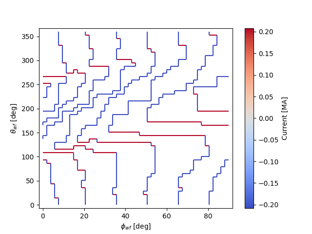

::

  wf.make_plot_3d(to_show='active')

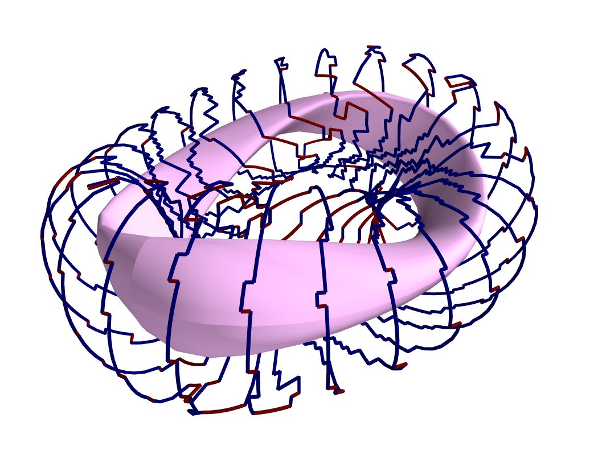

Sector-confined saddle coils
----------------------------

While the above example serves as a useful proof-of-concept for the GSCO
procedure, it doesn't take advantage of some of the distinguishing capabilities
of GSCO and the wireframe; namely, the ability to control where coils may be
placed. In this next example, constraints will be used to produce a design
consisting of a combination of planar TF coils and saddle coils that are 
confined to the sectors in between adjacent TF coils. The example is implemented
in the file :simsopt_file:`examples/2_Intermediate/wireframe_gsco_sector_saddle.py`.

The setup for this example will be similar to that of the modular coil example,
although with a few key differences. First, rather than initializing six planar
TF coils per half-period, this example will initialize three to leave more room
for the formation of saddle coils in between. Next, to ensure that the GSCO
procedure only creates coils between the TF coils and doesn't reshape the TF
coils, constraints will be placed on segments surrounding each TF coil::

  # Number of planar TF coils in the solution per half period
  n_tf_coils_hp = 3
    
  # Toroidal width, in cells, of the restricted regions (breaks) between sectors
  break_width = 2   

::

  # Constrain toroidal segments around the TF coils to prevent new coils from
  # being placed there (and to prevent the TF coils from being reshaped)
  wf.set_toroidal_breaks(n_tf_coils_hp, break_width, allow_pol_current=True)

The constrained segments can be visualized with the 
:obj:`~simsopt.geo.ToroidalWireframe.make_plot_2d` method, setting the 
``quantity`` argument to ``'constrained segments'``. Note that the planar TF
coils are not visible in this particular plot, but each one runs down through
the middle of each of the red stripes::

  # Make a plot to show the constrained segments
  wf.make_plot_2d(quantity='constrained segments')
   
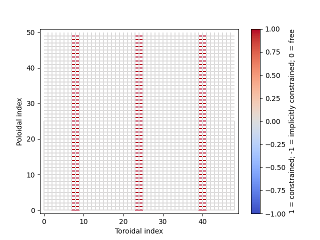

Another key difference for this example compared to the modular coil case is
in the choice of the loop current :math:`I_{loop}` to be used for the GSCO 
solver. In the 
modular coil case, the choice of loop current was straightforward: it should
match the current of the initialized TF coils such that loops placed next to
them could modify their shape without creating forked current paths. However,
in this optimization, GSCO will only create saddle coils between the planar 
TF coils; thus, the TF coil currents are not directly relevant. 

Without the need to match the TF coil current, the choice of :math:`I_{loop}`
is somewhat arbitrary. In general, one should experiment, re-running the 
optimization with different current levels and seeing which produces the best
result. For the example here, setting the loop current to be 5% of the net 
current used to produce the toroidal field seems to work well. In the paper
reference, which uses a higher wireframe grid resolution, a value of 3% is 
used. ::

  # GSCO loop current as a fraction of net TF coil current
  gsco_cur_frac = 0.05

Apart from the constraints and the selection of :math:`I_{loop}`, the 
optimization proceeds much the same as for the modular coils, with the same 
eligibility rules::

  # Set the optimization parameters
  opt_params = {'lambda_S': lambda_S,
                'max_iter': max_iter,
                'print_interval': print_interval,
                'no_crossing': True,
                'default_current': np.abs(gsco_cur_frac*pol_cur),
                'max_current': 1.1 * np.abs(gsco_cur_frac*pol_cur)
               }

  # Run the GSCO optimization
  res = optimize_wireframe(wf, 'gsco', opt_params, surf_plas=surf_plas,
                           verbose=False)

The solution is rendered below in 2D and 3D. The 3D rendering shows a top view 
with the wireframe solution superimposed on a toroidal surface that takes the 
shape of the wireframe to emphasize the distinguishing features of this 
solution. As can be seen in both plots, the TF coils remain planar (vertical in 
the 2D plot, and forming straight lines radiating from the center of the 3D 
plot). GSCO has added saddle coils in between each of the planar TF coils. In 
many cases, the saddle coils are concentric. Note that, as desired, the saddle 
coils do not touch any of the TF coils and therefore remain confined to toroidal 
sectors. Such a coil layout is convenient for assembly and disassembly of the 
device. 

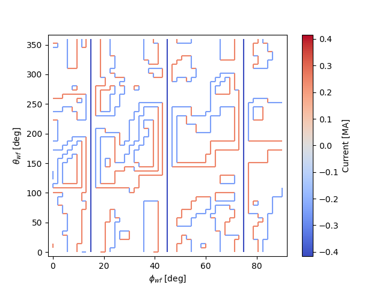

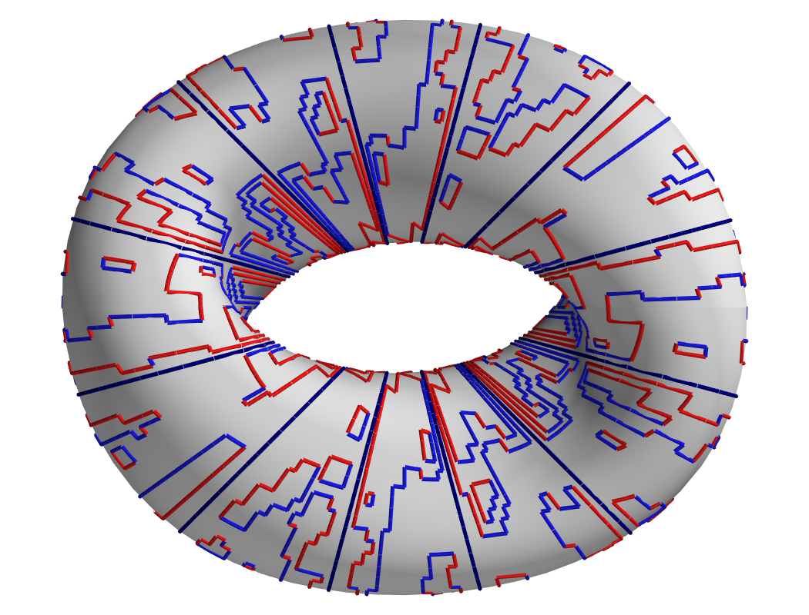

Note that many of the saddle coils form loops that are nested within one 
another, particularly on the inboard side. This could be (roughly) interpreted 
as a winding pattern for coils of finite cross-sectional dimensions. In general, 
using a larger value of :math:`I_{loop}` in the optimization will result in less 
nesting of coils, whereas smaller values of :math:`I_{loop}` will result in more 
nesting. How much nesting can occur is limited by the wireframe resolution (e.g. 
no nested coils can form inside a coil that is only one cell large), and/or by 
setting a maximum net number of loops :math:`N_{max}` via the "max loops per 
cell" eligibility rule. The next example avoids nesting using the latter 
strategy. 

Multi-step GSCO optimization
----------------------------

The above two GSCO examples produced solutions in which the non-planar coils 
were limited to having a single current value. However, it is possible to find 
solutions with multiple distinct coil currents and other desirable features by 
applying a sequence of GSCO procedures to a wireframe with carefully chosen 
constraints. In this example, a solution is found with saddle coils that exhibit 
multiple current levels and avoid the nesting that was prevalent in the previous 
saddle coil example. In addition, the toroidal field is supplied by external 
planar coils rather than from the wireframe itself, illustrating the ability of 
the wireframe to provide a magnetic field in tandem with other sources. 

The basic idea behind this procedure is to perform GSCO multiple times, 
beginning with a high loop current :math:`I_{loop}` and ending with a 
small :math:`I_{loop}`. The first step will start from an empty wireframe and 
add a few 
saddle coils with the maximum :math:`I_{loop}`, the second will add on a few 
coils with a lower :math:`I_{loop}`, the third will add a few more coils with 
yet a lower :math:`I_{loop}`, and so on, resulting in a solution with many 
saddle soils with several different current values. Empirically, good results
have been obtained by halving :math:`I_{loop}` for each subsequent step. 

A few special measures are taken to avoid potentially undesirable or 
inconvenient features such as (1) very small coils and (2) nested coils. To 
avoid very small coils, after each GSCO step the size of each of the new coils 
is checked. Any coil found to be smaller than a certain size (quantified here by 
the number of wireframe cells it encloses) is eliminated. Presumably, that small 
coil produced in step :math:`n-1` will be replaced with a larger coil in 
step :math:`n` with a smaller :math:`I_{loop}`. To avoid the formation of 
nested coils, two measures are taken. First, the GSCO optimizations apply the 
"max loops per cell" rule with :math:`N_{max}=1`. Second, after each GSCO step, 
any segments that happen to be enclosed within a saddle coil are constrained to 
carry no current; hence, subsequent GSCO iterations may not place new coils 
there.

These GSCO steps proceed until the solution converges; i.e. the solution from 
step :math:`n` is no different from the solution from step :math:`n-1`. At this 
point, one final GSCO optimization is performed, although the intent in this 
case is not to add new coils but rather to fine-tune the solution by adjusting 
the shapes of the existing coils. This can be done by invoking the "no new 
coils" rule (and/or setting the default :math:`I_{loop}` to zero) and running 
GSCO in "match current" mode. In "match current" mode, during each iteration 
when GSCO considers the impact on the objective function of adding a loops of 
current to eligible wireframe cells, for each cell lying next to an existing 
coil it will adopt as :math:`I_{loop}` whatever current happens to be flowing in 
that adjacent coil. Hence, unlike in the standard mode in which :math:`I_{loop}` 
is restricted to one value, GSCO in "match current" mode can adjust the shapes 
of multiple coils that have different currents.

To summarize, the multistep procedure in this example goes as follows:

#. Set an initial loop current :math:`I_{loop}`

#. Repeat the following until the solution stops changing:

   a. Run GSCO with :math:`I_{loop}`, invoking the following eligibility rules:
      "wireframe constraints", "no crossing", and "max loops per cell (1)"

   b. Remove any coils that enclose fewer than the minimum number of cells

   c. Constrain segments enclosed by coils to carry no current

   d. Set :math:`I_{loop} = 0.5 I_{loop}`

#. Run GSCO in "match current" mode, invoking the following eligibility rules: 
   "wireframe constraints", "no crossing", "max loops per cell (1)", and 
   "no new coils"

This example is implemented in the file 
:simsopt_file:`examples/3_Advanced/wireframe_gsco_multistep.py`. The wireframe is 
initialized in a very similar way to that of the 
`sector-confined saddle coil <#sector-confined-saddle-coils>`_ example; however 
with twice the resolution and with no planar TF coils appearing in the 
wireframe::

  # Number of wireframe segments per half period, toroidal dimension
  wf_nPhi = 96      

  # Number of wireframe segments per half period, poloidal dimension
  wf_nTheta = 100   

  # Number of planar TF coils in the solution per half period
  n_tf_coils_hp = 3     
                      
  # Toroidal width, in cells, of the restricted regions (breaks) between sectors
  break_width = 4

  # Construct the wireframe on a toroidal surface
  surf_wf = SurfaceRZFourier.from_nescoil_input(filename_wf_surf, 'current')
  wf = ToroidalWireframe(surf_wf, wf_nPhi, wf_nTheta)

  # Constrain toroidal segments around the TF coils to prevent new coils from
  # being placed there (and to prevent the TF coils from being reshaped)
  wf.set_toroidal_breaks(n_tf_coils_hp, break_width, allow_pol_current=True)

The toroidal field will be provided in this case by an external set of circular, planar coils::

  # Number of planar TF coils in the solution per half period
  n_tf_coils_hp = 3

  # Create an external set of TF coils
  tf_curves = create_equally_spaced_curves(n_tf_coils_hp, surf_plas.nfp, True,
                                           R0=1.0, R1=0.85)
  tf_curr = [Current(-pol_cur/(2*n_tf_coils_hp*surf_plas.nfp))
             for i in range(n_tf_coils_hp)]
  tf_coils = coils_via_symmetries(tf_curves, tf_curr, surf_plas.nfp, True)
  mf_tf = BiotSavart(tf_coils)
      
The initial value of :math:`I_{loop}`, to be used in the first GSCO step, is 
chosen to be 20% of the net poloidal current used to generate the toroidal 
field::

  # GSCO loop current as a fraction of net TF coil current
  init_gsco_cur_frac = 0.2

The series of GSCO optimizations is performed within one ``while`` loop. Prior 
to starting the loop, a number of updating variables must be initialized::

  # Initialize loop variables
  soln_prev = np.full(wf.currents.shape, np.nan)
  soln_current = np.array(wf.currents)
  cur_frac = init_gsco_cur_frac
  loop_count = None
  final_step = False
  encl_segs = []
  n_step = 0

``soln_current`` and ``soln_prev`` hold, respectively, the current solution and 
the solution from the previous step. They are used to determine whether the 
solution has changed from one step to the next. ``cur_frac`` effectively 
determines what :math:`I_{loop}` should be for each GSCO procedure and is 
initialized here prior to the beginning of the ``while`` loop. ``loop_count`` is 
an array with one element per wireframe cell that keeps track of how many loops 
have been added to each cell during a GSCO procedure (it is updated by the GSCO 
function). Nominally, ``loop_count`` must have the same number of elements as 
wireframe cells, but if it is set to ``None``, the GSCO function will interpret 
this as an empty grid. However, in subsequent steps, ``loop_count`` will be an 
array containing the data on loops added in previous steps, and subsequent calls 
to GSCO will add to this loop.

Steps 2-3 of the summarized procedure above are implemented in a single 
``while`` loop since much of the code for steps 2a-d and step 3 is the same. 
Whether or not an iteration of the ``while`` loop is in step 2a-d or step 3 is 
determined by the logical variable ``final_step``. In turn, ``final_step`` is 
initialized as ``False`` and set to ``True`` only once the solution stops 
changing (``soln_prev == soln_current``). Note that the initialization of 
``soln_prev`` and ``soln_current`` above will prevent the first iteration of 
the ``while`` loop from being the final step::

  # Multi-step optimization loop
  while not final_step:

      n_step += 1

      if not final_step and np.all(soln_prev == soln_current):
          final_step = True
          wf.set_segments_free(encl_segs)

One of the distinguishing features of steps 2a-d and step 3 are the optimization 
parameters used by GSCO, as shown below. Steps 2a-d use a nonzero default 
current. By contrast, step 3 (active when ``final_step == True``) invokes the 
``no_new_coils`` rule, operates in ``match_current`` mode, and uses a 
``default_current`` of zero. Note that, in step 3, it is necessary to set the 
``max_current`` to (slightly above) the initial current to allow GSCO to adjust 
the shape of coils carrying the initial (highest) current level::

  # Set the optimization parameters
  if not final_step:
      opt_params = {'lambda_S': lambda_S,
                    'max_iter': max_iter,
                    'print_interval': print_interval,
                    'no_crossing': True,
                    'max_loop_count': 1,
                    'loop_count_init': loop_count,
                    'default_current': np.abs(cur_frac*pol_cur),
                    'max_current': 1.1 * np.abs(cur_frac*pol_cur)
                   }
  else:
      opt_params = {'lambda_S': lambda_S,
                    'max_iter': max_iter,
                    'print_interval': print_interval,
                    'no_crossing': True,
                    'max_loop_count': 1,
                    'loop_count_init': loop_count,
                    'match_current': True,
                    'no_new_coils': True,
                    'default_current': 0,
                    'max_current': 1.1 * np.abs(init_gsco_cur_frac*pol_cur)
                   }

Conveniently, with ``opt_params`` set suitably for the respective stage of the 
procedure, the call to :func:`~simsopt.solve.optimize_wireframe` is the same. Note that, unlike in 
the other examples in this tutorial, an external field (``ext_field``) must be 
provided corresponding to the field provided by the external TF coils::

  # Run the GSCO optimization
  res = optimize_wireframe(wf, 'gsco', opt_params, surf_plas=surf_plas,
                           ext_field=mf_tf, verbose=False)

If ``final_step == False``, the above call to :func:`~simsopt.solve.optimize_wireframe`
constitutes step 2a of the above procedure. Before moving on to the next GSCO 
stage, steps 2b-c must be conducted. First, any saddle coil smaller than the 
user-designated minimum size is removed from the solution. The coil sizes are 
obtained with the helper function ``find_coil_sizes`` included in the file. The 
removal of the coils is implemented through a modification of the ``currents`` 
array of the :obj:`~simsopt.geo.ToroidalWireframe` class instance. Specifically, 
any segment that had been a part of the small coils has its current set to zero. 
Additionally, the ``loop_count`` array, which is not contained within  the 
:obj:`~simsopt.geo.ToroidalWireframe`, must be updated. Then, within all the 
new saddle coils (at least those that weren't removed for being too small), 
the wireframe segments are constrained to carry zero current::

  if not final_step:

      # "Sweep" the solution to remove coils that are too small
      coil_sizes = find_coil_sizes(res['loop_count'], wf.get_cell_neighbors())
      small_inds = np.where(\
          np.logical_and(coil_sizes > 0, coil_sizes < min_coil_size))[0]
      adjoining_segs = wf.get_cell_key()[small_inds,:]
      segs_to_zero = np.unique(adjoining_segs.reshape((-1)))

      # Modify the solution by removing the small coils
      loop_count = res['loop_count']
      wf.currents[segs_to_zero] = 0
      loop_count[small_inds] = 0

      # Prevent coils from being placed inside existing coils in subsequent 
      # steps
      encl_segs = constrain_enclosed_segments(wf, loop_count)

Assuming this is not the last step, i.e. ``final_step == False``, the last 
steps before the next ``while`` loop iteration include halving :math:`I_{loop}` 
(as per step 2d of the above procedure) and updating ``soln_prev`` and 
``soln_current``::

  cur_frac *= 0.5

  soln_prev = soln_current
  soln_current = np.array(wf.currents)

The end result of this multistep procedure is shown in 2D and 3D below.

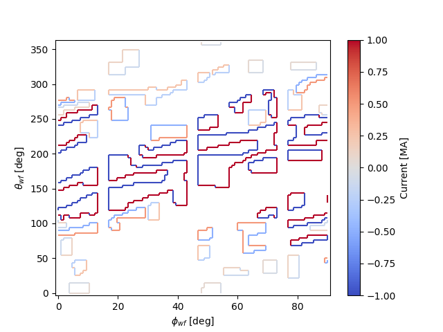

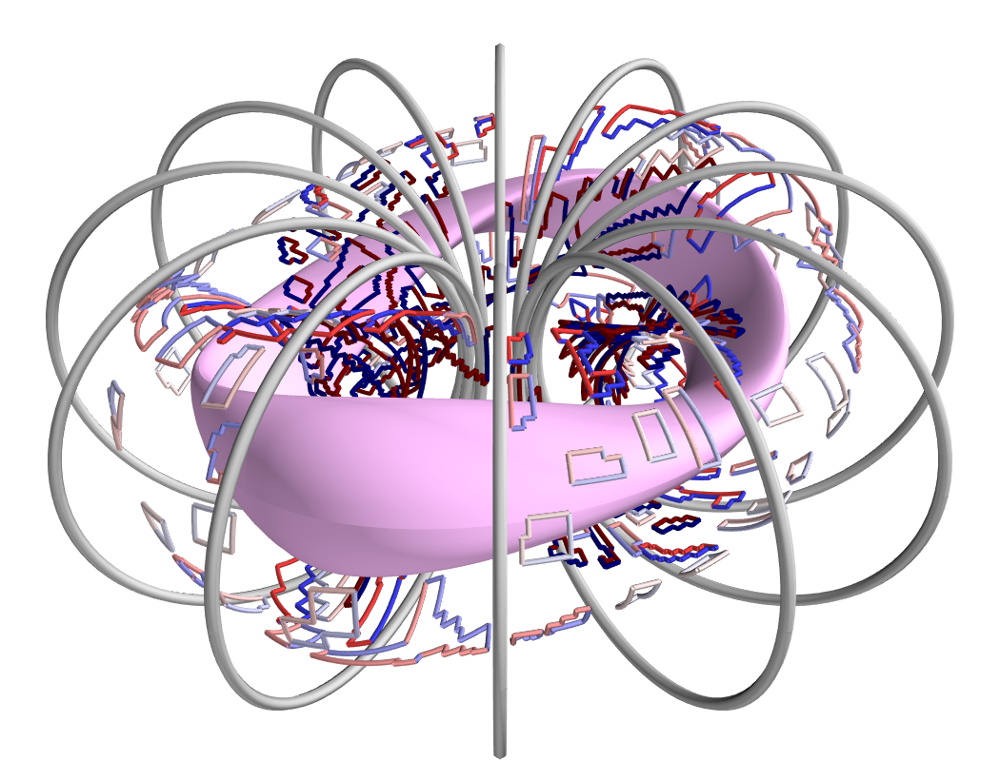

