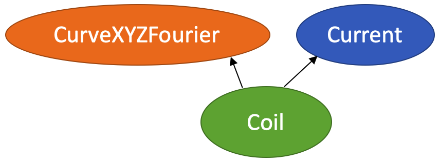
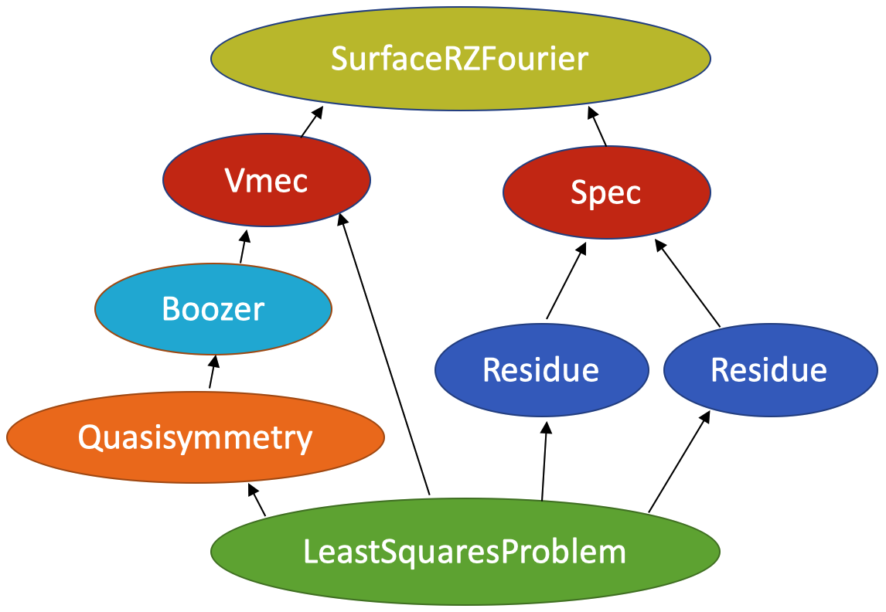

Defining optimization problems
==============================

The Optimizable class
---------------------

A basic tool for defining optimization problems in simsopt is the
class :obj:`~simsopt._core.Optimizable`. Many
classes in simsopt are subclasses of this class.  This parent class
provides several functions.  First, it allows for the parameters of an
object to be either fixed or varied in an optimization, for a useful
name string to be associated with each such degree of freedom, and for
box constraints on each parameter to be set.  Second, the
:obj:`~simsopt._core.Optimizable` class manages
dependencies between objects.  For example, if an MHD equilibrium
depends on a :obj:`~simsopt.geo.Surface` object representing
the boundary, the equilibrium object will know it needs to recompute
the equilibrium if the :obj:`~simsopt.geo.Surface` changes.
Third, when a set of objects with dependencies is combined into an
objective function, the
:obj:`~simsopt._core.Optimizable` class
automatically combines the non-fixed degrees of freedom into a global
state vector, which can be passed to numerical optimization
algorithms.

Users can create their own optimizable objects in two ways. One method
is to create a standard python function, and apply the
:meth:`simsopt.make_optimizable()` function to it, as explained
below. Or, you can directly subclass
:obj:`simsopt._core.Optimizable`.

Optimizable degrees of freedom
------------------------------

..
    A notebook containing the example in this section can be found in
    ~/Box Sync/work21/20211219-01 Simsopt optimizable demo.ipynb
    
The parameters of an object that can potentially be included in the
parameter space for optimization are referred to in simsopt as "dofs"
(degrees of freedom). Each dof is a float; integers are not optimized
in simsopt.  Each dof has several properties: it can be either "fixed"
or "free", it has a string name, and it has upper and lower bounds.
The free dofs are varied in an optimization, whereas the fixed ones
are not.

To demonstrate these functions, we can use a
:obj:`simsopt.geo.CurveXYZFourier` object as a
concrete example::

  >>> from simsopt.geo import CurveXYZFourier
  >>> c = CurveXYZFourier(quadpoints=30, order=1)

This object provides a Fourier representation of a closed curve, as is
commonly used for coil optimization.  The dofs for this object are the
Fourier series amplitudes of the Cartesian coordinates
:math:`(X(\theta), Y(\theta), Z(\theta))` with respect to the
parameter :math:`\theta`. By choosing ``order=1``, only mode numbers 0
and 1 are included.

Each dof has a string name, which can be queried using the
:obj:`~simsopt._core.Optimizable.local_dof_names`
property::

  >>> c.local_dof_names

  ['xc(0)', 'xs(1)', 'xc(1)', 'yc(0)', 'ys(1)', 'yc(1)', 'zc(0)', 'zs(1)', 'zc(1)']

Evidently there are nine dofs in this case. For each, the number in
parentheses is the mode number :math:`m`. The values of the dofs can
be read or written to using the
:obj:`~simsopt._core.Optimizable.x` property::

  >>> c.x

  array([0., 0., 0., 0., 0., 0., 0., 0., 0.])

  >>> c.x = [1, 0.1, 0, -2, 0, 0.3, 3, 0, 0.2]
  >>> c.x

  array([ 1. ,  0.1,  0. , -2. ,  0. ,  0.3,  3. ,  0. ,  0.2])

  >>> c.x[3]

  -2.0

Although you can use indices to retrieve selected elements of
:obj:`~simsopt._core.Optimizable.x`, as in the last
line, you *cannot* assign values to individual elements of
:obj:`~simsopt._core.Optimizable.x`, i.e. ``c.x[2] =
7.0`` will not work -- you can only assign an entire array to
:obj:`~simsopt._core.Optimizable.x`. You can get or
set individual dofs using their index or string name with the
:obj:`~simsopt._core.Optimizable.get()` and
:obj:`~simsopt._core.Optimizable.set()` methods::

  >>> c.get(5)

  0.3
  
  >>> c.get('xs(1)')

  0.1

  >>> c.set(7, -0.5)
  >>> c.x
  
  array([ 1. ,  0.1,  0. , -2. ,  0. ,  0.3,  3. , -0.5,  0.2])

  >>> c.set('zc(1)', 0.4)
  >>> c.x

  array([ 1. ,  0.1,  0. , -2. ,  0. ,  0.3,  3. , -0.5,  0.4])

Sometimes we may want to vary a particular dof in an optimization, and
other times we may want to hold that same dof fixed. Some common use
cases for fixing dofs are fixing the major radius or minor radius of a
surface, fixing the high-mode-number modes of a surface, or fixing the
current in a coil.  All dofs in our
:obj:`~simsopt.geo.CurveXYZFourier` object are free by
default. We can fix a dof using the
:obj:`~simsopt._core.Optimizable.fix()` method.
When a dof is fixed, it is excluded from the state vector
:obj:`~simsopt._core.Optimizable.x`, but you can
still access its value either by name, or with the
:obj:`~simsopt._core.Optimizable.full_x` property
(which gives both the free and fixed dofs)::

  >>> c.fix('xc(0)')
  >>> c.x

  array([ 0.1,  0. , -2. ,  0. ,  0.3,  3. , -0.5,  0.4])

  >>> c.full_x

  array([ 1. ,  0.1,  0. , -2. ,  0. ,  0.3,  3. , -0.5,  0.4])

  >>> c.get('xc(0)')

  1.0

To check which dofs are free, you can use the
:obj:`~simsopt._core.Optimizable.dofs_free_status`
property. The status of individual dofs can also be checked using
:obj:`~simsopt._core.Optimizable.is_fixed` or
:obj:`~simsopt._core.Optimizable.is_free`, specify
the dof either using its index or string name ::

  >>> c.dofs_free_status

  array([False,  True,  True,  True,  True,  True,  True,  True,  True])

  >>> c.is_fixed(0)

  True

  >>> c.is_fixed('xc(0)')

  True

  >>> c.is_free('xc(0)')

  False

In addition to
:obj:`~simsopt._core.Optimizable.fix()`, you can
also manipulate the fixed/free status of dofs using the functions
:obj:`~simsopt._core.Optimizable.unfix()`,
:obj:`~simsopt._core.Optimizable.local_fix_all()`, 
:obj:`~simsopt._core.Optimizable.local_unfix_all()`,
:obj:`~simsopt._core.Optimizable.fix_all()`, and
:obj:`~simsopt._core.Optimizable.unfix_all()`::

  >>> c.fix_all()
  >>> c.x

  array([], dtype=float64)

  >>> c.unfix('yc(0)')
  >>> c.x

  array([-2.])

  >>> c.unfix_all()
  >>> c.x

  array([ 1. ,  0.1,  0. , -2. ,  0. ,  0.3,  3. , -0.5,  0.4])

.. _dependecies:

Dependencies
------------

A collection of optimizable objects with dependencies is represented
in simsopt as a directed acyclic graph (DAG): each vertex in the graph
is an instance of an
:obj:`~simsopt._core.Optimizable` object, and the
direction of each edge indicates dependency.  An
:obj:`~simsopt._core.Optimizable` object can depend
on the dofs of other objects, which are called its parents. The
orignal object is considered a child of the parent objects. An
object's "ancestors" are the an object's parents, their parents, and
so on, i.e. all the objects it depends on.  Note that each dof is
"owned" by only one object, even if multiple objects depend on the
value of that dof.

Many of the functions and properties discussed in the previous section
each have two variants: one that applies just to the dofs owned
directly by an object, and another that applies to the dofs of an
object together with its ancestors. The version that applies just to
the dofs directly owned by an object has a name beginning ``local_``.
For example, analogous to the properties
:obj:`~simsopt._core.Optimizable.x` and
:obj:`~simsopt._core.Optimizable.dof_names`, which
include all ancestor dofs, there are also properties
:obj:`~simsopt._core.Optimizable.local_x` and
:obj:`~simsopt._core.Optimizable.local_dof_names`.
To demonstrate these features, we can consider the following small
collection of objects: a :obj:`simsopt.field.Coil`, which is a
pairing of a :obj:`simsopt.field.Current` with a
:obj:`simsopt.geo.Curve`.  For the latter, we can use the
subclass :obj:`simsopt.geo.CurveXYZFourier` as in the
previous section.  These objects can be created as follows::

  >>> from simsopt.field import Current, Coil
  >>> from simsopt.geo import CurveXYZFourier
  >>>
  >>> current = Current(1.0e4)
  >>> curve = CurveXYZFourier(quadpoints=30, order=1)
  >>> coil = Coil(curve, current)

Here, ``coil`` is a child of ``curve`` and ``current``, and ``curve``
and ``current`` are parents of ``coil``. The corresponding graph looks
as follows:

..
    The original vector graphics for the following figure are on Matt's laptop in
    ~/Box Sync/work21/20211220-01 Simsopt optimizable docs graphs.pptx

(Arrows point from children to parents.) You can access a list of the
parents or ancestors of an object with the ``parents`` or
``ancestors`` attributes::

  >>> coil.parents

  [<simsopt.geo.curvexyzfourier.CurveXYZFourier at 0x1259ac630>,
   <simsopt.field.coil.Current at 0x1259a2040>]

The object ``coil`` does not own any dofs of its own, so its
``local_`` properties return empty arrays, whereas its non-``local_``
properties include the dofs of both of its parents::

  >>> coil.local_dof_names

  []

  >>> coil.dof_names

  ['Current1:x0', 'CurveXYZFourier1:xc(0)', 'CurveXYZFourier1:xs(1)',
   'CurveXYZFourier1:xc(1)', 'CurveXYZFourier1:yc(0)', 'CurveXYZFourier1:ys(1)',
   'CurveXYZFourier1:yc(1)', 'CurveXYZFourier1:zc(0)', 'CurveXYZFourier1:zs(1)',
   'CurveXYZFourier1:zc(1)']

Note that the names returned by
:obj:`~simsopt._core.Optimizable.dof_names` have the
name of the object and a colon prepended, to distinguish which
instance owns the dof. This unique name for each object instance can
be accessed by
:obj:`~simsopt._core.Optimizable.name`. For the ``current`` and ``curve`` objects,
since they have no ancestors, their
:obj:`~simsopt._core.Optimizable.dof_names` and
:obj:`~simsopt._core.Optimizable.local_dof_names` are the same, except
that the non-``local_`` versions have the object name prepended::

  >>> curve.local_dof_names

  ['xc(0)', 'xs(1)', 'xc(1)', 'yc(0)', 'ys(1)', 'yc(1)', 'zc(0)', 'zs(1)', 'zc(1)']

  >>> curve.dof_names

  ['CurveXYZFourier1:xc(0)', 'CurveXYZFourier1:xs(1)', 'CurveXYZFourier1:xc(1)',
   'CurveXYZFourier1:yc(0)', 'CurveXYZFourier1:ys(1)', 'CurveXYZFourier1:yc(1)',
   'CurveXYZFourier1:zc(0)', 'CurveXYZFourier1:zs(1)', 'CurveXYZFourier1:zc(1)']

  >>> current.local_dof_names

  ['x0']

  >>> current.dof_names

  ['Current1:x0']

The :obj:`~simsopt._core.Optimizable.x` property
discussed in the previous section includes dofs from ancestors. The
related property
:obj:`~simsopt._core.Optimizable.local_x` applies
only to the dofs directly owned by an object. When the dofs of a
parent are changed, the
:obj:`~simsopt._core.Optimizable.x` property of
child objects is automatically updated::

  >>> curve.x = [1.7, -0.2, 0.1, -1.1, 0.7, 0.3, 1.3, -0.6, 0.5]
  >>> curve.x

  array([ 1.7, -0.2,  0.1, -1.1,  0.7,  0.3,  1.3, -0.6,  0.5])

  >>> curve.local_x

  array([ 1.7, -0.2,  0.1, -1.1,  0.7,  0.3,  1.3, -0.6,  0.5])

  >>> current.x

  array([10000.])

  >>> current.local_x

  array([10000.])

  >>> coil.x

  array([ 1.0e+04,  1.7e+00, -2.0e-01,  1.0e-01, -1.1e+00,  7.0e-01,
        3.0e-01,  1.3e+00, -6.0e-01,  5.0e-01])

  >>> coil.local_x

  array([], dtype=float64)

Above, you can see that
:obj:`~simsopt._core.Optimizable.x` and
:obj:`~simsopt._core.Optimizable.local_x`
give the same results for ``curve`` and ``current`` since these objects have no ancestors.
For ``coil``,
:obj:`~simsopt._core.Optimizable.local_x`
returns an empty array because ``coil`` does not
own any dofs itself, while
:obj:`~simsopt._core.Optimizable.x`
is a concatenation of the dofs of its ancestors.

The functions :obj:`~simsopt._core.Optimizable.get()`,
:obj:`~simsopt._core.Optimizable.set()`,
:obj:`~simsopt._core.Optimizable.fix()`,
:obj:`~simsopt._core.Optimizable.unfix()`,
:obj:`~simsopt._core.Optimizable.is_fixed()`, and
:obj:`~simsopt._core.Optimizable.is_free()` refer only to
dofs directly owned by an object. If an integer index is supplied to
these functions it must be the local index, and if a string name is
supplied to these functions, it does not have the object name and
colon prepended. So for instance, ``curve.fix('yc(0)')`` works, but
``curve.fix('CurveXYZFourier3:yc(0)')``, ``coil.fix('yc(0)')``, and
``coil.fix('CurveXYZFourier3:yc(0)')`` do not.  The functions
:func:`~simsopt._core.Optimizable.fix_all()` and
:func:`~simsopt._core.Optimizable.unfix_all()` fix or
unfix all the dofs owned by an object as well as the dofs of all its
ancestors.  To fix or unfix all the dofs owned by an object without
affecting its ancestors, use
:func:`~simsopt._core.Optimizable.local_fix_all()` or
:func:`~simsopt._core.Optimizable.local_unfix_all()`.

When some dofs are fixed in parent objects, these dofs are
automatically removed from the global state vector
:obj:`~simsopt._core.Optimizable.x` of a child
object::

  >>> curve.fix_all()
  >>> curve.unfix('zc(0)')
  >>> coil.x

  array([1.0e+04, 1.3e+00])

  >>> coil.dof_names

  ['Current1:x0', 'CurveXYZFourier1:zc(0)']

Thus, the :obj:`~simsopt._core.Optimizable.x`
property of a child object is convenient to use as the state vector
for numerical optimization packages, as it automatically combines the
selected degrees of freedom that you wish to vary from all objects
that are involved in the optimization problem. If you wish to get or
set the state vector *including* the fixed dofs, you can use the
properties :obj:`~simsopt._core.Optimizable.full_x`
(which includes ancestors) or
:obj:`~simsopt._core.Optimizable.local_full_x`
(which does not). The corresponding string labels including the fixed
dofs can be accessed using
:obj:`~simsopt._core.Optimizable.full_dof_names` and
:obj:`~simsopt._core.Optimizable.local_full_dof_names`::
       
  >>> coil.full_x

  array([ 1.0e+04,  1.7e+00, -2.0e-01,  1.0e-01, -1.1e+00,  7.0e-01,
        3.0e-01,  1.3e+00, -6.0e-01,  5.0e-01])

  >>> coil.full_dof_names

  ['CurveXYZFourier1:xc(0)', 'CurveXYZFourier1:xs(1)', 'CurveXYZFourier1:xc(1)',
   'CurveXYZFourier1:yc(0)', 'CurveXYZFourier1:ys(1)', 'CurveXYZFourier1:yc(1)',
   'CurveXYZFourier1:zc(0)', 'CurveXYZFourier1:zs(1)', 'CurveXYZFourier1:zc(1)']
  
Realistic optimization problems can have significantly more complicated graphs.
For example, here is the graph for the problem described in the paper
`"Stellarator optimization for good magnetic surfaces at the same time as quasisymmetry",
M Landreman, B Medasani, and C Zhu,
Phys. Plasmas 28, 092505 (2021). <https://doi.org/10.1063/5.0061665>`__

   
Function reference
------------------

The following tables provide a reference for many of the properties
and functions of :obj:`~simsopt._core.Optimizable`
objects. Many come in a set of 2x2 variants:

.. list-table:: State vector
   :widths: 20 20 20
   :header-rows: 1
   :stub-columns: 1

   * -
     - Excluding ancestors
     - Including ancestors
   * - Both fixed and free
     - :obj:`~simsopt._core.Optimizable.local_full_x`
     - :obj:`~simsopt._core.Optimizable.full_x`
   * - Free only
     - :obj:`~simsopt._core.Optimizable.local_x`
     - :obj:`~simsopt._core.Optimizable.x`

.. list-table:: Number of elements in the state vector
   :widths: 20 20 20
   :header-rows: 1
   :stub-columns: 1

   * -
     - Excluding ancestors
     - Including ancestors
   * - Both fixed and free
     - :obj:`~simsopt._core.Optimizable.local_full_dof_size`
     - :obj:`~simsopt._core.Optimizable.full_dof_size`
   * - Free only
     - :obj:`~simsopt._core.Optimizable.local_dof_size`
     - :obj:`~simsopt._core.Optimizable.dof_size`

.. list-table:: String names
   :widths: 20 20 20
   :header-rows: 1
   :stub-columns: 1

   * -
     - Excluding ancestors
     - Including ancestors
   * - Both fixed and free
     - :obj:`~simsopt._core.Optimizable.local_full_dof_names`
     - :obj:`~simsopt._core.Optimizable.full_dof_names`
   * - Free only
     - :obj:`~simsopt._core.Optimizable.local_dof_names`
     - :obj:`~simsopt._core.Optimizable.dof_names`

.. list-table:: Whether dofs are free
   :widths: 20 20 20
   :header-rows: 1
   :stub-columns: 1

   * -
     - Excluding ancestors
     - Including ancestors
   * - Both fixed and free
     - :obj:`~simsopt._core.Optimizable.local_dofs_free_status`
     - :obj:`~simsopt._core.Optimizable.dofs_free_status`
   * - Free only
     - N/A
     - N/A

.. list-table:: Making all dofs fixed or free
   :widths: 20 20 20
   :header-rows: 1
   :stub-columns: 1

   * -
     - Excluding ancestors
     - Including ancestors
   * - Both fixed and free
     - :func:`~simsopt._core.Optimizable.local_fix_all()`,
       :func:`~simsopt._core.Optimizable.local_unfix_all()`
     - :func:`~simsopt._core.Optimizable.fix_all()`,
       :func:`~simsopt._core.Optimizable.unfix_all()`
   * - Free only
     - N/A
     - N/A

Other attributes: ``name``, ``parents``, ``ancestors``

Other functions:
:obj:`~simsopt._core.Optimizable.get()`,
:obj:`~simsopt._core.Optimizable.set()`,
:obj:`~simsopt._core.Optimizable.fix()`,
:obj:`~simsopt._core.Optimizable.unfix()`,
:obj:`~simsopt._core.Optimizable.is_fixed()`,
:obj:`~simsopt._core.Optimizable.is_free()`.

       
Caching
-------

Optimizable objects may need to run a relatively expensive
computation, such as computing an MHD equilibrium.  As long as no dofs
change, results can be re-used without re-running the computation.
However if any dofs change, either dofs owned locally or by an
ancestor object, this computation needs to be re-run. Many Optimizable
objects in simsopt therefore implement caching: results are saved,
until the cache is cleared due to changes in dofs.  The
:obj:`~simsopt._core.Optimizable` base class
provides a function
:obj:`~simsopt._core.Optimizable.recompute_bell()`
to assist with caching. This function is called automatically whenever
dofs of an object or any of its ancestors change. Subclasses of
:obj:`~simsopt._core.Optimizable` can overload the
default (empty)
:obj:`~simsopt._core.Optimizable.recompute_bell()`
function to manage their cache in a customized way.

Specifying least-squares objective functions
--------------------------------------------

A common use case is to minimize a nonlinear least-squares objective
function, which consists of a sum of several terms. In this case the
:obj:`simsopt.objectives.LeastSquaresProblem`
class can be used.  Suppose we want to solve a least-squares
optimization problem in which an
:obj:`~simsopt._core.Optimizable` object ``obj`` has
some dofs to be optimized. If ``obj`` has a function ``func()``, we
can define the objective function ``weight * ((obj.func() - goal) **
2)`` as follows::

  from simsopt.objectives import LeastSquaresProblem
  prob = LeastSquaresProblem.from_tuples([(obj.func, goal, weight)])

Note that the problem was defined using a 3-element tuple of the form
``(function_handle, goal, weight)``.  In this example, ``func()``
could return a scalar, or it could return a 1D numpy array. In the
latter case, ``sum(weight * ((obj.func() - goal) ** 2))`` would be
included in the objective function, and ``goal`` could be either a
scalar or a 1D numpy array of the same length as that returned by
``func()``.  Similarly, we can define least-squares problems with
additional terms with a list of multiple tuples::

  prob = LeastSquaresProblem.from_tuples([(obj1.func1, goal1, weight1),
                                          (obj2.func2, goal2, weight2)])

The corresponding objective funtion is then ``weight1 *
((obj1.func1() - goal1) ** 2) + weight2 * ((obj2.func2() - goal2) **
2)``. The list of tuples can include any mixture of terms defined by
scalar functions and by 1D numpy array-valued functions.  Note that
the function handles that are specified should be members of an
:obj:`~simsopt._core.Optimizable` object.  As
:obj:`~simsopt.objectives.LeastSquaresProblem` is
a subclass of :obj:`~simsopt._core.Optimizable`, the
free dofs of all the objects that go into the objective function are
available in the global state vector ``prob.x``. The overall scalar
objective function is available from
:func:`simsopt.objectives.LeastSquaresProblem.objective`.
The vector of residuals before scaling by the ``weight`` factors
``obj.func() - goal`` is available from
:func:`simsopt.objectives.LeastSquaresProblem.unweighted_residuals`.
The vector of residuals after scaling by the ``weight`` factors,
``sqrt(weight) * (obj.func() - goal)``, is available from
:func:`simsopt.objectives.LeastSquaresProblem.residuals`.

Least-squares problems can also be defined in an alternative way::
  
  prob = LeastSquaresProblem([goal1, goal2, goal3],
                             [weight1, weight2, weight3],
                             [obj1.fn1, obj2.fn2, obj3.fn3])

If you prefer, you can specify
``sigma = 1 / sqrt(weight)`` rather than ``weight`` and use the
``LeastSquaresProblem.from_sigma``  as::

  prob = LeastSquaresProblem.from_sigma([goal1, goal2, goal3],
                                        [sigma1, sigma2, sigma3],
                                        [obj1.fn1, obj2.fn2, obj3.fn3])

Custom objective functions and optimizable objects
--------------------------------------------------

You may wish to use a custom objective function.  The recommended
approach for this is to use
:func:`simsopt._core.make_optimizable()`, which can
be imported from the top-level ``simsopt`` module. In this approach,
you first define a standard python function which takes as arguments
any :obj:`~simsopt._core.Optimizable` objects that
the function depends on. This function can return a float or 1D numpy
array.  You then apply
:func:`~simsopt._core.make_optimizable()` to the
function handle, including the parent objects as additional
arguments. The newly created
:obj:`~simsopt._core.Optimizable` object will have a
function ``.J()`` that returns the function you created.

For instance, suppose we wish to minimize the objective function
``(m - 0.1)**2``, where ``m`` is the value of VMEC's ``DMerc`` array
(for Mercier stability) at the outermost available grid point. This
can be accomplished as follows::

  from simsopt import make_optimizable
  from simsopt.mhd import Vmec
  from simsopt.objectives import LeastSquaresProblem

  def myfunc(v):
     v.run()  # Ensure VMEC has run with the latest dofs.
     return v.wout.DMerc[-2]

  vmec = Vmec('input.extension')
  myopt = make_optimizable(myfunc, vmec)
  prob = LeastSquaresProblem.from_tuples([(myopt.J, 0.1, 1)])
      
In this example, the new
:obj:`~simsopt._core.Optimizable` object did not own
any dofs.  However the
:func:`~simsopt._core.make_optimizable()` can also
create :obj:`~simsopt._core.Optimizable` objects
with their own dofs and other parameters. For this syntax, see the API documentation for
:func:`~simsopt._core.make_optimizable()`.

An alternative to using
:func:`~simsopt._core.make_optimizable()` is to
write your own subclass of
:obj:`~simsopt._core.Optimizable`.  In this
approach, the above example looks as follows::
  
  from simsopt._core import Optimizable
  from simsopt.mhd import Vmec
  from simsopt.objectives import LeastSquaresProblem

  class Myopt(Optimizable):
      def __init__(self, v):
          self.v = v
	  Optimizable.__init__(self, depends_on=[v])

      def J(self):
          self.v.run()  # Ensure VMEC has run with the latest dofs.
	  return self.v.wout.DMerc[-2]

  vmec = Vmec('input.extension')
  myopt = Myopt(vmec)
  prob = LeastSquaresProblem.from_tuples([(myopt.J, 0.1, 1)])

  
Derivatives
-----------

Simsopt can be used for both derivative-free and derivative-based
optimization. Examples are included in which derivatives are computed
analytically, with adjoint methods, or with automatic differentiation.
Generally, the objects in the :obj:`simsopt.geo` and
:obj:`simsopt.field` modules provide derivative information, while
objects in :obj:`simsopt.mhd` do not, aside from several adjoint
methods in the latter.  For problems with derivatives, the class
:obj:`simsopt._core.derivative.Derivative` is used.  See the API
documentation of this class for details.  This class provides the
chain rule, and automatically masks out rows of the gradient
corresponding to fixed dofs. The chain rule is computed with "reverse
mode", using vector-Jacobian products, which is efficient for cases in
which the objective function is a scalar or a vector with fewer
dimensions than the number of dofs.  For objects that return a
gradient, the gradient function is typically named ``.dJ()``.

Serialization
-------------

Simsopt has the ability to serialize geometric and field objects 
into JSON objects for archiving and sharing. To save a single simsopt 
object, one can use the ``save`` method, which returns a json string with 
optional file saving.

.. code-block::

    curve = CurveRZFourier(...)
    curve_json_str = curve.save(filename='curve.json')
    # or
    curve_json_str = curve.save(fmt='json')

To load individual serialized simsopt objects, you can use ``from_str`` or ``from_file``
class methods. One could use the base class name such as ``Optimizable`` instead of trying to figure
out the exact class name of the saved object.

.. code-block::

    curve = Optimizable.from_str(curve_json_str)
    # or
    curve = Optimizable.from_file('curve.json')

To save multiple simsopt objects use the ``save`` function implemented in simsopt.

.. code-block::

    from simsopt import save

    curves = [CurveRZFourier(...), CurveXYZFourier(...), CurveHelical(...), ...]
    save(curves, 'curves.json')

To load the geometric objects from the saved json file, use the ``load`` function.

.. code-block::

    from simsopt import load

    curves = load('curves.json')
