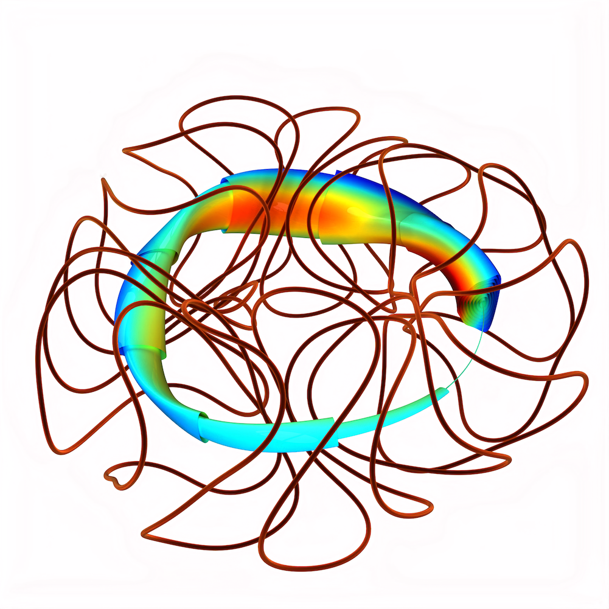

# Summary

[//]: # (JOSS guidelines: A summary describing the high-level functionality and purpose of the software for a diverse, non-specialist audience.)

A stellarator is a magnetic field configuration used to confine
plasma, and it is a candidate configuration for fusion energy, as well
as a general charged particle trap.  A stellarator's magnetic field is
typically produced using electromagnetic coils, and the shaping of the
field and coils must be optimized to achieve good confinement.
SIMSOPT is a collection of software components for carrying out these
optimizations.  These components include

- Interfaces to physics codes, e.g. for magnetohydrodynamic (MHD) equilibrium.
- Tools for defining objective functions and parameter spaces for optimization.
- Geometric objects that are important for stellarators – surfaces and curves – with several available parameterizations.
- Implementations of the Biot-Savart law and other magnetic fields, including derivatives.
- Tools for parallelized finite-difference gradient calculations.

# Statement of need

[//]: # (Should include references "to other software addressing related needs.")

# Structure

Some of the physics modules with compiled code reside in separate
repositories. Two such modules are VMEC [@VMEC1983] and
SPEC [@SPEC], for MHD equilibrium.  Another module in a separate
repository is booz_xform, for calculation of Boozer coordinates.  This
latter repository is a new C++ re-implementation of an algorithm in an
older fortran 77 code of the same name.

Simsopt does not presently use input data files to define optimization
problems, in contrast to STELLOPT. Rather, problems are specified
using a python driver script, in which objects are defined and
configured. However, objects related to specific physics codes may use
their own input files. In particular, a `Vmec` object can be
initialized using a standard VMEC `input.*` input file, and a `Spec`
object can be initialized using a standard SPEC `*.sp` input file.

- C++/Python combination
- Fortran/Python combination
- Parallelism using MPI and OpenMP

# Capabilities

Two general sentences on stage 1 and stage 2 optimisation, include picture of a stellarator

- Optimising surfaces for physics quantities, mention rotational transform, quasi symmetry, greens residue. mention connected libraries (vmec, spec, ...)
- Optimising coils for physics quantities
- Visualisation of coils, surfaces
- Computation of poincare plots, particle tracing

# Acknowledgements

This work was supported by a grant from the Simons Foundation (560651, ML).
?? PPPL grant number??

# References
